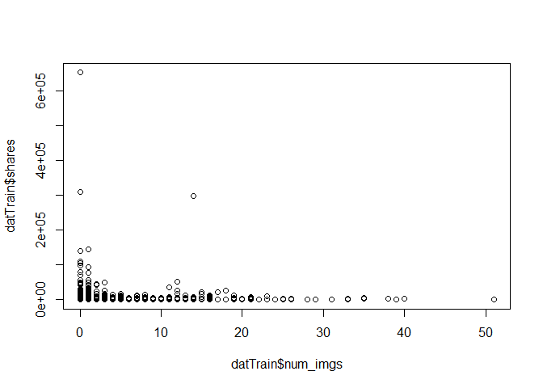
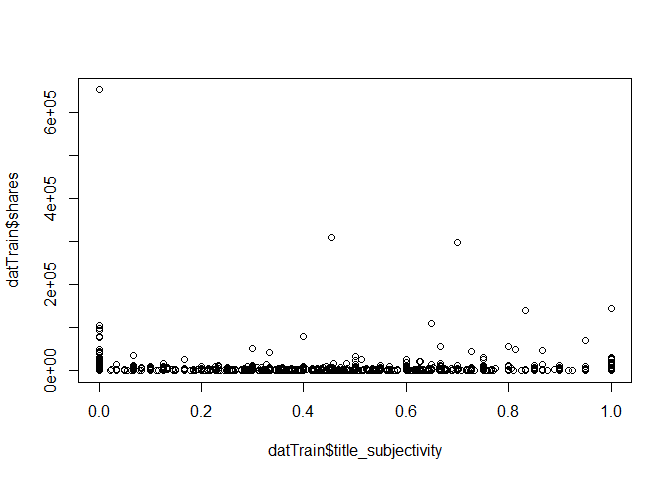
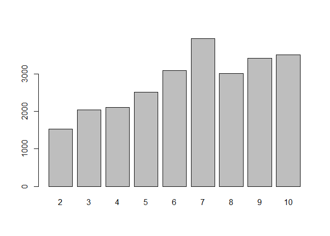
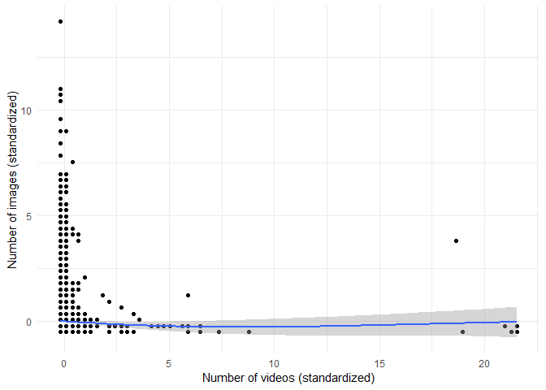
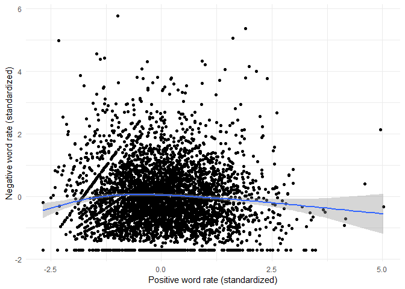
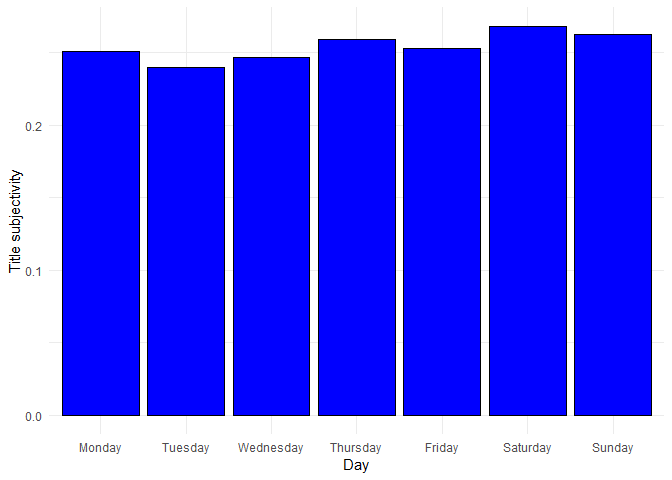
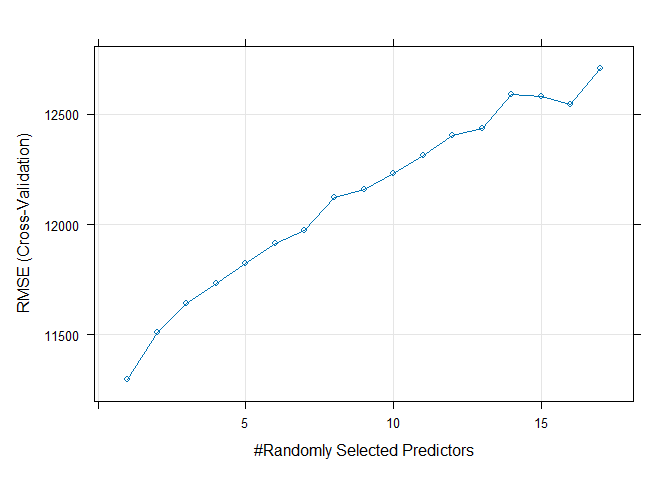
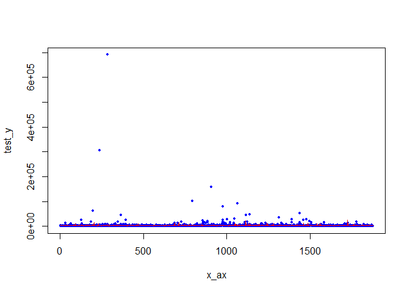
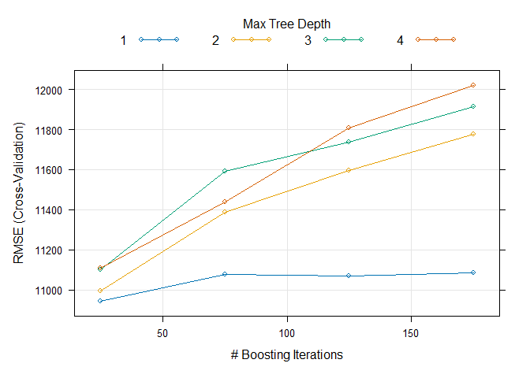
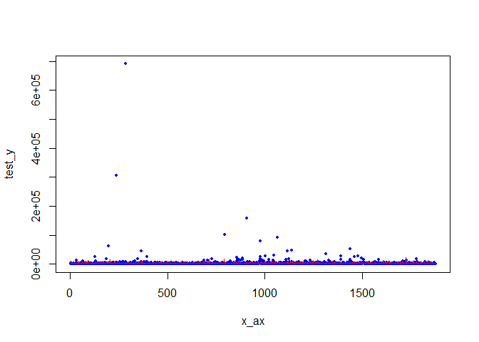

Project 2
================
Grace Holliday and Damon D’Ambrosio
2023-07-03

# Data Channel: **data_channel_is_bus**

# Introduction

The goal/purpose of this project is to explore the factors influencing
the amount of shares (popularity) of articles published by Mashable in a
period of two years.

The data includes 39,644 observations of 61 total variables. For our
exploration, we will use variables num_imgs, num_videos, num_keywords,
weekday_is variables (including is_weekend), global_subjectivity (Text
subjectivity),global_sentiment_polarity (Text sentiment polarity),
global_rate_positive_words (Rate of positive words in the content),
global_rate_negative_words (Rate of negative words in the content),
title_subjectivity, and title_polarity, to explore the target variable
(shares).

The methods we will use to model the response include:  
- Linear Regression  
- Random Forest  
- Boosted Tree

# Data

``` r
dat <- read_csv("OnlineNewsPopularity.csv")
```

    ## Rows: 39644 Columns: 61
    ## ── Column specification ───────────────────────────────────────────────────────────────────────
    ## Delimiter: ","
    ## chr  (1): url
    ## dbl (60): timedelta, n_tokens_title, n_tokens_content, n_unique_tokens, n_non_stop_words, n...
    ## 
    ## ℹ Use `spec()` to retrieve the full column specification for this data.
    ## ℹ Specify the column types or set `show_col_types = FALSE` to quiet this message.

``` r
# Subset data to variables we want
dat <- dat[,-c(1:9,12,20:31,39:44, 49:55,58,59)]

# Subsetting to correct channel(s)
col <- params[[1]][1]
if(col=="data_channel_is_lifestyle")
{
  dattype <- subset(dat,data_channel_is_lifestyle==1)
} else if(col=="data_channel_is_entertainment")
{
  dattype <- subset(dat,data_channel_is_entertainment==1)
} else if(col=="data_channel_is_bus")
{
  dattype <- subset(dat,data_channel_is_bus==1)
} else if(col=="data_channel_is_socmed")
{
  dattype <- subset(dat,data_channel_is_socmed==1)
} else if(col=="data_channel_is_tech")
{
  dattype <- subset(dat,data_channel_is_tech==1)
} else if(col=="data_channel_is_world")
{
  dattype <- subset(dat,data_channel_is_world==1)
}

# Removing data channel columns
dattype <- dattype[,-c(4:9)]
```

# Summarizations

First, we will produce basic summary statistics and plots about the
training data. To do this, we first need to divide the data into a
training and test set.

``` r
# First, establishing every categorical variable as a character
# so can change the factor
dattype$weekday_is_monday <- as.character(dattype$weekday_is_monday)
dattype$weekday_is_tuesday <- as.character(dattype$weekday_is_tuesday)
dattype$weekday_is_wednesday <- as.character(dattype$weekday_is_wednesday)
dattype$weekday_is_thursday <- as.character(dattype$weekday_is_thursday)
dattype$weekday_is_friday <- as.character(dattype$weekday_is_friday)
dattype$weekday_is_saturday <- as.character(dattype$weekday_is_saturday)
dattype$weekday_is_sunday <- as.character(dattype$weekday_is_sunday)

# Creating single variable for day 1 = Monday 2 = Tuesday 3 = Wednesday
# 4 = Thursday 5 = Friday 6 = Saturday 7 = Sunday 0 if no day, also
# making these a factor and not 0 and 1 for ensemble models

for(i in 1:nrow(dattype))
{
  if(dattype[i,4]==1)
  {
    dattype[i,19] <- 'Monday'
    dattype[i,4] <- 'Y'
    dattype[i,5] <- 'N'
    dattype[i,6] <- 'N'
    dattype[i,7] <- 'N'
    dattype[i,8] <- 'N'
    dattype[i,9] <- 'N' 
    dattype[i,10] <- 'N'
  }
  else if (dattype[i,5]==1)
  {
    dattype[i,19] <- 'Tuesday'
    dattype[i,4] <- 'N'
    dattype[i,5] <- 'Y'
    dattype[i,6] <- 'N'
    dattype[i,7] <- 'N'
    dattype[i,8] <- 'N'
    dattype[i,9] <- 'N' 
    dattype[i,10] <- 'N'
  }
  else if (dattype[i,6]==1)
  {
    dattype[i,19] <- 'Wednesday'
    dattype[i,6] <- 'Y'
    dattype[i,4] <- 'N'
    dattype[i,5] <- 'N'
    dattype[i,7] <- 'N'
    dattype[i,8] <- 'N'
    dattype[i,9] <- 'N' 
    dattype[i,10] <- 'N'
  }
  else if (dattype[i,7]==1)
  {
    dattype[i,19] <- 'Thursday'
    dattype[i,6] <- 'N'
    dattype[i,4] <- 'N'
    dattype[i,5] <- 'N'
    dattype[i,7] <- 'Y'
    dattype[i,8] <- 'N'
    dattype[i,9] <- 'N' 
    dattype[i,10] <- 'N'
    }
  else if (dattype[i,8]==1)
  {
    dattype[i,19] <- 'Friday'
    dattype[i,6] <- 'N'
    dattype[i,4] <- 'N'
    dattype[i,5] <- 'N'
    dattype[i,7] <- 'N'
    dattype[i,8] <- 'Y'
    dattype[i,9] <- 'N' 
    dattype[i,10] <- 'N'
  }
  else if (dattype[i,9]==1)
  {
    dattype[i,19] <- 'Saturday'
    dattype[i,6] <- 'N'
    dattype[i,4] <- 'N'
    dattype[i,5] <- 'N'
    dattype[i,7] <- 'N'
    dattype[i,8] <- 'N'
    dattype[i,9] <- 'Y' 
    dattype[i,10] <- 'N'
  }
  else if (dattype[i,10]==1)
  {
    dattype[i,19] <- 'Sunday'
    dattype[i,6] <- 'N'
    dattype[i,4] <- 'N'
    dattype[i,5] <- 'N'
    dattype[i,7] <- 'N'
    dattype[i,8] <- 'N'
    dattype[i,9] <- 'N' 
    dattype[i,10] <- 'Y'
  }
  else
  {
    dattype[i,19] <- 'NA'
  }
}

colnames(dattype)[19] <- 'day'

# and back to a factor
dattype$weekday_is_monday <- as.factor(dattype$weekday_is_monday)
dattype$weekday_is_tuesday <- as.factor(dattype$weekday_is_tuesday)
dattype$weekday_is_wednesday <- as.factor(dattype$weekday_is_wednesday)
dattype$weekday_is_thursday <- as.factor(dattype$weekday_is_thursday)
dattype$weekday_is_friday <- as.factor(dattype$weekday_is_friday)
dattype$weekday_is_saturday <- as.factor(dattype$weekday_is_saturday)
dattype$weekday_is_sunday <- as.factor(dattype$weekday_is_sunday)
dattype$day <- as.factor(dattype$day)

# Setting order of new factor levels
dattype$day <- factor(dattype$day, levels =c('Monday', 'Tuesday', 'Wednesday',
                                  'Thursday', 'Friday', 'Saturday', 'Sunday'))

# First setting seed for reproducibility.
set.seed(1234)

# Divide data into training and test set.
train <- sample(1:nrow(dattype), size = nrow(dattype)*.70)
test <- setdiff(1:nrow(dattype), train)

# training and testing subsets
datTrain <- dattype[train, ]
datTest <- dattype[test, ]
```

## Summary Statistics

Now, we will conduct exploratory data analysis through creation of basic
summary statistics and graphs exploring variables of interest to our
response (shares) before we select variables for potential models.

### Mean Shares by Day

``` r
datTrain %>%
  group_by(day) %>%
  summarise_at(vars(shares), list(name = mean))
```

    ## # A tibble: 7 × 2
    ##   day        name
    ##   <fct>     <dbl>
    ## 1 Monday    3543.
    ## 2 Tuesday   3139.
    ## 3 Wednesday 2680.
    ## 4 Thursday  2738.
    ## 5 Friday    2150.
    ## 6 Saturday  4733.
    ## 7 Sunday    3718.

This summary reveals the average number of shares by day of the week
(Days 1-7, Mon-Sun). The highest average represents the day with the
most shares. A day of 0 means no day was specified.

### Total Multimedia (Images and Videos) by Day

``` r
datTrain %>% group_by(day) %>%
  mutate(total.media = num_imgs + num_videos) %>%
    group_by(day) %>%
      summarize(average = mean(total.media), median = median(total.media), 
                min = min(total.media), max = max(total.media),
                sd =   sd(total.media))
```

    ## # A tibble: 7 × 6
    ##   day       average median   min   max    sd
    ##   <fct>       <dbl>  <dbl> <dbl> <dbl> <dbl>
    ## 1 Monday       2.63      1     0    75  6.01
    ## 2 Tuesday      2.34      1     0    34  3.93
    ## 3 Wednesday    2.09      1     0    31  3.34
    ## 4 Thursday     2.28      1     0    74  4.20
    ## 5 Friday       2.41      1     0    76  5.17
    ## 6 Saturday     2.68      1     0    51  5.18
    ## 7 Sunday       3.10      1     0    80  8.39

This summary provides the mean, median, minimum, maximum, and standard
deviation of the total multimedia objects (images + videos) appearing in
articles by day. Potential trends in this summary (e.g., if articles
published on certain day have more multimedia objects), may indicate
some type of collinearity between “day” and the “num_imgs” or
“num_videos” variables.

## Graphs

### Number of Images vs Shares

We can inspect the trend of shares as a function of the number of
images. If the points show an upward trend, then articles with more
images tend to be shared more often. If the points show a downward
trend, then articles with less images tend to be shared more often.

``` r
plot(datTrain$shares~datTrain$num_imgs)
```

<!-- -->

### Title Subjectivity vs Shares

We can inspect the trend of shares as a function of title subjectivity.
If the points show an upward trend, then articles with higher title
subjectivity tend to be shared more often. If the points show a downward
trend, then articles with lower title subjectivity tend to be shared
more often.

``` r
plot(datTrain$shares~datTrain$title_subjectivity)
```

<!-- -->

### Average Number of Keywords vs Shares

We can inspect the trend of shares as a function of number of keywords.
If the bars show an upward trend, then articles with more keywords tend
to be shared more often. If the bars show a downward trend, then
articles with less keywords tend to be shared more often.

``` r
datTrain$num_keywords <- as.factor(datTrain$num_keywords)
means <- datTrain %>%
  group_by(num_keywords) %>%
  summarise_at(vars(shares), list(name = mean))
barplot(height=means$name, names=means$num_keywords)
```

<!-- -->

``` r
# back to numeric for later models
datTrain$num_keywords <- as.numeric(datTrain$num_keywords)
```

### Images vs Videos

We can inspect possible relationships between the number of images and
videos in an article. If some type of relationship is evident (e.g.,
articles with more images tend to have more videos), it may suggest some
collinearity between these two variables.

``` r
g <- ggplot(datTrain, aes(x = scale(num_videos), y = scale(num_imgs)))

g + geom_point() + 
    xlab("Number of videos (standardized)") + 
    ylab("Number of images (standardized)") + 
    geom_smooth() + 
    theme_minimal()
```

<!-- -->

### Positive vs negative word rates

We can inspect the relationship between positive and negative word rates
in articles. If some type of relationship is evident (e.g., articles
with higher positive word rates tend to have lower negative word rates),
it may suggest some collinearity between these two variables.

``` r
g <- ggplot(datTrain, aes(x = scale(global_rate_positive_words), y = scale(global_rate_negative_words)))

g + geom_point() + 
    xlab("Positive word rate (standardized)") + 
    ylab("Negative word rate (standardized)") + 
    geom_smooth() + 
    theme_minimal()
```

<!-- -->

### Title subjectivity by day of week

We can inspect the relationship between title subjectivity and the day
of the week to see if certain days tend to have more/less subjective
article titles.

``` r
g <- ggplot(datTrain, aes(x = day, y = title_subjectivity))

g + geom_bar(stat = "summary", fun = "mean", color = "black", fill = "blue") + 
    xlab("Day") + ylab("Title subjectivity") +
    theme_minimal()
```

<!-- -->

# Modeling

Linear regression is an analysis method wherein the values of a variable
(i.e., response variable) is predicted based upon the value of one more
more other variables (i.e., predictor variables). There is an underlying
assumption that there is a linear relationship between the response
variable and any given predictor. The slope of this line is determined
mathematically by minimizing the sum of the squared residuals.

## Linear Models

This first model will explore the impact of images as combined with
number of key words, title subjectivity, sentiment polarity, and
positive word rate.

``` r
#Train model
mod2 <- train(shares ~ num_imgs+num_keywords+title_subjectivity+
                global_subjectivity+global_sentiment_polarity +
                global_rate_positive_words,
              data = datTrain,
              method = "lm",
              preProcess = c("center", "scale"), 
              trControl = trainControl(method = "cv", number = 5))

summary(mod2)
```

    ## 
    ## Call:
    ## lm(formula = .outcome ~ ., data = dat)
    ## 
    ## Residuals:
    ##    Min     1Q Median     3Q    Max 
    ##  -8650  -2202  -1236     -5 647196 
    ## 
    ## Coefficients:
    ##                            Estimate Std. Error t value Pr(>|t|)    
    ## (Intercept)                  3004.8      200.2  15.005  < 2e-16 ***
    ## num_imgs                      214.9      200.9   1.070 0.284877    
    ## num_keywords                  447.9      202.7   2.210 0.027166 *  
    ## title_subjectivity            176.5      203.7   0.866 0.386328    
    ## global_subjectivity          1033.3      213.9   4.832  1.4e-06 ***
    ## global_sentiment_polarity    -915.8      252.9  -3.621 0.000297 ***
    ## global_rate_positive_words    329.3      253.8   1.297 0.194647    
    ## ---
    ## Signif. codes:  0 '***' 0.001 '**' 0.01 '*' 0.05 '.' 0.1 ' ' 1
    ## 
    ## Residual standard error: 13250 on 4373 degrees of freedom
    ## Multiple R-squared:  0.009157,   Adjusted R-squared:  0.007798 
    ## F-statistic: 6.736 on 6 and 4373 DF,  p-value: 4.073e-07

``` r
#Run on test data
mod2.predict <- predict(mod2, newdata = datTest)

#Obtain RMSE from test set, which will be used in automated comparison
mod2.compare <- postResample(mod2.predict, obs = datTest$shares)
```

The second model explores the impact of videos instead of images.
Keywords are retained as a variable. Instead of exploring subjectivity
and postive word rates, this model explores the “negative” (i.e., global
rate of negative words and maximum polarity of negative words). It also
includes an interaction between the number of videos and number of
keywords.

``` r
#Train model
mod3 <- train(shares ~ num_videos + num_keywords + num_videos:num_keywords + global_rate_negative_words + max_negative_polarity,
              data = datTrain,
              method = "lm",
              preProcess = c("center", "scale"), 
              trControl = trainControl(method = "cv", number = 5))

#Run on test data
mod3.predict <- predict(mod3, newdata = datTest)

#Obtain RMSE from test set, which will be used in automated comparison
mod3.compare <- postResample(mod3.predict, obs = datTest$shares)
```

## Ensemble Models

To streamline model fitting, we will first remove the previously created
“day” variable.

``` r
# this is regression, not classification
#removing previously created day variable for boosted tree model
datTrain <- datTrain[,-19]
datTest <- datTest[,-19]
```

Now to fit the ensemble models.

### Random Forest Model

Random forests are similar to bagging in the sense that multiple trees
(i.e., a “forest”) are created from bootstrap samples of data, with the
outcome of these trees averaged to form a conclusion. Unlike bagging,
not all possible predictors are used in each tree when using a random
forest- only a random subset is used for each tree. This in turn makes
the trees less correlated with one another, which allows for a greater
reduction in variation once the outcomes of all trees are averaged.

Below is a random forest model to predict shares:

``` r
#Create model
random.forest.fit <- train(shares ~ ., data = datTrain,
                           method = "rf",
                           preProcess = c("center", "scale"),
                           trControl = trainControl(method = "cv", number = 5),
                           tuneGrid = data.frame(mtry = 1:17))

# plot fit
plot(random.forest.fit)
```

<!-- -->

``` r
random.forest.fit$finalModel
```

    ## 
    ## Call:
    ##  randomForest(x = x, y = y, mtry = param$mtry) 
    ##                Type of random forest: regression
    ##                      Number of trees: 500
    ## No. of variables tried at each split: 1
    ## 
    ##           Mean of squared residuals: 176043340
    ##                     % Var explained: 0.52

``` r
# test fit
test_x = datTest[, -18] 
test_y = datTest[, 18] 
pred_y = predict(random.forest.fit, test_x)
x_ax = 1:length(pred_y)
x_ax <- as.numeric(x_ax)
test_y <- test_y$shares 
test_y <- as.integer(test_y)
pred_y <- as.integer(pred_y)
plot(x_ax, test_y, col="blue", pch=20, cex=.9)
lines(x_ax, pred_y, col="red", pch=20, cex=.9)
```

<!-- -->

``` r
#Run on test data
random.forest.predict <- predict(random.forest.fit, newdata = datTest)

#Obtain RMSE from test set, which will be used in automated comparison
random.forest.compare <- postResample(random.forest.predict, 
                                      obs = datTest$shares)
```

Here, the red lines are the predicted values for each observation. If
the red lines are close to following the blue dots (which are
representative of the actual value for each observation), then the model
is closely predicting.

### Boosted Tree Model

Boosting is a general approach that can be applied to trees and allows
for the slow training of trees. The trees are grown sequentially with
each subsequent tree being grown on a modified version of the original
data. The predictions are then updated as the trees are grown, and new
trees are grown by considering the errors in the trees previously
created. Lambda represents a shrinkage parameter than slows the fitting
process.

Below is a boosted tree model to predict shares.

``` r
boostFit <- train(shares~., data=datTrain, method="gbm",
                      preProcess=c("center","scale"),
                      trControl=trainControl(method='cv',number=5),
                      tuneGrid = expand.grid(n.trees=seq(25,200,50),
                                             interaction.depth=seq(1,4,1),
                                             shrinkage=0.1,
                                             n.minobsinnode=10))
```

    ## Iter   TrainDeviance   ValidDeviance   StepSize   Improve
    ##      1 213676780.5703             nan     0.1000 81616.5024
    ##      2 213467841.1100             nan     0.1000 46245.5952
    ##      3 212536966.7585             nan     0.1000 53481.1002
    ##      4 212346039.1691             nan     0.1000 -11412.7090
    ##      5 212179374.1336             nan     0.1000 74920.9418
    ##      6 211979555.5748             nan     0.1000 -59357.8037
    ##      7 211347840.7338             nan     0.1000 77691.9175
    ##      8 210772042.1398             nan     0.1000 -104654.3014
    ##      9 210558867.0461             nan     0.1000 -221080.4534
    ##     10 210066056.9141             nan     0.1000 44552.0233
    ##     20 208524152.3194             nan     0.1000 -367443.1353
    ##     40 205792200.2863             nan     0.1000 -320061.2472
    ##     60 204912555.7016             nan     0.1000 -753499.6037
    ##     80 204266019.2023             nan     0.1000 -714573.3990
    ##    100 202957008.1431             nan     0.1000 29951.4295
    ##    120 202944302.6277             nan     0.1000 -167220.0114
    ##    140 202364669.3695             nan     0.1000 95993.1332
    ##    160 201428383.8034             nan     0.1000 -447054.3366
    ##    175 200767081.7575             nan     0.1000 71792.0282
    ## 
    ## Iter   TrainDeviance   ValidDeviance   StepSize   Improve
    ##      1 213617158.3194             nan     0.1000 -22799.1827
    ##      2 213014076.6594             nan     0.1000 -146864.4987
    ##      3 210901555.3142             nan     0.1000 -287823.1284
    ##      4 210140645.9980             nan     0.1000 52358.7442
    ##      5 206993449.0629             nan     0.1000 -60139.7705
    ##      6 206415097.4428             nan     0.1000 194283.4131
    ##      7 206206862.2417             nan     0.1000 -273074.7619
    ##      8 206001600.2090             nan     0.1000 -33394.3234
    ##      9 205704008.0251             nan     0.1000 -148231.3345
    ##     10 203565930.4221             nan     0.1000 -301949.1152
    ##     20 192726497.4116             nan     0.1000 -145004.6280
    ##     40 183066189.9031             nan     0.1000 -158211.2562
    ##     60 175972463.8374             nan     0.1000 -343919.1192
    ##     80 169952365.8678             nan     0.1000 -485859.4320
    ##    100 164933735.6755             nan     0.1000 -674117.1521
    ##    120 158102794.4209             nan     0.1000 -330868.2792
    ##    140 155305436.4077             nan     0.1000 -502583.4173
    ##    160 153881747.8342             nan     0.1000 -292841.8138
    ##    175 150966240.0912             nan     0.1000 -541381.3462
    ## 
    ## Iter   TrainDeviance   ValidDeviance   StepSize   Improve
    ##      1 212907074.4519             nan     0.1000 70013.1766
    ##      2 209248458.9915             nan     0.1000 -281683.7364
    ##      3 208357574.6799             nan     0.1000 1314970.4159
    ##      4 207652791.8007             nan     0.1000 -39616.6077
    ##      5 205215706.3863             nan     0.1000 -2153.9183
    ##      6 204713979.2335             nan     0.1000 -77265.7370
    ##      7 204261701.2054             nan     0.1000 -206287.3500
    ##      8 204029157.9189             nan     0.1000 7411.6130
    ##      9 201937218.7589             nan     0.1000 -464361.3807
    ##     10 199353941.9798             nan     0.1000 -862003.7625
    ##     20 189729938.0698             nan     0.1000 81240.0158
    ##     40 179040475.0091             nan     0.1000 -511594.8528
    ##     60 168163810.1220             nan     0.1000 -645741.8109
    ##     80 158364974.2525             nan     0.1000 -1438981.5440
    ##    100 150004622.7295             nan     0.1000 -1199064.2180
    ##    120 145434899.4170             nan     0.1000 -415177.5550
    ##    140 138234531.0969             nan     0.1000 146453.0854
    ##    160 132685805.9059             nan     0.1000 -895106.5851
    ##    175 129480833.6799             nan     0.1000 -787084.9876
    ## 
    ## Iter   TrainDeviance   ValidDeviance   StepSize   Improve
    ##      1 209637708.3221             nan     0.1000 118124.5545
    ##      2 209025203.6258             nan     0.1000 -293178.4528
    ##      3 208213818.0216             nan     0.1000 32890.9543
    ##      4 207824266.6867             nan     0.1000 106192.6923
    ##      5 204937462.7880             nan     0.1000 -1387465.0245
    ##      6 204476079.2748             nan     0.1000 -330075.0995
    ##      7 202119273.2844             nan     0.1000 -75688.4324
    ##      8 202337739.3750             nan     0.1000 -936210.8500
    ##      9 201872871.5676             nan     0.1000 -342939.4415
    ##     10 199474319.5278             nan     0.1000 -915581.3821
    ##     20 183319879.7414             nan     0.1000 -1007397.6094
    ##     40 164847347.4451             nan     0.1000 -561998.0070
    ##     60 153110110.4799             nan     0.1000 -1650909.8704
    ##     80 143894406.6787             nan     0.1000 -668654.0619
    ##    100 136977354.6708             nan     0.1000 -615073.9865
    ##    120 131080503.1464             nan     0.1000 -775363.6947
    ##    140 121603278.7324             nan     0.1000 -426057.5584
    ##    160 118546493.7192             nan     0.1000 -525653.4661
    ##    175 115399946.9247             nan     0.1000 -1035053.3158
    ## 
    ## Iter   TrainDeviance   ValidDeviance   StepSize   Improve
    ##      1 58169730.8516             nan     0.1000 122465.9235
    ##      2 58063037.1506             nan     0.1000 60547.0936
    ##      3 57749782.6263             nan     0.1000 31145.9426
    ##      4 57490710.8986             nan     0.1000 -100928.7476
    ##      5 57425282.8077             nan     0.1000 11499.5316
    ##      6 57350766.4903             nan     0.1000 62553.4138
    ##      7 57212087.3646             nan     0.1000 -96546.7479
    ##      8 57150110.2112             nan     0.1000 6635.6952
    ##      9 57069275.0019             nan     0.1000 10805.6671
    ##     10 57009072.0054             nan     0.1000 6537.9788
    ##     20 56114612.3375             nan     0.1000 104429.4675
    ##     40 54853889.5312             nan     0.1000 87348.5436
    ##     60 54152699.6721             nan     0.1000 58724.6639
    ##     80 53773535.6086             nan     0.1000 -228231.1701
    ##    100 52577843.1345             nan     0.1000 -157373.9322
    ##    120 51713847.9809             nan     0.1000 57232.5947
    ##    140 50737052.3405             nan     0.1000 -108862.5166
    ##    160 49947658.6370             nan     0.1000 -85866.8101
    ##    175 49365140.8392             nan     0.1000 -96337.4284
    ## 
    ## Iter   TrainDeviance   ValidDeviance   StepSize   Improve
    ##      1 58086528.6648             nan     0.1000 22173.5059
    ##      2 57930853.3535             nan     0.1000 38530.4290
    ##      3 57415100.8518             nan     0.1000 59980.8917
    ##      4 57097005.2342             nan     0.1000 -91072.7822
    ##      5 56711136.8270             nan     0.1000 -50117.5674
    ##      6 56561691.5800             nan     0.1000 -114883.5582
    ##      7 56079530.6487             nan     0.1000 -48943.3997
    ##      8 55911354.3776             nan     0.1000 -14254.4375
    ##      9 55809336.1615             nan     0.1000 -126772.4590
    ##     10 55709702.9218             nan     0.1000 38110.3584
    ##     20 53441163.6539             nan     0.1000 -233357.1533
    ##     40 51081318.2994             nan     0.1000 -106017.7853
    ##     60 48999521.2503             nan     0.1000 44910.9716
    ##     80 47576179.6841             nan     0.1000 -27253.7181
    ##    100 45920366.0032             nan     0.1000 -227713.5147
    ##    120 44425198.3099             nan     0.1000 -121332.7693
    ##    140 43209371.5422             nan     0.1000 -267496.3680
    ##    160 41903015.3062             nan     0.1000 -73601.3426
    ##    175 41172046.2197             nan     0.1000 -77449.6778
    ## 
    ## Iter   TrainDeviance   ValidDeviance   StepSize   Improve
    ##      1 57815962.8005             nan     0.1000 65940.5285
    ##      2 57237902.7842             nan     0.1000 31433.7884
    ##      3 56699538.8376             nan     0.1000 42523.9053
    ##      4 56574713.7419             nan     0.1000 98684.9176
    ##      5 56339289.6576             nan     0.1000 49182.5282
    ##      6 55747658.8206             nan     0.1000 -31976.6351
    ##      7 55494839.8955             nan     0.1000 -60615.1462
    ##      8 55297946.9808             nan     0.1000 3308.8170
    ##      9 55153859.5502             nan     0.1000 -41771.6191
    ##     10 54704468.0413             nan     0.1000 -191486.1991
    ##     20 53608213.5059             nan     0.1000 -138648.9338
    ##     40 50114169.0769             nan     0.1000 -167570.2325
    ##     60 47812610.6149             nan     0.1000 -203254.4813
    ##     80 45176724.8005             nan     0.1000 30733.7416
    ##    100 43469536.6973             nan     0.1000 -251094.9507
    ##    120 41944251.4262             nan     0.1000 -114533.5964
    ##    140 40095063.4577             nan     0.1000 -164597.0792
    ##    160 39106230.6559             nan     0.1000 -37830.4484
    ##    175 37721751.2166             nan     0.1000 -51179.1826
    ## 
    ## Iter   TrainDeviance   ValidDeviance   StepSize   Improve
    ##      1 57441835.8370             nan     0.1000 33866.5983
    ##      2 56748296.1983             nan     0.1000 77638.9238
    ##      3 55887120.5701             nan     0.1000 -77815.5226
    ##      4 55802313.2087             nan     0.1000 11447.0026
    ##      5 55395402.6215             nan     0.1000 -5980.1637
    ##      6 55196221.2154             nan     0.1000 78758.7177
    ##      7 54892810.5775             nan     0.1000 -88202.5698
    ##      8 54729596.6359             nan     0.1000 -50083.2437
    ##      9 54536691.0217             nan     0.1000 55456.1526
    ##     10 54099424.9997             nan     0.1000 -177086.4665
    ##     20 51961645.1073             nan     0.1000 -20054.0144
    ##     40 49031417.7239             nan     0.1000 -135152.8826
    ##     60 46932976.9350             nan     0.1000 -330918.6063
    ##     80 44177793.7490             nan     0.1000 28590.8073
    ##    100 42965289.2037             nan     0.1000 -120990.4562
    ##    120 41281886.0977             nan     0.1000 3671.4273
    ##    140 39409237.8787             nan     0.1000 -182887.3937
    ##    160 36920276.4695             nan     0.1000 -95860.5767
    ##    175 35803817.9408             nan     0.1000 -97982.5863
    ## 
    ## Iter   TrainDeviance   ValidDeviance   StepSize   Improve
    ##      1 207687792.3909             nan     0.1000 384067.5798
    ##      2 207417856.3228             nan     0.1000 -66677.2866
    ##      3 207320932.9704             nan     0.1000 54494.9328
    ##      4 206856410.4400             nan     0.1000 -31218.7072
    ##      5 206403784.4370             nan     0.1000 493275.5727
    ##      6 205870063.5737             nan     0.1000 -35559.6164
    ##      7 205308016.6953             nan     0.1000 -17195.6583
    ##      8 205192923.3163             nan     0.1000 -156927.6000
    ##      9 204885329.6295             nan     0.1000 -45348.3130
    ##     10 204555266.0867             nan     0.1000 -76817.0175
    ##     20 201695437.1621             nan     0.1000 -234667.8811
    ##     40 199989326.2499             nan     0.1000 -502977.9556
    ##     60 199234353.7313             nan     0.1000 -382000.5025
    ##     80 197773463.4057             nan     0.1000 -233770.9977
    ##    100 196724051.3074             nan     0.1000 -44690.7012
    ##    120 195419108.2779             nan     0.1000 92625.5443
    ##    140 194984823.0336             nan     0.1000 -340575.1855
    ##    160 194460088.9780             nan     0.1000 -271412.3670
    ##    175 194059182.2872             nan     0.1000 71409.9466
    ## 
    ## Iter   TrainDeviance   ValidDeviance   StepSize   Improve
    ##      1 205798001.4069             nan     0.1000 -267165.3116
    ##      2 203272547.3865             nan     0.1000 -489333.6309
    ##      3 203172434.9528             nan     0.1000 -66918.4184
    ##      4 200383770.0589             nan     0.1000 311625.1677
    ##      5 197720857.4206             nan     0.1000 -486156.1565
    ##      6 197319048.8550             nan     0.1000 -93205.6690
    ##      7 193870675.8092             nan     0.1000 -439951.4451
    ##      8 193795652.1637             nan     0.1000 -391116.5401
    ##      9 192736538.0101             nan     0.1000 -54088.3397
    ##     10 191150082.8003             nan     0.1000 -1182298.3007
    ##     20 185091394.7436             nan     0.1000 -996831.0415
    ##     40 175990589.3840             nan     0.1000 -221480.5329
    ##     60 170431864.6189             nan     0.1000 -925893.9845
    ##     80 165646957.7910             nan     0.1000 -1488463.5183
    ##    100 160904477.4184             nan     0.1000 -203328.2418
    ##    120 154352442.1314             nan     0.1000 -608395.3478
    ##    140 150748229.7817             nan     0.1000 -1264971.2510
    ##    160 146639837.8077             nan     0.1000 -1774978.9964
    ##    175 143977672.0321             nan     0.1000 -1087675.7902
    ## 
    ## Iter   TrainDeviance   ValidDeviance   StepSize   Improve
    ##      1 203048788.7062             nan     0.1000 -328629.9233
    ##      2 202305024.1054             nan     0.1000 383887.7818
    ##      3 199707728.3588             nan     0.1000 -343306.5196
    ##      4 196356271.2006             nan     0.1000 -173640.8038
    ##      5 196194679.1035             nan     0.1000 -261919.9591
    ##      6 194435425.2907             nan     0.1000 -619158.8604
    ##      7 193731226.0332             nan     0.1000 826383.2503
    ##      8 192988275.4946             nan     0.1000 122727.1946
    ##      9 192466434.3381             nan     0.1000 -147784.8702
    ##     10 190547951.8843             nan     0.1000 -476435.4311
    ##     20 179765731.4783             nan     0.1000 144526.2853
    ##     40 159933257.7698             nan     0.1000 77948.2016
    ##     60 149855583.1836             nan     0.1000 -910219.2160
    ##     80 141479591.3479             nan     0.1000 51022.1727
    ##    100 134189309.9554             nan     0.1000 -831977.1501
    ##    120 127241996.8743             nan     0.1000 -527379.8875
    ##    140 123161321.2101             nan     0.1000 -442317.2980
    ##    160 120502784.6808             nan     0.1000 -374595.2214
    ##    175 116415476.1397             nan     0.1000 -133264.4367
    ## 
    ## Iter   TrainDeviance   ValidDeviance   StepSize   Improve
    ##      1 207612760.6120             nan     0.1000 306895.9142
    ##      2 205288885.5953             nan     0.1000 -541600.3308
    ##      3 204747478.1115             nan     0.1000 267555.9231
    ##      4 201714332.7413             nan     0.1000 503924.2250
    ##      5 201800777.3631             nan     0.1000 -449373.9033
    ##      6 201324245.7608             nan     0.1000 67791.9002
    ##      7 198864947.8667             nan     0.1000 376975.1031
    ##      8 198751196.1057             nan     0.1000 -69147.3388
    ##      9 198356992.9201             nan     0.1000 18671.4094
    ##     10 196064917.4381             nan     0.1000 -955842.2191
    ##     20 181560439.9299             nan     0.1000 -489481.6822
    ##     40 161969634.3778             nan     0.1000 -794480.8665
    ##     60 150805791.2412             nan     0.1000 -1366976.5312
    ##     80 142663960.1999             nan     0.1000 -994283.5752
    ##    100 131774520.3722             nan     0.1000 -253086.5858
    ##    120 123683301.3250             nan     0.1000 -198268.8022
    ##    140 118398769.4408             nan     0.1000 -473798.5330
    ##    160 111115034.6196             nan     0.1000 -495055.4089
    ##    175 105136106.5038             nan     0.1000 189909.3992
    ## 
    ## Iter   TrainDeviance   ValidDeviance   StepSize   Improve
    ##      1 187733739.0873             nan     0.1000 425409.6947
    ##      2 187104516.0182             nan     0.1000 333272.6339
    ##      3 186986561.5719             nan     0.1000 -20993.2845
    ##      4 186445558.5106             nan     0.1000 14595.6433
    ##      5 186150049.9672             nan     0.1000 -19391.9545
    ##      6 186010204.7004             nan     0.1000 89588.9106
    ##      7 185711628.1770             nan     0.1000 -53031.6539
    ##      8 185450933.3496             nan     0.1000 -176468.7759
    ##      9 185241178.7405             nan     0.1000 -300821.4458
    ##     10 184633069.9247             nan     0.1000 64808.3627
    ##     20 183514011.3571             nan     0.1000 -215878.5099
    ##     40 181587044.0699             nan     0.1000 -248288.9970
    ##     60 181282937.5366             nan     0.1000 -220578.1869
    ##     80 180853329.8247             nan     0.1000 95218.4129
    ##    100 180621937.5375             nan     0.1000 -296108.0791
    ##    120 180158566.0140             nan     0.1000 -283181.4485
    ##    140 179846602.3184             nan     0.1000 -396682.7980
    ##    160 179787478.5943             nan     0.1000 -163973.2574
    ##    175 179070542.9950             nan     0.1000 -366309.2320
    ## 
    ## Iter   TrainDeviance   ValidDeviance   StepSize   Improve
    ##      1 185469606.1122             nan     0.1000 -359425.5134
    ##      2 185101102.7364             nan     0.1000 -13820.3412
    ##      3 184867034.2837             nan     0.1000 -69212.8395
    ##      4 184582522.1800             nan     0.1000 -74227.1625
    ##      5 184438378.4854             nan     0.1000 -51635.7798
    ##      6 184347424.2728             nan     0.1000 -53514.1228
    ##      7 181493884.7553             nan     0.1000 -229387.9766
    ##      8 178682404.7827             nan     0.1000 181418.1624
    ##      9 176426446.6582             nan     0.1000 -362808.3008
    ##     10 174389423.1512             nan     0.1000 -276471.5612
    ##     20 168683029.8609             nan     0.1000 -181142.9005
    ##     40 155271543.4918             nan     0.1000 -970059.2935
    ##     60 151314974.9154             nan     0.1000 -612057.5669
    ##     80 145866674.3504             nan     0.1000 -906496.3374
    ##    100 143581321.4713             nan     0.1000 -755866.2272
    ##    120 137445509.9924             nan     0.1000 -332687.2907
    ##    140 133175420.1179             nan     0.1000 -1115358.1482
    ##    160 129424926.9346             nan     0.1000 -472067.9919
    ##    175 128424271.3574             nan     0.1000 -806149.0341
    ## 
    ## Iter   TrainDeviance   ValidDeviance   StepSize   Improve
    ##      1 184674691.6025             nan     0.1000 411329.2547
    ##      2 183989333.7848             nan     0.1000 162128.3545
    ##      3 183830831.5387             nan     0.1000 -44132.9615
    ##      4 183350869.1073             nan     0.1000 294240.2709
    ##      5 183165937.9323             nan     0.1000 -69506.9990
    ##      6 182608937.6695             nan     0.1000 -227399.1914
    ##      7 180162024.0704             nan     0.1000 -323039.2140
    ##      8 179401182.3737             nan     0.1000 6539.8563
    ##      9 178740814.1496             nan     0.1000 -87846.3940
    ##     10 176664934.8647             nan     0.1000 -248422.2863
    ##     20 164262876.0445             nan     0.1000 -720654.8213
    ##     40 153045437.5027             nan     0.1000 -1010295.2627
    ##     60 144135425.1455             nan     0.1000 -998358.8514
    ##     80 136104582.3010             nan     0.1000 -77714.1829
    ##    100 130453959.9067             nan     0.1000 -697614.6000
    ##    120 127115351.0231             nan     0.1000 -157264.6774
    ##    140 121526549.3470             nan     0.1000 -618957.5522
    ##    160 118985022.0498             nan     0.1000 -715490.5590
    ##    175 116887499.3033             nan     0.1000 -850437.6231
    ## 
    ## Iter   TrainDeviance   ValidDeviance   StepSize   Improve
    ##      1 185181999.6050             nan     0.1000 -289406.6491
    ##      2 182925175.6692             nan     0.1000 -99955.1068
    ##      3 182061161.1691             nan     0.1000 -137354.0974
    ##      4 181531987.4765             nan     0.1000 -88142.7579
    ##      5 179148547.1772             nan     0.1000 527518.4118
    ##      6 175808656.7148             nan     0.1000 -433714.0446
    ##      7 175617835.0228             nan     0.1000 -73073.8123
    ##      8 173004383.8292             nan     0.1000 -361406.4467
    ##      9 170837195.1324             nan     0.1000 -466208.5241
    ##     10 170558067.2026             nan     0.1000 -630937.6029
    ##     20 159067283.7142             nan     0.1000 -1374078.9513
    ##     40 142886631.2368             nan     0.1000 -550251.8712
    ##     60 133074853.9697             nan     0.1000 -944931.3135
    ##     80 126160567.7124             nan     0.1000 -947264.8925
    ##    100 117678102.5087             nan     0.1000 -206141.4017
    ##    120 108612833.9842             nan     0.1000 -841728.9783
    ##    140 102002717.7513             nan     0.1000 -488475.5865
    ##    160 98648881.2581             nan     0.1000 -499182.2762
    ##    175 97180608.8758             nan     0.1000 -965178.0003
    ## 
    ## Iter   TrainDeviance   ValidDeviance   StepSize   Improve
    ##      1 215055497.5882             nan     0.1000 87425.0518
    ##      2 214729504.7181             nan     0.1000 -27370.8317
    ##      3 214399192.7731             nan     0.1000 353513.7810
    ##      4 213701291.8236             nan     0.1000 47924.4975
    ##      5 213643074.5275             nan     0.1000 -8495.3568
    ##      6 213428046.3718             nan     0.1000 3530.8487
    ##      7 212888760.0993             nan     0.1000 -104792.2939
    ##      8 212372550.2348             nan     0.1000 -269404.5269
    ##      9 212180744.2464             nan     0.1000 74659.0328
    ##     10 212109630.9410             nan     0.1000 17816.6877
    ##     20 209967228.4104             nan     0.1000 -32478.4457
    ##     40 208462259.3338             nan     0.1000 -149650.5003
    ##     60 207137692.9167             nan     0.1000 -431208.0459
    ##     80 206206943.1859             nan     0.1000 148252.5289
    ##    100 205440449.8601             nan     0.1000 -431004.4747
    ##    120 205084316.0448             nan     0.1000 -326967.7396
    ##    140 204316434.5836             nan     0.1000 -238955.7871
    ##    160 203342222.8561             nan     0.1000 -50637.3039
    ##    175 202970298.6864             nan     0.1000 -255262.3084
    ## 
    ## Iter   TrainDeviance   ValidDeviance   StepSize   Improve
    ##      1 213781655.4635             nan     0.1000 -148847.4550
    ##      2 211368577.1058             nan     0.1000 -868733.6642
    ##      3 206875837.3748             nan     0.1000 -736827.5037
    ##      4 206426908.3093             nan     0.1000 93445.8943
    ##      5 203595061.8184             nan     0.1000 -1422920.4500
    ##      6 201343306.7706             nan     0.1000 89167.1864
    ##      7 200785676.8223             nan     0.1000 -42528.3523
    ##      8 200220546.3333             nan     0.1000 -105203.9212
    ##      9 198685029.3300             nan     0.1000 -155731.0715
    ##     10 198698851.6353             nan     0.1000 -551745.0247
    ##     20 187848615.1313             nan     0.1000 -346593.2352
    ##     40 182121580.2002             nan     0.1000 -970667.9634
    ##     60 175881274.8943             nan     0.1000 -105936.6088
    ##     80 170324986.2557             nan     0.1000 -1015031.1862
    ##    100 165820115.2312             nan     0.1000 -317112.3518
    ##    120 160895460.5970             nan     0.1000 -446268.0531
    ##    140 157931342.6122             nan     0.1000 -374338.1839
    ##    160 156089699.2766             nan     0.1000 -2069397.5611
    ##    175 153270540.5566             nan     0.1000 -156264.6151
    ## 
    ## Iter   TrainDeviance   ValidDeviance   StepSize   Improve
    ##      1 214710808.3512             nan     0.1000 282498.7772
    ##      2 211770416.0819             nan     0.1000 -815467.4689
    ##      3 211420888.6872             nan     0.1000 177166.5082
    ##      4 210390627.3036             nan     0.1000 333510.5327
    ##      5 207307113.5689             nan     0.1000 -270693.8840
    ##      6 204123199.2156             nan     0.1000 530648.8297
    ##      7 203456744.3836             nan     0.1000 -26270.4735
    ##      8 200971075.7242             nan     0.1000 -200578.8745
    ##      9 200540329.1755             nan     0.1000 -127690.9193
    ##     10 198563008.3020             nan     0.1000 -953816.1261
    ##     20 188923491.2002             nan     0.1000 -996683.6102
    ##     40 171277933.8093             nan     0.1000 -5761.9948
    ##     60 161118386.0469             nan     0.1000 -1082064.0803
    ##     80 144881576.3269             nan     0.1000 -788161.1292
    ##    100 140182793.5838             nan     0.1000 -719505.8713
    ##    120 133764522.3589             nan     0.1000 -1054018.8609
    ##    140 131282391.6401             nan     0.1000 -495864.6773
    ##    160 124755759.6994             nan     0.1000 -934821.5121
    ##    175 120692876.6104             nan     0.1000 -697709.7949
    ## 
    ## Iter   TrainDeviance   ValidDeviance   StepSize   Improve
    ##      1 214750345.8715             nan     0.1000 19433.7815
    ##      2 210625643.6443             nan     0.1000 -25399.3896
    ##      3 209703217.5341             nan     0.1000 -144839.7329
    ##      4 206555681.0485             nan     0.1000 -247354.9814
    ##      5 205887252.6351             nan     0.1000 -304465.0659
    ##      6 204650400.6018             nan     0.1000 32401.5516
    ##      7 202171219.6861             nan     0.1000 -191928.0132
    ##      8 201807723.6942             nan     0.1000 -265202.0314
    ##      9 199127201.8539             nan     0.1000 -334372.2305
    ##     10 198744806.5808             nan     0.1000 -424347.5628
    ##     20 187237911.9469             nan     0.1000 -757557.2325
    ##     40 171009414.9280             nan     0.1000 24309.4157
    ##     60 162667286.5914             nan     0.1000 -130271.0945
    ##     80 153302361.9976             nan     0.1000 -900919.0872
    ##    100 146121308.9732             nan     0.1000 -1068823.3345
    ##    120 139630999.5135             nan     0.1000 -1322159.7484
    ##    140 132687026.0064             nan     0.1000 -923669.1181
    ##    160 125835505.0568             nan     0.1000 -1037932.9994
    ##    175 119122399.2316             nan     0.1000 -192339.4768
    ## 
    ## Iter   TrainDeviance   ValidDeviance   StepSize   Improve
    ##      1 176247930.0667             nan     0.1000 340685.8178
    ##      2 175899715.9618             nan     0.1000 -79365.7119
    ##      3 175422692.7808             nan     0.1000 -33285.6084
    ##      4 175224078.8121             nan     0.1000 -36091.8982
    ##      5 174860115.0908             nan     0.1000 -65751.5025
    ##      6 174403545.3816             nan     0.1000 165870.2927
    ##      7 174022392.6936             nan     0.1000 -72896.5523
    ##      8 173741765.0307             nan     0.1000 -232202.5897
    ##      9 173531484.6052             nan     0.1000 -70025.0707
    ##     10 173422176.8620             nan     0.1000 -83660.8614
    ##     20 172381307.3935             nan     0.1000 -60710.2584
    ##     25 171977868.7292             nan     0.1000 -397335.3919

``` r
# plot fit
plot(boostFit)
```

<!-- -->

``` r
boostFit$finalModel
```

    ## A gradient boosted model with gaussian loss function.
    ## 25 iterations were performed.
    ## There were 17 predictors of which 6 had non-zero influence.

``` r
# test fit
test_x = datTest[, -18] 
test_y = datTest[, 18] 
pred_y = predict(boostFit, test_x)
x_ax = 1:length(pred_y)
x_ax <- as.numeric(x_ax)
test_y <- test_y$shares 
test_y <- as.integer(test_y)
pred_y <- as.integer(pred_y)
plot(x_ax, test_y, col="blue", pch=20, cex=.9)
lines(x_ax, pred_y, col="red", pch=20, cex=.9)
```

<!-- -->

``` r
#Run on test data
boostFit.predict <- predict(boostFit, newdata = datTest)

#Obtain RMSE from test set, which will be used in automated comparison
boostFit.compare <- postResample(boostFit.predict, obs = datTest$shares)
```

Here, the red lines are the predicted values for each observation. If
the red lines are close to following the blue dots (which are
representative of the actual value for each observation), then the model
is closely predicting.

## Comparison

Now, grab all the RMSEs obtained from fitting the 4 models on the test
set to determine the “winner.”

``` r
#Compile RMSEs from the 4 models
mod2.RMSE <- mod2.compare[1]
mod3.RMSE <- mod3.compare[1]
random.forest.RMSE <- random.forest.compare[1]
boostFit.RMSE <- boostFit.compare[1]

compare.all <- data.frame(
                    model = c("mod2", "mod3", "random.forest", "boostFit"),
                    RMSE = c(mod2.RMSE, mod3.RMSE, random.forest.RMSE, boostFit.RMSE)
)

winner <- compare.all %>% slice_min(order_by = RMSE)
```

The lowest RMSE obtained on the test set was **1.8408988^{4}**, which
belongs to the **random.forest** model. Therefore, **random.forest** is
the winner!

The final standings of all 4 models can be seen below:

``` r
compare.all %>% arrange(RMSE) %>% mutate(Final.Rank = rank(RMSE))
```

    ##           model     RMSE Final.Rank
    ## 1 random.forest 18408.99          1
    ## 2          mod3 18449.21          2
    ## 3      boostFit 18479.14          3
    ## 4          mod2 18497.88          4

Automation Below is the code (also found in the file
render_w_automation.R) that is used to automate production of the six
data channel html documents. This is run in the command line and
produces the six separate reports.

``` r
channels <- c("data_channel_is_lifestyle","data_channel_is_entertainment",
    "data_channel_is_bus",
    "data_channel_is_socmed",
    "data_channel_is_tech",
    "data_channel_is_world")

for(i in 1:6)
{rmarkdown::render("project2.rmd",
                  output_format="github_document",
                  params=list(datachannel=channels[i]),
                  output_file = channels[i])
}
```
