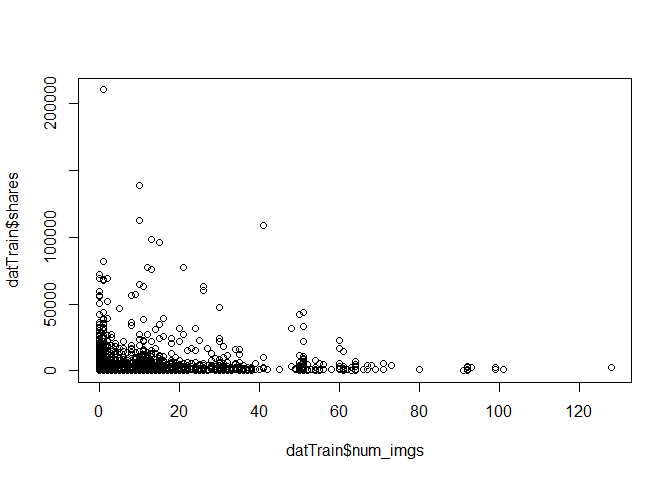
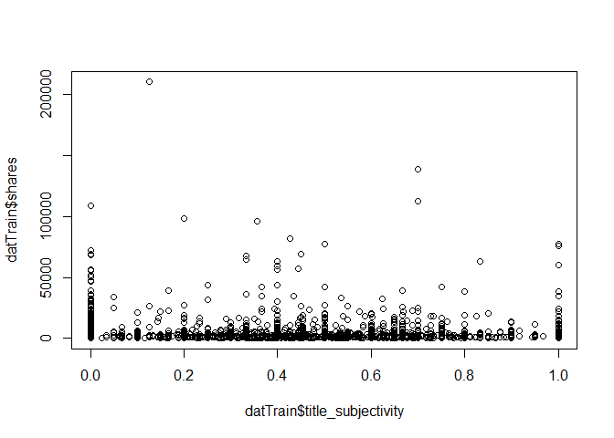
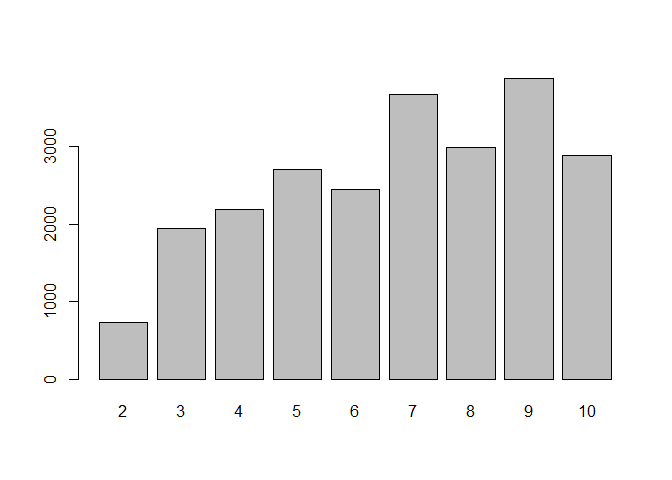
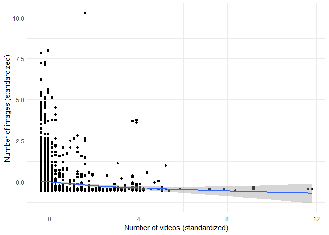
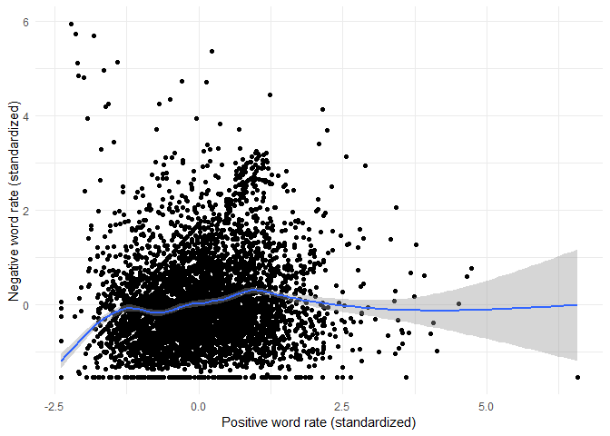
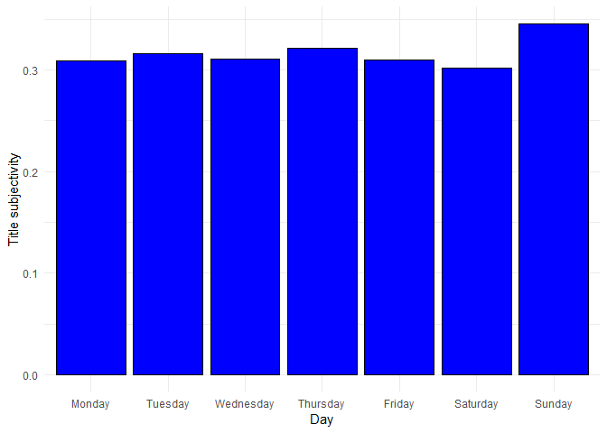
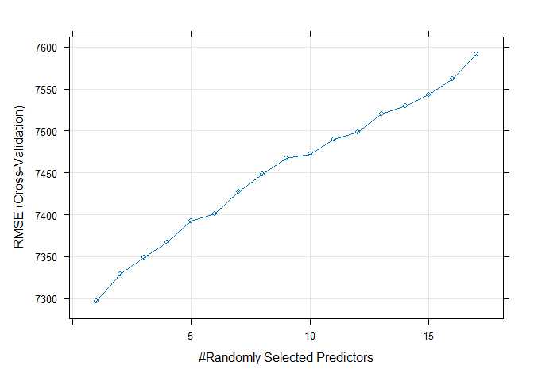
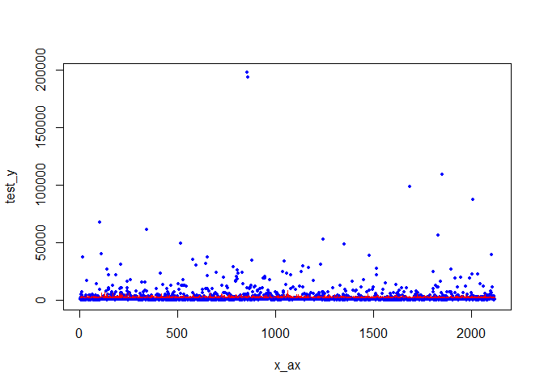
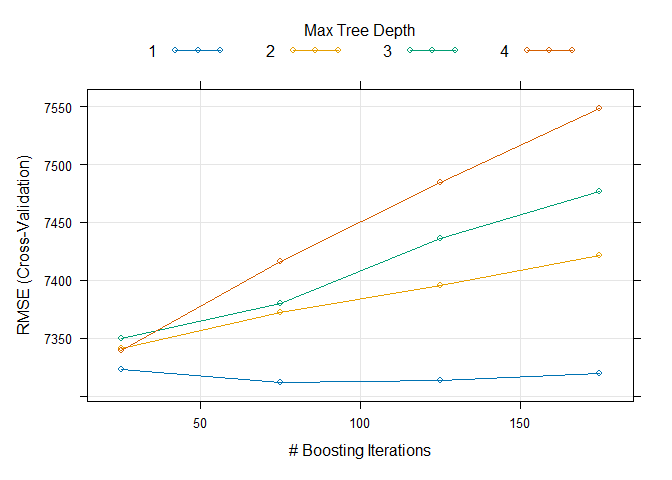
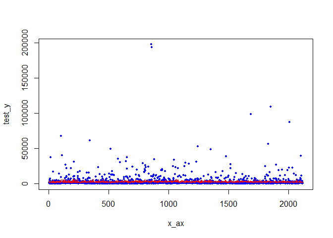

Project 2
================
Grace Holliday and Damon D’Ambrosio
2023-07-03

# Data Channel: **data_channel_is_entertainment**

# Introduction

The goal/purpose of this project is to explore the factors influencing
the amount of shares (popularity) of articles published by Mashable in a
period of two years.

The data includes 39,644 observations of 61 total variables. For our
exploration, we will use variables num_imgs, num_videos, num_keywords,
weekday_is variables (including is_weekend), global_subjectivity (Text
subjectivity),global_sentiment_polarity (Text sentiment polarity),
global_rate_positive_words (Rate of positive words in the content),
global_rate_negative_words (Rate of negative words in the content),
title_subjectivity, and title_polarity, to explore the target variable
(shares).

The methods we will use to model the response include:  
- Linear Regression  
- Random Forest  
- Boosted Tree

# Data

``` r
dat <- read_csv("OnlineNewsPopularity.csv")
```

    ## Rows: 39644 Columns: 61
    ## ── Column specification ───────────────────────────────────────────────────────────────────────
    ## Delimiter: ","
    ## chr  (1): url
    ## dbl (60): timedelta, n_tokens_title, n_tokens_content, n_unique_tokens, n_non_stop_words, n...
    ## 
    ## ℹ Use `spec()` to retrieve the full column specification for this data.
    ## ℹ Specify the column types or set `show_col_types = FALSE` to quiet this message.

``` r
# Subset data to variables we want
dat <- dat[,-c(1:9,12,20:31,39:44, 49:55,58,59)]

# Subsetting to correct channel(s)
col <- params[[1]][1]
if(col=="data_channel_is_lifestyle")
{
  dattype <- subset(dat,data_channel_is_lifestyle==1)
} else if(col=="data_channel_is_entertainment")
{
  dattype <- subset(dat,data_channel_is_entertainment==1)
} else if(col=="data_channel_is_bus")
{
  dattype <- subset(dat,data_channel_is_bus==1)
} else if(col=="data_channel_is_socmed")
{
  dattype <- subset(dat,data_channel_is_socmed==1)
} else if(col=="data_channel_is_tech")
{
  dattype <- subset(dat,data_channel_is_tech==1)
} else if(col=="data_channel_is_world")
{
  dattype <- subset(dat,data_channel_is_world==1)
}

# Removing data channel columns
dattype <- dattype[,-c(4:9)]
```

# Summarizations

First, we will produce basic summary statistics and plots about the
training data. To do this, we first need to divide the data into a
training and test set.

``` r
# First, establishing every categorical variable as a character
# so can change the factor
dattype$weekday_is_monday <- as.character(dattype$weekday_is_monday)
dattype$weekday_is_tuesday <- as.character(dattype$weekday_is_tuesday)
dattype$weekday_is_wednesday <- as.character(dattype$weekday_is_wednesday)
dattype$weekday_is_thursday <- as.character(dattype$weekday_is_thursday)
dattype$weekday_is_friday <- as.character(dattype$weekday_is_friday)
dattype$weekday_is_saturday <- as.character(dattype$weekday_is_saturday)
dattype$weekday_is_sunday <- as.character(dattype$weekday_is_sunday)

# Creating single variable for day 1 = Monday 2 = Tuesday 3 = Wednesday
# 4 = Thursday 5 = Friday 6 = Saturday 7 = Sunday 0 if no day, also
# making these a factor and not 0 and 1 for ensemble models

for(i in 1:nrow(dattype))
{
  if(dattype[i,4]==1)
  {
    dattype[i,19] <- 'Monday'
    dattype[i,4] <- 'Y'
    dattype[i,5] <- 'N'
    dattype[i,6] <- 'N'
    dattype[i,7] <- 'N'
    dattype[i,8] <- 'N'
    dattype[i,9] <- 'N' 
    dattype[i,10] <- 'N'
  }
  else if (dattype[i,5]==1)
  {
    dattype[i,19] <- 'Tuesday'
    dattype[i,4] <- 'N'
    dattype[i,5] <- 'Y'
    dattype[i,6] <- 'N'
    dattype[i,7] <- 'N'
    dattype[i,8] <- 'N'
    dattype[i,9] <- 'N' 
    dattype[i,10] <- 'N'
  }
  else if (dattype[i,6]==1)
  {
    dattype[i,19] <- 'Wednesday'
    dattype[i,6] <- 'Y'
    dattype[i,4] <- 'N'
    dattype[i,5] <- 'N'
    dattype[i,7] <- 'N'
    dattype[i,8] <- 'N'
    dattype[i,9] <- 'N' 
    dattype[i,10] <- 'N'
  }
  else if (dattype[i,7]==1)
  {
    dattype[i,19] <- 'Thursday'
    dattype[i,6] <- 'N'
    dattype[i,4] <- 'N'
    dattype[i,5] <- 'N'
    dattype[i,7] <- 'Y'
    dattype[i,8] <- 'N'
    dattype[i,9] <- 'N' 
    dattype[i,10] <- 'N'
    }
  else if (dattype[i,8]==1)
  {
    dattype[i,19] <- 'Friday'
    dattype[i,6] <- 'N'
    dattype[i,4] <- 'N'
    dattype[i,5] <- 'N'
    dattype[i,7] <- 'N'
    dattype[i,8] <- 'Y'
    dattype[i,9] <- 'N' 
    dattype[i,10] <- 'N'
  }
  else if (dattype[i,9]==1)
  {
    dattype[i,19] <- 'Saturday'
    dattype[i,6] <- 'N'
    dattype[i,4] <- 'N'
    dattype[i,5] <- 'N'
    dattype[i,7] <- 'N'
    dattype[i,8] <- 'N'
    dattype[i,9] <- 'Y' 
    dattype[i,10] <- 'N'
  }
  else if (dattype[i,10]==1)
  {
    dattype[i,19] <- 'Sunday'
    dattype[i,6] <- 'N'
    dattype[i,4] <- 'N'
    dattype[i,5] <- 'N'
    dattype[i,7] <- 'N'
    dattype[i,8] <- 'N'
    dattype[i,9] <- 'N' 
    dattype[i,10] <- 'Y'
  }
  else
  {
    dattype[i,19] <- 'NA'
  }
}

colnames(dattype)[19] <- 'day'

# and back to a factor
dattype$weekday_is_monday <- as.factor(dattype$weekday_is_monday)
dattype$weekday_is_tuesday <- as.factor(dattype$weekday_is_tuesday)
dattype$weekday_is_wednesday <- as.factor(dattype$weekday_is_wednesday)
dattype$weekday_is_thursday <- as.factor(dattype$weekday_is_thursday)
dattype$weekday_is_friday <- as.factor(dattype$weekday_is_friday)
dattype$weekday_is_saturday <- as.factor(dattype$weekday_is_saturday)
dattype$weekday_is_sunday <- as.factor(dattype$weekday_is_sunday)
dattype$day <- as.factor(dattype$day)

# Setting order of new factor levels
dattype$day <- factor(dattype$day, levels =c('Monday', 'Tuesday', 'Wednesday',
                                  'Thursday', 'Friday', 'Saturday', 'Sunday'))

# First setting seed for reproducibility.
set.seed(1234)

# Divide data into training and test set.
train <- sample(1:nrow(dattype), size = nrow(dattype)*.70)
test <- setdiff(1:nrow(dattype), train)

# training and testing subsets
datTrain <- dattype[train, ]
datTest <- dattype[test, ]
```

## Summary Statistics

Now, we will conduct exploratory data analysis through creation of basic
summary statistics and graphs exploring variables of interest to our
response (shares) before we select variables for potential models.

### Mean Shares by Day

``` r
datTrain %>%
  group_by(day) %>%
  summarise_at(vars(shares), list(name = mean))
```

    ## # A tibble: 7 × 2
    ##   day        name
    ##   <fct>     <dbl>
    ## 1 Monday    3008.
    ## 2 Tuesday   2674.
    ## 3 Wednesday 2846.
    ## 4 Thursday  2502.
    ## 5 Friday    3162.
    ## 6 Saturday  3765.
    ## 7 Sunday    3718.

This summary reveals the average number of shares by day of the week
(Days 1-7, Mon-Sun). The highest average represents the day with the
most shares. A day of 0 means no day was specified.

### Total Multimedia (Images and Videos) by Day

``` r
datTrain %>% group_by(day) %>%
  mutate(total.media = num_imgs + num_videos) %>%
    group_by(day) %>%
      summarize(average = mean(total.media), median = median(total.media), 
                min = min(total.media), max = max(total.media),
                sd =   sd(total.media))
```

    ## # A tibble: 7 × 6
    ##   day       average median   min   max    sd
    ##   <fct>       <dbl>  <dbl> <dbl> <dbl> <dbl>
    ## 1 Monday       8.32    2       0    94  12.1
    ## 2 Tuesday      9.51    3       0    99  13.0
    ## 3 Wednesday    8.43    2       0    92  11.9
    ## 4 Thursday     8.95    3       0    92  12.5
    ## 5 Friday       8.23    2       0    99  12.5
    ## 6 Saturday    10.2     5.5     0   103  14.4
    ## 7 Sunday      10.5     5       0   140  15.4

This summary provides the mean, median, minimum, maximum, and standard
deviation of the total multimedia objects (images + videos) appearing in
articles by day. Potential trends in this summary (e.g., if articles
published on certain day have more multimedia objects), may indicate
some type of collinearity between “day” and the “num_imgs” or
“num_videos” variables.

## Graphs

### Number of Images vs Shares

We can inspect the trend of shares as a function of the number of
images. If the points show an upward trend, then articles with more
images tend to be shared more often. If the points show a downward
trend, then articles with less images tend to be shared more often.

``` r
plot(datTrain$shares~datTrain$num_imgs)
```

<!-- -->

### Title Subjectivity vs Shares

We can inspect the trend of shares as a function of title subjectivity.
If the points show an upward trend, then articles with higher title
subjectivity tend to be shared more often. If the points show a downward
trend, then articles with lower title subjectivity tend to be shared
more often.

``` r
plot(datTrain$shares~datTrain$title_subjectivity)
```

<!-- -->

### Average Number of Keywords vs Shares

We can inspect the trend of shares as a function of number of keywords.
If the bars show an upward trend, then articles with more keywords tend
to be shared more often. If the bars show a downward trend, then
articles with less keywords tend to be shared more often.

``` r
datTrain$num_keywords <- as.factor(datTrain$num_keywords)
means <- datTrain %>%
  group_by(num_keywords) %>%
  summarise_at(vars(shares), list(name = mean))
barplot(height=means$name, names=means$num_keywords)
```

<!-- -->

``` r
# back to numeric for later models
datTrain$num_keywords <- as.numeric(datTrain$num_keywords)
```

### Images vs Videos

We can inspect possible relationships between the number of images and
videos in an article. If some type of relationship is evident (e.g.,
articles with more images tend to have more videos), it may suggest some
collinearity between these two variables.

``` r
g <- ggplot(datTrain, aes(x = scale(num_videos), y = scale(num_imgs)))

g + geom_point() + 
    xlab("Number of videos (standardized)") + 
    ylab("Number of images (standardized)") + 
    geom_smooth() + 
    theme_minimal()
```

<!-- -->

### Positive vs negative word rates

We can inspect the relationship between positive and negative word rates
in articles. If some type of relationship is evident (e.g., articles
with higher positive word rates tend to have lower negative word rates),
it may suggest some collinearity between these two variables.

``` r
g <- ggplot(datTrain, aes(x = scale(global_rate_positive_words), y = scale(global_rate_negative_words)))

g + geom_point() + 
    xlab("Positive word rate (standardized)") + 
    ylab("Negative word rate (standardized)") + 
    geom_smooth() + 
    theme_minimal()
```

<!-- -->

### Title subjectivity by day of week

We can inspect the relationship between title subjectivity and the day
of the week to see if certain days tend to have more/less subjective
article titles.

``` r
g <- ggplot(datTrain, aes(x = day, y = title_subjectivity))

g + geom_bar(stat = "summary", fun = "mean", color = "black", fill = "blue") + 
    xlab("Day") + ylab("Title subjectivity") +
    theme_minimal()
```

<!-- -->

# Modeling

Linear regression is an analysis method wherein the values of a variable
(i.e., response variable) is predicted based upon the value of one more
more other variables (i.e., predictor variables). There is an underlying
assumption that there is a linear relationship between the response
variable and any given predictor. The slope of this line is determined
mathematically by minimizing the sum of the squared residuals.

## Linear Models

This first model will explore the impact of images as combined with
number of key words, title subjectivity, sentiment polarity, and
positive word rate.

``` r
#Train model
mod2 <- train(shares ~ num_imgs+num_keywords+title_subjectivity+
                global_subjectivity+global_sentiment_polarity +
                global_rate_positive_words,
              data = datTrain,
              method = "lm",
              preProcess = c("center", "scale"), 
              trControl = trainControl(method = "cv", number = 5))

summary(mod2)
```

    ## 
    ## Call:
    ## lm(formula = .outcome ~ ., data = dat)
    ## 
    ## Residuals:
    ##    Min     1Q Median     3Q    Max 
    ##  -5093  -2142  -1597   -686 206896 
    ## 
    ## Coefficients:
    ##                            Estimate Std. Error t value Pr(>|t|)    
    ## (Intercept)                 2949.39     106.06  27.808  < 2e-16 ***
    ## num_imgs                     253.00     107.62   2.351  0.01877 *  
    ## num_keywords                 301.01     106.96   2.814  0.00491 ** 
    ## title_subjectivity           128.62     107.27   1.199  0.23060    
    ## global_subjectivity          383.16     119.10   3.217  0.00130 ** 
    ## global_sentiment_polarity     44.11     121.28   0.364  0.71606    
    ## global_rate_positive_words  -298.95     133.69  -2.236  0.02538 *  
    ## ---
    ## Signif. codes:  0 '***' 0.001 '**' 0.01 '*' 0.05 '.' 0.1 ' ' 1
    ## 
    ## Residual standard error: 7454 on 4932 degrees of freedom
    ## Multiple R-squared:  0.005742,   Adjusted R-squared:  0.004533 
    ## F-statistic: 4.747 on 6 and 4932 DF,  p-value: 7.849e-05

``` r
#Run on test data
mod2.predict <- predict(mod2, newdata = datTest)

#Obtain RMSE from test set, which will be used in automated comparison
mod2.compare <- postResample(mod2.predict, obs = datTest$shares)
```

The second model explores the impact of videos instead of images.
Keywords are retained as a variable. Instead of exploring subjectivity
and postive word rates, this model explores the “negative” (i.e., global
rate of negative words and maximum polarity of negative words). It also
includes an interaction between the number of videos and number of
keywords.

``` r
#Train model
mod3 <- train(shares ~ num_videos + num_keywords + num_videos:num_keywords + global_rate_negative_words + max_negative_polarity,
              data = datTrain,
              method = "lm",
              preProcess = c("center", "scale"), 
              trControl = trainControl(method = "cv", number = 5))

#Run on test data
mod3.predict <- predict(mod3, newdata = datTest)

#Obtain RMSE from test set, which will be used in automated comparison
mod3.compare <- postResample(mod3.predict, obs = datTest$shares)
```

## Ensemble Models

To streamline model fitting, we will first remove the previously created
“day” variable.

``` r
# this is regression, not classification
#removing previously created day variable for boosted tree model
datTrain <- datTrain[,-19]
datTest <- datTest[,-19]
```

Now to fit the ensemble models.

### Random Forest Model

Random forests are similar to bagging in the sense that multiple trees
(i.e., a “forest”) are created from bootstrap samples of data, with the
outcome of these trees averaged to form a conclusion. Unlike bagging,
not all possible predictors are used in each tree when using a random
forest- only a random subset is used for each tree. This in turn makes
the trees less correlated with one another, which allows for a greater
reduction in variation once the outcomes of all trees are averaged.

Below is a random forest model to predict shares:

``` r
#Create model
random.forest.fit <- train(shares ~ ., data = datTrain,
                           method = "rf",
                           preProcess = c("center", "scale"),
                           trControl = trainControl(method = "cv", number = 5),
                           tuneGrid = data.frame(mtry = 1:17))

# plot fit
plot(random.forest.fit)
```

<!-- -->

``` r
random.forest.fit$finalModel
```

    ## 
    ## Call:
    ##  randomForest(x = x, y = y, mtry = param$mtry) 
    ##                Type of random forest: regression
    ##                      Number of trees: 500
    ## No. of variables tried at each split: 1
    ## 
    ##           Mean of squared residuals: 55412619
    ##                     % Var explained: 0.7

``` r
# test fit
test_x = datTest[, -18] 
test_y = datTest[, 18] 
pred_y = predict(random.forest.fit, test_x)
x_ax = 1:length(pred_y)
x_ax <- as.numeric(x_ax)
test_y <- test_y$shares 
test_y <- as.integer(test_y)
pred_y <- as.integer(pred_y)
plot(x_ax, test_y, col="blue", pch=20, cex=.9)
lines(x_ax, pred_y, col="red", pch=20, cex=.9)
```

<!-- -->

``` r
#Run on test data
random.forest.predict <- predict(random.forest.fit, newdata = datTest)

#Obtain RMSE from test set, which will be used in automated comparison
random.forest.compare <- postResample(random.forest.predict, 
                                      obs = datTest$shares)
```

Here, the red lines are the predicted values for each observation. If
the red lines are close to following the blue dots (which are
representative of the actual value for each observation), then the model
is closely predicting.

### Boosted Tree Model

Boosting is a general approach that can be applied to trees and allows
for the slow training of trees. The trees are grown sequentially with
each subsequent tree being grown on a modified version of the original
data. The predictions are then updated as the trees are grown, and new
trees are grown by considering the errors in the trees previously
created. Lambda represents a shrinkage parameter than slows the fitting
process.

Below is a boosted tree model to predict shares.

``` r
boostFit <- train(shares~., data=datTrain, method="gbm",
                      preProcess=c("center","scale"),
                      trControl=trainControl(method='cv',number=5),
                      tuneGrid = expand.grid(n.trees=seq(25,200,50),
                                             interaction.depth=seq(1,4,1),
                                             shrinkage=0.1,
                                             n.minobsinnode=10))
```

    ## Iter   TrainDeviance   ValidDeviance   StepSize   Improve
    ##      1 61119750.2954             nan     0.1000 19262.1439
    ##      2 61056404.1915             nan     0.1000 48207.5755
    ##      3 61012546.6338             nan     0.1000 14281.0481
    ##      4 60935517.5243             nan     0.1000 61606.0525
    ##      5 60883347.8191             nan     0.1000 32642.6998
    ##      6 60841417.3870             nan     0.1000 23705.9864
    ##      7 60790237.7702             nan     0.1000 -58220.7673
    ##      8 60737132.6926             nan     0.1000 53975.0134
    ##      9 60682448.9677             nan     0.1000 35568.5688
    ##     10 60628103.2829             nan     0.1000 34151.7845
    ##     20 60304947.4668             nan     0.1000 5367.2367
    ##     40 60014955.2367             nan     0.1000 -9886.5716
    ##     60 59749798.8474             nan     0.1000 -3970.8335
    ##     80 59534101.3450             nan     0.1000 -6083.4802
    ##    100 59372991.3701             nan     0.1000 -40425.0819
    ##    120 59205589.4258             nan     0.1000 -16619.8983
    ##    140 59040969.8244             nan     0.1000 -16620.1240
    ##    160 58928128.9696             nan     0.1000 -19452.3545
    ##    175 58789539.0919             nan     0.1000 -31512.1582
    ## 
    ## Iter   TrainDeviance   ValidDeviance   StepSize   Improve
    ##      1 61062026.2185             nan     0.1000 -68862.8568
    ##      2 60894412.5909             nan     0.1000 47263.5923
    ##      3 60714875.2578             nan     0.1000 -81084.8872
    ##      4 60632161.8007             nan     0.1000 33054.8484
    ##      5 60502062.0819             nan     0.1000 -41052.9255
    ##      6 60389002.3771             nan     0.1000 7218.7193
    ##      7 60315920.8141             nan     0.1000 -23853.0613
    ##      8 60148242.2288             nan     0.1000 -35521.6253
    ##      9 60051365.4892             nan     0.1000 -53427.9174
    ##     10 59983814.3402             nan     0.1000 -36829.3972
    ##     20 59143351.2215             nan     0.1000 -21875.4038
    ##     40 58213848.6130             nan     0.1000 -25007.9102
    ##     60 57208316.4614             nan     0.1000 -40176.6180
    ##     80 56208514.0199             nan     0.1000 -12590.6660
    ##    100 55471829.6665             nan     0.1000 -18244.2464
    ##    120 55050775.5028             nan     0.1000 -44925.9237
    ##    140 54594316.9822             nan     0.1000 -47231.3572
    ##    160 54181531.2473             nan     0.1000 -66885.5802
    ##    175 53829941.5058             nan     0.1000 -55387.6386
    ## 
    ## Iter   TrainDeviance   ValidDeviance   StepSize   Improve
    ##      1 61012571.1807             nan     0.1000 22382.8165
    ##      2 60806440.1329             nan     0.1000 64870.0039
    ##      3 60689300.9598             nan     0.1000 6124.9978
    ##      4 60465411.9578             nan     0.1000 -41473.6272
    ##      5 60277895.9802             nan     0.1000 -22007.0707
    ##      6 60104690.5854             nan     0.1000 -41368.1648
    ##      7 59907585.4689             nan     0.1000 -64018.6057
    ##      8 59716898.9940             nan     0.1000 -8059.5482
    ##      9 59524171.0880             nan     0.1000 20782.7929
    ##     10 59356419.5505             nan     0.1000 72742.5037
    ##     20 57928936.2279             nan     0.1000 -48194.1246
    ##     40 55350885.6277             nan     0.1000 -13754.5678
    ##     60 53664324.7458             nan     0.1000 -85919.3829
    ##     80 52412179.9827             nan     0.1000 -81363.8292
    ##    100 51317931.2258             nan     0.1000 -53637.1621
    ##    120 49933782.4341             nan     0.1000 -44125.0159
    ##    140 48967383.3110             nan     0.1000 -18488.6757
    ##    160 48253931.5589             nan     0.1000 -94029.0204
    ##    175 47531448.6477             nan     0.1000 -34761.7934
    ## 
    ## Iter   TrainDeviance   ValidDeviance   StepSize   Improve
    ##      1 60937623.3954             nan     0.1000 90706.1885
    ##      2 60575995.8119             nan     0.1000 106293.5730
    ##      3 60321430.7548             nan     0.1000 -44594.4713
    ##      4 60190276.4802             nan     0.1000 -66048.7309
    ##      5 59868688.4554             nan     0.1000 -1449.5320
    ##      6 59663803.8882             nan     0.1000 -6123.2820
    ##      7 59609152.3540             nan     0.1000 -34863.1433
    ##      8 59415936.6132             nan     0.1000 -28856.9462
    ##      9 59256312.7837             nan     0.1000 4244.3873
    ##     10 59007396.0334             nan     0.1000 -73560.0036
    ##     20 57108719.9495             nan     0.1000 -11403.6170
    ##     40 54826745.6949             nan     0.1000 12249.5763
    ##     60 52773223.3083             nan     0.1000 -47553.0556
    ##     80 50703665.2163             nan     0.1000 -59269.3278
    ##    100 48909750.1512             nan     0.1000 -4662.7687
    ##    120 47638243.3308             nan     0.1000 -74392.1954
    ##    140 46174124.6192             nan     0.1000 -122715.2602
    ##    160 45206836.3943             nan     0.1000 -47940.1602
    ##    175 44557982.9772             nan     0.1000 -59631.4718
    ## 
    ## Iter   TrainDeviance   ValidDeviance   StepSize   Improve
    ##      1 52626259.2177             nan     0.1000 37640.7493
    ##      2 52542953.9394             nan     0.1000 25262.4208
    ##      3 52505010.7778             nan     0.1000 11904.0527
    ##      4 52452681.7188             nan     0.1000 15863.5969
    ##      5 52397358.6807             nan     0.1000 4099.7546
    ##      6 52367954.0193             nan     0.1000 11640.1979
    ##      7 52320653.0232             nan     0.1000 -9631.3687
    ##      8 52281980.1306             nan     0.1000 2398.7016
    ##      9 52259045.4669             nan     0.1000 -40739.4506
    ##     10 52219409.9929             nan     0.1000 17242.9125
    ##     20 51999715.5208             nan     0.1000 -2611.9896
    ##     40 51676350.1059             nan     0.1000 -18529.0884
    ##     60 51441076.9829             nan     0.1000 -32226.2196
    ##     80 51270989.0225             nan     0.1000 -9216.5295
    ##    100 51089620.9038             nan     0.1000 -11031.7511
    ##    120 50968753.9907             nan     0.1000 -24449.3805
    ##    140 50826200.7503             nan     0.1000 -24746.5646
    ##    160 50698747.7030             nan     0.1000 -23569.5282
    ##    175 50596089.4533             nan     0.1000 -25943.8738
    ## 
    ## Iter   TrainDeviance   ValidDeviance   StepSize   Improve
    ##      1 52592575.3332             nan     0.1000 -6775.3250
    ##      2 52496988.1350             nan     0.1000 -37378.0328
    ##      3 52449227.8005             nan     0.1000 16664.8409
    ##      4 52394393.2339             nan     0.1000 1877.5986
    ##      5 52296754.7925             nan     0.1000 -8005.4904
    ##      6 52199350.3971             nan     0.1000 -16601.5456
    ##      7 52015224.4597             nan     0.1000 -74151.1697
    ##      8 51919690.8130             nan     0.1000 4967.5230
    ##      9 51795324.0800             nan     0.1000 -87576.1736
    ##     10 51729170.2236             nan     0.1000 1572.4995
    ##     20 50981043.2602             nan     0.1000 -42377.1830
    ##     40 49906712.4536             nan     0.1000 -9076.4193
    ##     60 48955194.5258             nan     0.1000 -41920.3300
    ##     80 48337133.7567             nan     0.1000 -36139.2810
    ##    100 47752664.0688             nan     0.1000 -42455.4949
    ##    120 47301107.4947             nan     0.1000 -52820.9156
    ##    140 46633527.7353             nan     0.1000 -78870.5766
    ##    160 46283920.7978             nan     0.1000 -59229.2817
    ##    175 45916106.5684             nan     0.1000 -8726.5091
    ## 
    ## Iter   TrainDeviance   ValidDeviance   StepSize   Improve
    ##      1 52459059.6052             nan     0.1000  738.1189
    ##      2 52076241.4583             nan     0.1000 113135.5118
    ##      3 51947299.0753             nan     0.1000 -45892.9610
    ##      4 51648511.4864             nan     0.1000 10440.9166
    ##      5 51512198.3557             nan     0.1000 25381.1172
    ##      6 51396789.6526             nan     0.1000 61856.8950
    ##      7 51122897.2588             nan     0.1000 164944.6059
    ##      8 50995603.6626             nan     0.1000 -22394.9964
    ##      9 50870363.2256             nan     0.1000 -51694.5522
    ##     10 50665295.8038             nan     0.1000 -54233.5681
    ##     20 49197552.8927             nan     0.1000 -31717.1265
    ##     40 47530660.7217             nan     0.1000 -58240.8754
    ##     60 46058934.3418             nan     0.1000 -37824.6614
    ##     80 44524013.4326             nan     0.1000 -37346.1409
    ##    100 43679002.0034             nan     0.1000 -79070.1774
    ##    120 42464747.4316             nan     0.1000 -160241.5155
    ##    140 41831537.3752             nan     0.1000 -138627.4406
    ##    160 40645534.1403             nan     0.1000 -100465.3345
    ##    175 40211257.6772             nan     0.1000 -57869.3058
    ## 
    ## Iter   TrainDeviance   ValidDeviance   StepSize   Improve
    ##      1 52470826.6029             nan     0.1000 32066.8715
    ##      2 52189692.1445             nan     0.1000 -20474.7508
    ##      3 52053986.2743             nan     0.1000 26706.9459
    ##      4 51885406.4341             nan     0.1000 -70131.8658
    ##      5 51696977.3459             nan     0.1000 -76799.9386
    ##      6 51460530.8445             nan     0.1000 54160.6099
    ##      7 51329232.3105             nan     0.1000 -105398.8122
    ##      8 51212506.6100             nan     0.1000 -131559.3939
    ##      9 50878422.9668             nan     0.1000 -261192.8393
    ##     10 50657267.3265             nan     0.1000 48656.5195
    ##     20 48836867.5752             nan     0.1000 -51865.6377
    ##     40 46495950.8225             nan     0.1000 -81361.6033
    ##     60 43838216.5855             nan     0.1000 -142145.1657
    ##     80 42346462.6268             nan     0.1000 -6728.2296
    ##    100 40908015.2908             nan     0.1000 -44296.6841
    ##    120 39809353.0522             nan     0.1000 -29834.7303
    ##    140 38865071.9013             nan     0.1000 -15487.0177
    ##    160 37927466.0975             nan     0.1000 -97096.2405
    ##    175 36931517.8344             nan     0.1000 -19863.8253
    ## 
    ## Iter   TrainDeviance   ValidDeviance   StepSize   Improve
    ##      1 57361397.2271             nan     0.1000 36387.8932
    ##      2 57301403.2819             nan     0.1000 -7989.8590
    ##      3 57254913.1161             nan     0.1000 30399.7893
    ##      4 57208710.7941             nan     0.1000 22907.4695
    ##      5 57150725.7232             nan     0.1000 -5669.1944
    ##      6 57103466.8481             nan     0.1000 33116.0864
    ##      7 57059635.8750             nan     0.1000  375.9869
    ##      8 57040987.1530             nan     0.1000 -14682.0354
    ##      9 57013781.9141             nan     0.1000 -14981.0537
    ##     10 56995247.5666             nan     0.1000 -23174.5606
    ##     20 56700571.1981             nan     0.1000 -7644.5844
    ##     40 56414038.1696             nan     0.1000 -17886.2166
    ##     60 56222867.0496             nan     0.1000 -28510.2293
    ##     80 56038616.1079             nan     0.1000 -12048.1719
    ##    100 55857034.8396             nan     0.1000 -25791.8316
    ##    120 55737873.2054             nan     0.1000 -42120.7908
    ##    140 55574401.2694             nan     0.1000 -36677.3029
    ##    160 55438703.6575             nan     0.1000 -18994.9721
    ##    175 55362793.5468             nan     0.1000 -11423.0744
    ## 
    ## Iter   TrainDeviance   ValidDeviance   StepSize   Improve
    ##      1 57339486.7390             nan     0.1000 -6913.6110
    ##      2 57189879.5246             nan     0.1000 92263.3501
    ##      3 57020704.2397             nan     0.1000 -28216.7751
    ##      4 56923321.8440             nan     0.1000 52722.7254
    ##      5 56829808.9303             nan     0.1000 -15523.0228
    ##      6 56731384.9028             nan     0.1000 3816.4716
    ##      7 56606442.4495             nan     0.1000 -48188.3570
    ##      8 56564405.9980             nan     0.1000 2297.6305
    ##      9 56536910.5782             nan     0.1000 -2404.0632
    ##     10 56501778.3028             nan     0.1000 -3681.0666
    ##     20 55782793.9865             nan     0.1000 -52136.4724
    ##     40 54576411.8608             nan     0.1000 -67939.6063
    ##     60 53596403.7883             nan     0.1000 -42370.0289
    ##     80 52774747.2749             nan     0.1000 -33767.7086
    ##    100 51979957.0406             nan     0.1000 -45560.5128
    ##    120 51239948.0798             nan     0.1000 -5360.6417
    ##    140 50656666.9429             nan     0.1000 -30800.7228
    ##    160 50126966.5085             nan     0.1000 -24198.7511
    ##    175 49746827.8100             nan     0.1000 -48594.9252
    ## 
    ## Iter   TrainDeviance   ValidDeviance   StepSize   Improve
    ##      1 57322563.6556             nan     0.1000 23002.7482
    ##      2 57210951.4975             nan     0.1000 -32751.5074
    ##      3 57088541.0418             nan     0.1000  766.1435
    ##      4 56832057.7555             nan     0.1000 -27097.6185
    ##      5 56736987.4244             nan     0.1000 63520.2357
    ##      6 56570502.4423             nan     0.1000 -3142.7270
    ##      7 56444124.6739             nan     0.1000 76272.1313
    ##      8 56332019.4080             nan     0.1000 -8354.6558
    ##      9 56263065.3405             nan     0.1000 -17522.8524
    ##     10 56136235.8209             nan     0.1000 13308.3494
    ##     20 54789997.8708             nan     0.1000 -28921.1307
    ##     40 52743128.6156             nan     0.1000 -47738.4221
    ##     60 51335214.7255             nan     0.1000 -65921.1636
    ##     80 49909785.1447             nan     0.1000 -67890.9115
    ##    100 48476691.2802             nan     0.1000 -42995.2323
    ##    120 47045949.3692             nan     0.1000 -45928.0597
    ##    140 46409064.2705             nan     0.1000 -47191.1013
    ##    160 45168372.3820             nan     0.1000 -35228.6858
    ##    175 44544596.7328             nan     0.1000 -29928.1339
    ## 
    ## Iter   TrainDeviance   ValidDeviance   StepSize   Improve
    ##      1 57181642.1393             nan     0.1000 86145.4265
    ##      2 56806125.9455             nan     0.1000 -58598.1747
    ##      3 56727138.7258             nan     0.1000  195.2918
    ##      4 56613967.3546             nan     0.1000 -25304.3590
    ##      5 56389445.8015             nan     0.1000 -6627.8938
    ##      6 56135466.4005             nan     0.1000 -56752.9165
    ##      7 55984622.8592             nan     0.1000 -20535.6223
    ##      8 55887905.0372             nan     0.1000 -27450.4816
    ##      9 55771939.9909             nan     0.1000 4370.5415
    ##     10 55460579.8038             nan     0.1000 91775.9296
    ##     20 54203221.2503             nan     0.1000 19811.2088
    ##     40 51708993.2118             nan     0.1000 -20043.1724
    ##     60 49629128.4176             nan     0.1000 -53120.5192
    ##     80 47617337.7143             nan     0.1000 -34062.8434
    ##    100 46048052.0874             nan     0.1000 -41178.7024
    ##    120 44412112.7587             nan     0.1000 -45095.9431
    ##    140 43172347.0544             nan     0.1000 -65383.4476
    ##    160 41812137.2686             nan     0.1000 -72374.2500
    ##    175 40888945.5898             nan     0.1000 -80018.1912
    ## 
    ## Iter   TrainDeviance   ValidDeviance   StepSize   Improve
    ##      1 60461256.4014             nan     0.1000 35548.9399
    ##      2 60402818.9208             nan     0.1000 48282.2115
    ##      3 60352354.0629             nan     0.1000 41082.0130
    ##      4 60312332.7845             nan     0.1000 28621.6938
    ##      5 60282168.4326             nan     0.1000 -5201.5759
    ##      6 60228215.2436             nan     0.1000 44652.4494
    ##      7 60184176.9035             nan     0.1000 -20350.4886
    ##      8 60158550.7731             nan     0.1000 3875.9610
    ##      9 60117846.6790             nan     0.1000 -23652.8437
    ##     10 60079002.3383             nan     0.1000 16732.5757
    ##     20 59737478.1717             nan     0.1000 -31556.0104
    ##     40 59293882.0143             nan     0.1000 -16733.8893
    ##     60 59128327.8877             nan     0.1000 -16743.4009
    ##     80 58936675.4790             nan     0.1000 -8878.5597
    ##    100 58796067.2136             nan     0.1000 -36165.1006
    ##    120 58634616.3499             nan     0.1000 -74363.2228
    ##    140 58461145.5846             nan     0.1000 -30369.0705
    ##    160 58329498.0573             nan     0.1000 -26092.5429
    ##    175 58251366.3112             nan     0.1000 -27644.2191
    ## 
    ## Iter   TrainDeviance   ValidDeviance   StepSize   Improve
    ##      1 60447347.3826             nan     0.1000  -45.9440
    ##      2 60329524.7350             nan     0.1000 59062.6667
    ##      3 60211367.9797             nan     0.1000 34240.0319
    ##      4 60111654.9443             nan     0.1000 62891.7921
    ##      5 59933858.4588             nan     0.1000 130026.9401
    ##      6 59732993.9922             nan     0.1000 49338.6845
    ##      7 59672397.2709             nan     0.1000 -31579.5365
    ##      8 59594635.1045             nan     0.1000 12988.5031
    ##      9 59469816.3969             nan     0.1000 -13741.1915
    ##     10 59362726.1676             nan     0.1000 -2188.1733
    ##     20 58564844.6948             nan     0.1000 -40504.7357
    ##     40 57655540.9333             nan     0.1000 -15211.2683
    ##     60 56820045.9516             nan     0.1000 -52802.9393
    ##     80 55759718.7087             nan     0.1000 -35229.0902
    ##    100 54576541.6088             nan     0.1000 -47279.0651
    ##    120 53889743.9348             nan     0.1000 -52337.4245
    ##    140 53329593.5857             nan     0.1000 -43738.2723
    ##    160 52666922.3928             nan     0.1000 -44503.5823
    ##    175 52279373.1363             nan     0.1000 -39907.0638
    ## 
    ## Iter   TrainDeviance   ValidDeviance   StepSize   Improve
    ##      1 60346876.6412             nan     0.1000 93075.4864
    ##      2 60052880.3803             nan     0.1000 -55912.1106
    ##      3 59911017.9764             nan     0.1000 41880.7251
    ##      4 59721063.0024             nan     0.1000 9456.8858
    ##      5 59552098.7082             nan     0.1000 -64280.8450
    ##      6 59404977.2067             nan     0.1000 -92359.7675
    ##      7 59242063.6299             nan     0.1000  223.4987
    ##      8 58965793.3090             nan     0.1000 76399.3960
    ##      9 58932761.8046             nan     0.1000 -71758.3282
    ##     10 58814627.4710             nan     0.1000 51052.2245
    ##     20 57399555.9160             nan     0.1000 16373.1512
    ##     40 55214995.6686             nan     0.1000 -24445.2496
    ##     60 53906434.0362             nan     0.1000 -12435.8031
    ##     80 52478810.7706             nan     0.1000 -49565.1060
    ##    100 51009034.0353             nan     0.1000 -6988.7531
    ##    120 50138044.4263             nan     0.1000 -43445.9683
    ##    140 48531900.0069             nan     0.1000 -47999.8475
    ##    160 47188827.2066             nan     0.1000 -9784.3984
    ##    175 46356677.0486             nan     0.1000 -40849.0996
    ## 
    ## Iter   TrainDeviance   ValidDeviance   StepSize   Improve
    ##      1 60098749.4958             nan     0.1000 6068.0736
    ##      2 59779100.8621             nan     0.1000 22038.4652
    ##      3 59541619.7181             nan     0.1000 98456.8892
    ##      4 59389876.7146             nan     0.1000 -1809.7707
    ##      5 58832944.6010             nan     0.1000 10794.2703
    ##      6 58714352.8175             nan     0.1000 -19172.1340
    ##      7 58545521.9448             nan     0.1000 -66524.1205
    ##      8 58217918.1727             nan     0.1000 42334.5990
    ##      9 58008395.0581             nan     0.1000 -46252.0786
    ##     10 57869987.1792             nan     0.1000 -19860.0135
    ##     20 56126612.9459             nan     0.1000 -40950.4526
    ##     40 52958881.1024             nan     0.1000 -61485.2886
    ##     60 50827690.4511             nan     0.1000 -72367.3126
    ##     80 48513535.8979             nan     0.1000 -86213.9699
    ##    100 46827384.0978             nan     0.1000 -32755.5201
    ##    120 45252573.0638             nan     0.1000 -139488.2955
    ##    140 43587052.1557             nan     0.1000 -17078.1650
    ##    160 42439320.3682             nan     0.1000 -21989.5396
    ##    175 41658987.0774             nan     0.1000 -52234.7913
    ## 
    ## Iter   TrainDeviance   ValidDeviance   StepSize   Improve
    ##      1 47180128.4023             nan     0.1000 -27225.6542
    ##      2 47144983.2397             nan     0.1000 -47623.8137
    ##      3 47037242.2947             nan     0.1000 -12424.7554
    ##      4 47015760.0722             nan     0.1000 -56223.8013
    ##      5 46970533.9704             nan     0.1000 -49094.7295
    ##      6 46942606.7360             nan     0.1000 -29063.9088
    ##      7 46895172.2278             nan     0.1000 -26743.5783
    ##      8 46838934.7608             nan     0.1000 46574.9559
    ##      9 46806379.2925             nan     0.1000 1167.4560
    ##     10 46749131.0846             nan     0.1000 19314.7318
    ##     20 46484297.8916             nan     0.1000 -49180.6336
    ##     40 46115638.4517             nan     0.1000 -36308.6227
    ##     60 45889664.1621             nan     0.1000 -69263.8439
    ##     80 45656121.0455             nan     0.1000 -10682.1137
    ##    100 45509948.0800             nan     0.1000 -7604.8339
    ##    120 45359343.2749             nan     0.1000 -63310.9367
    ##    140 45203097.3338             nan     0.1000 -42849.8641
    ##    160 45070744.4324             nan     0.1000 -10485.0674
    ##    175 44965550.2537             nan     0.1000 -19111.3254
    ## 
    ## Iter   TrainDeviance   ValidDeviance   StepSize   Improve
    ##      1 47137869.6937             nan     0.1000 36078.2152
    ##      2 46989743.8334             nan     0.1000 37937.0493
    ##      3 46939952.7721             nan     0.1000 6191.0755
    ##      4 46719699.4448             nan     0.1000 42896.7865
    ##      5 46655376.0694             nan     0.1000 -9678.4997
    ##      6 46561536.5026             nan     0.1000 43088.8016
    ##      7 46408815.4759             nan     0.1000 -83263.0719
    ##      8 46299651.0405             nan     0.1000 -18268.5482
    ##      9 46171846.3962             nan     0.1000 87530.4516
    ##     10 46107927.1385             nan     0.1000 -75569.5989
    ##     20 45435785.0714             nan     0.1000 -18806.3407
    ##     40 44422402.6132             nan     0.1000 -24611.6339
    ##     60 43820104.7059             nan     0.1000 -38013.5128
    ##     80 43049235.2761             nan     0.1000 -53695.8773
    ##    100 42495321.3024             nan     0.1000 -47920.3060
    ##    120 41771921.8842             nan     0.1000 -39147.2320
    ##    140 41330710.7123             nan     0.1000 -27683.8247
    ##    160 40728179.8477             nan     0.1000 4798.5465
    ##    175 40296437.2627             nan     0.1000 -23397.4045
    ## 
    ## Iter   TrainDeviance   ValidDeviance   StepSize   Improve
    ##      1 46888755.0979             nan     0.1000 108384.7278
    ##      2 46763857.5416             nan     0.1000 101332.5397
    ##      3 46580859.8610             nan     0.1000 -34520.5924
    ##      4 46436449.4829             nan     0.1000 7447.5805
    ##      5 46303767.0361             nan     0.1000 47670.9413
    ##      6 46158012.6148             nan     0.1000 -56035.6412
    ##      7 45989511.8305             nan     0.1000 66884.2529
    ##      8 45896377.9222             nan     0.1000 25787.3379
    ##      9 45768979.7781             nan     0.1000 -36822.3608
    ##     10 45519178.7319             nan     0.1000 -49428.0544
    ##     20 44381085.8992             nan     0.1000 -63171.8767
    ##     40 42871982.1867             nan     0.1000 -27983.3738
    ##     60 41274461.8918             nan     0.1000 -22614.9543
    ##     80 39986167.5378             nan     0.1000 -29986.5295
    ##    100 39118327.4084             nan     0.1000 -49939.3400
    ##    120 38444868.5919             nan     0.1000 -110763.3867
    ##    140 37425182.7699             nan     0.1000 -91503.9834
    ##    160 36762264.4666             nan     0.1000 -57940.6108
    ##    175 36163648.6886             nan     0.1000 -137910.6305
    ## 
    ## Iter   TrainDeviance   ValidDeviance   StepSize   Improve
    ##      1 46802031.1531             nan     0.1000 162050.4275
    ##      2 46578046.5715             nan     0.1000 -51814.2677
    ##      3 46395912.3538             nan     0.1000 9271.4846
    ##      4 46150332.8819             nan     0.1000 152821.6792
    ##      5 45976251.0412             nan     0.1000 16195.4903
    ##      6 45755241.6552             nan     0.1000 -84123.9695
    ##      7 45473379.7957             nan     0.1000 7069.3050
    ##      8 45274743.9595             nan     0.1000 103564.9291
    ##      9 45076774.2339             nan     0.1000 -16496.5423
    ##     10 44960985.3484             nan     0.1000 23586.1133
    ##     20 43478200.1154             nan     0.1000 -83953.4806
    ##     40 40778006.5798             nan     0.1000 -51340.7494
    ##     60 39255820.7459             nan     0.1000 -19871.1791
    ##     80 38098232.8447             nan     0.1000 -76566.3956
    ##    100 37064073.6179             nan     0.1000 -47435.5916
    ##    120 35770745.8183             nan     0.1000 -136226.3081
    ##    140 34735678.5925             nan     0.1000 -52897.1471
    ##    160 33798790.3083             nan     0.1000 -42535.2217
    ##    175 33028064.2533             nan     0.1000 -63776.6147
    ## 
    ## Iter   TrainDeviance   ValidDeviance   StepSize   Improve
    ##      1 55747694.4850             nan     0.1000 46831.7883
    ##      2 55693792.4325             nan     0.1000 20678.7607
    ##      3 55624567.7429             nan     0.1000 -15547.8539
    ##      4 55590461.2690             nan     0.1000 32021.4826
    ##      5 55571956.6150             nan     0.1000 -10815.7484
    ##      6 55528751.8332             nan     0.1000 10145.1079
    ##      7 55475853.5750             nan     0.1000 33273.5822
    ##      8 55459183.0186             nan     0.1000 -5178.7562
    ##      9 55378995.4741             nan     0.1000 -23824.7813
    ##     10 55346153.5760             nan     0.1000 2650.6277
    ##     20 55057045.1576             nan     0.1000 -25424.9876
    ##     40 54778321.7157             nan     0.1000 8406.4675
    ##     60 54581163.6222             nan     0.1000 -23888.2005
    ##     75 54448888.0887             nan     0.1000 -31444.8383

``` r
# plot fit
plot(boostFit)
```

<!-- -->

``` r
boostFit$finalModel
```

    ## A gradient boosted model with gaussian loss function.
    ## 75 iterations were performed.
    ## There were 17 predictors of which 12 had non-zero influence.

``` r
# test fit
test_x = datTest[, -18] 
test_y = datTest[, 18] 
pred_y = predict(boostFit, test_x)
x_ax = 1:length(pred_y)
x_ax <- as.numeric(x_ax)
test_y <- test_y$shares 
test_y <- as.integer(test_y)
pred_y <- as.integer(pred_y)
plot(x_ax, test_y, col="blue", pch=20, cex=.9)
lines(x_ax, pred_y, col="red", pch=20, cex=.9)
```

<!-- -->

``` r
#Run on test data
boostFit.predict <- predict(boostFit, newdata = datTest)

#Obtain RMSE from test set, which will be used in automated comparison
boostFit.compare <- postResample(boostFit.predict, obs = datTest$shares)
```

Here, the red lines are the predicted values for each observation. If
the red lines are close to following the blue dots (which are
representative of the actual value for each observation), then the model
is closely predicting.

## Comparison

Now, grab all the RMSEs obtained from fitting the 4 models on the test
set to determine the “winner.”

``` r
#Compile RMSEs from the 4 models
mod2.RMSE <- mod2.compare[1]
mod3.RMSE <- mod3.compare[1]
random.forest.RMSE <- random.forest.compare[1]
boostFit.RMSE <- boostFit.compare[1]

compare.all <- data.frame(
                    model = c("mod2", "mod3", "random.forest", "boostFit"),
                    RMSE = c(mod2.RMSE, mod3.RMSE, random.forest.RMSE, boostFit.RMSE)
)

winner <- compare.all %>% slice_min(order_by = RMSE)
```

The lowest RMSE obtained on the test set was **8644.2921364**, which
belongs to the **boostFit** model. Therefore, **boostFit** is the
winner!

The final standings of all 4 models can be seen below:

``` r
compare.all %>% arrange(RMSE) %>% mutate(Final.Rank = rank(RMSE))
```

    ##           model     RMSE Final.Rank
    ## 1      boostFit 8644.292          1
    ## 2 random.forest 8655.091          2
    ## 3          mod2 8661.622          3
    ## 4          mod3 8690.153          4

Automation Below is the code (also found in the file
render_w_automation.R) that is used to automate production of the six
data channel html documents. This is run in the command line and
produces the six separate reports.

``` r
channels <- c("data_channel_is_lifestyle","data_channel_is_entertainment",
    "data_channel_is_bus",
    "data_channel_is_socmed",
    "data_channel_is_tech",
    "data_channel_is_world")

for(i in 1:6)
{rmarkdown::render("project2.rmd",
                  output_format="github_document",
                  params=list(datachannel=channels[i]),
                  output_file = channels[i])
}
```
