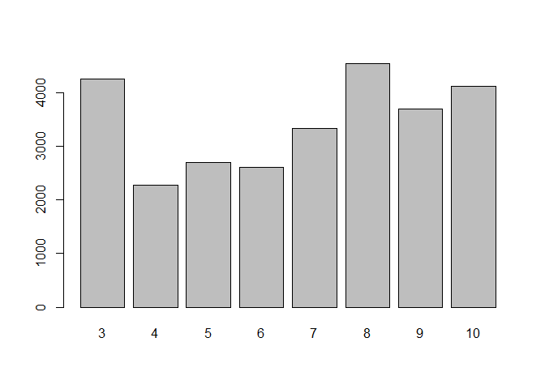

Project 2
================
Grace Holliday and Damon D’Ambrosio
2023-07-03

# Data Channel: **data_channel_is_lifestyle**

# Introduction

The goal/purpose of this project is to explore the factors influencing
the amount of shares (popularity) of articles published by Mashable in a
period of two years.

The data includes 39,644 observations of 61 total variables. For our
exploration, we will use variables num_imgs, num_videos, num_keywords,
weekday_is variables (including is_weekend), global_subjectivity (Text
subjectivity),global_sentiment_polarity (Text sentiment polarity),
global_rate_positive_words (Rate of positive words in the content),
global_rate_negative_words (Rate of negative words in the content),
title_subjectivity, and title_polarity, to explore the target variable
(shares).

The methods we will use to model the response include:  
- Linear Regression  
- Random Forest  
- Boosted Tree

# Data

``` r
dat <- read_csv("OnlineNewsPopularity.csv")
```

    ## Rows: 39644 Columns: 61
    ## ── Column specification ───────────────────────────────────────────────────────────────────────
    ## Delimiter: ","
    ## chr  (1): url
    ## dbl (60): timedelta, n_tokens_title, n_tokens_content, n_unique_tokens, n_non_stop_words, n...
    ## 
    ## ℹ Use `spec()` to retrieve the full column specification for this data.
    ## ℹ Specify the column types or set `show_col_types = FALSE` to quiet this message.

``` r
# Subset data to variables we want
dat <- dat[,-c(1:9,12,20:31,39:44, 49:55,58,59)]

# Subsetting to correct channel(s)
col <- params[[1]][1]
if(col=="data_channel_is_lifestyle")
{
  dattype <- subset(dat,data_channel_is_lifestyle==1)
} else if(col=="data_channel_is_entertainment")
{
  dattype <- subset(dat,data_channel_is_entertainment==1)
} else if(col=="data_channel_is_bus")
{
  dattype <- subset(dat,data_channel_is_bus==1)
} else if(col=="data_channel_is_socmed")
{
  dattype <- subset(dat,data_channel_is_socmed==1)
} else if(col=="data_channel_is_tech")
{
  dattype <- subset(dat,data_channel_is_tech==1)
} else if(col=="data_channel_is_world")
{
  dattype <- subset(dat,data_channel_is_world==1)
}

# Removing data channel columns
dattype <- dattype[,-c(4:9)]
```

# Summarizations

First, we will produce basic summary statistics and plots about the
training data. To do this, we first need to divide the data into a
training and test set.

``` r
# First, establishing every categorical variable as a character
# so can change the factor
dattype$weekday_is_monday <- as.character(dattype$weekday_is_monday)
dattype$weekday_is_tuesday <- as.character(dattype$weekday_is_tuesday)
dattype$weekday_is_wednesday <- as.character(dattype$weekday_is_wednesday)
dattype$weekday_is_thursday <- as.character(dattype$weekday_is_thursday)
dattype$weekday_is_friday <- as.character(dattype$weekday_is_friday)
dattype$weekday_is_saturday <- as.character(dattype$weekday_is_saturday)
dattype$weekday_is_sunday <- as.character(dattype$weekday_is_sunday)

# Creating single variable for day 1 = Monday 2 = Tuesday 3 = Wednesday
# 4 = Thursday 5 = Friday 6 = Saturday 7 = Sunday 0 if no day, also
# making these a factor and not 0 and 1 for ensemble models

for(i in 1:nrow(dattype))
{
  if(dattype[i,4]==1)
  {
    dattype[i,19] <- 'Monday'
    dattype[i,4] <- 'Y'
    dattype[i,5] <- 'N'
    dattype[i,6] <- 'N'
    dattype[i,7] <- 'N'
    dattype[i,8] <- 'N'
    dattype[i,9] <- 'N' 
    dattype[i,10] <- 'N'
  }
  else if (dattype[i,5]==1)
  {
    dattype[i,19] <- 'Tuesday'
    dattype[i,4] <- 'N'
    dattype[i,5] <- 'Y'
    dattype[i,6] <- 'N'
    dattype[i,7] <- 'N'
    dattype[i,8] <- 'N'
    dattype[i,9] <- 'N' 
    dattype[i,10] <- 'N'
  }
  else if (dattype[i,6]==1)
  {
    dattype[i,19] <- 'Wednesday'
    dattype[i,6] <- 'Y'
    dattype[i,4] <- 'N'
    dattype[i,5] <- 'N'
    dattype[i,7] <- 'N'
    dattype[i,8] <- 'N'
    dattype[i,9] <- 'N' 
    dattype[i,10] <- 'N'
  }
  else if (dattype[i,7]==1)
  {
    dattype[i,19] <- 'Thursday'
    dattype[i,6] <- 'N'
    dattype[i,4] <- 'N'
    dattype[i,5] <- 'N'
    dattype[i,7] <- 'Y'
    dattype[i,8] <- 'N'
    dattype[i,9] <- 'N' 
    dattype[i,10] <- 'N'
    }
  else if (dattype[i,8]==1)
  {
    dattype[i,19] <- 'Friday'
    dattype[i,6] <- 'N'
    dattype[i,4] <- 'N'
    dattype[i,5] <- 'N'
    dattype[i,7] <- 'N'
    dattype[i,8] <- 'Y'
    dattype[i,9] <- 'N' 
    dattype[i,10] <- 'N'
  }
  else if (dattype[i,9]==1)
  {
    dattype[i,19] <- 'Saturday'
    dattype[i,6] <- 'N'
    dattype[i,4] <- 'N'
    dattype[i,5] <- 'N'
    dattype[i,7] <- 'N'
    dattype[i,8] <- 'N'
    dattype[i,9] <- 'Y' 
    dattype[i,10] <- 'N'
  }
  else if (dattype[i,10]==1)
  {
    dattype[i,19] <- 'Sunday'
    dattype[i,6] <- 'N'
    dattype[i,4] <- 'N'
    dattype[i,5] <- 'N'
    dattype[i,7] <- 'N'
    dattype[i,8] <- 'N'
    dattype[i,9] <- 'N' 
    dattype[i,10] <- 'Y'
  }
  else
  {
    dattype[i,19] <- 'NA'
  }
}

colnames(dattype)[19] <- 'day'

# and back to a factor
dattype$weekday_is_monday <- as.factor(dattype$weekday_is_monday)
dattype$weekday_is_tuesday <- as.factor(dattype$weekday_is_tuesday)
dattype$weekday_is_wednesday <- as.factor(dattype$weekday_is_wednesday)
dattype$weekday_is_thursday <- as.factor(dattype$weekday_is_thursday)
dattype$weekday_is_friday <- as.factor(dattype$weekday_is_friday)
dattype$weekday_is_saturday <- as.factor(dattype$weekday_is_saturday)
dattype$weekday_is_sunday <- as.factor(dattype$weekday_is_sunday)
dattype$day <- as.factor(dattype$day)

# Setting order of new factor levels
dattype$day <- factor(dattype$day, levels =c('Monday', 'Tuesday', 'Wednesday',
                                  'Thursday', 'Friday', 'Saturday', 'Sunday'))

# First setting seed for reproducibility.
set.seed(1234)

# Divide data into training and test set.
train <- sample(1:nrow(dattype), size = nrow(dattype)*.70)
test <- setdiff(1:nrow(dattype), train)

# training and testing subsets
datTrain <- dattype[train, ]
datTest <- dattype[test, ]
```

## Summary Statistics

Now, we will conduct exploratory data analysis through creation of basic
summary statistics and graphs exploring variables of interest to our
response (shares) before we select variables for potential models.

### Mean Shares by Day

``` r
datTrain %>%
  group_by(day) %>%
  summarise_at(vars(shares), list(name = mean))
```

    ## # A tibble: 7 × 2
    ##   day        name
    ##   <fct>     <dbl>
    ## 1 Monday    4778.
    ## 2 Tuesday   4245.
    ## 3 Wednesday 3216.
    ## 4 Thursday  3283.
    ## 5 Friday    3035.
    ## 6 Saturday  3982.
    ## 7 Sunday    3812.

This summary reveals the average number of shares by day of the week
(Days 1-7, Mon-Sun). The highest average represents the day with the
most shares. A day of 0 means no day was specified.

### Total Multimedia (Images and Videos) by Day

``` r
datTrain %>% group_by(day) %>%
  mutate(total.media = num_imgs + num_videos) %>%
    group_by(day) %>%
      summarize(average = mean(total.media), median = median(total.media), 
                min = min(total.media), max = max(total.media),
                sd =   sd(total.media))
```

    ## # A tibble: 7 × 6
    ##   day       average median   min   max    sd
    ##   <fct>       <dbl>  <dbl> <dbl> <dbl> <dbl>
    ## 1 Monday       4.72      1     0    50  6.46
    ## 2 Tuesday      3.86      1     0    37  5.61
    ## 3 Wednesday    5.14      1     0   111  9.52
    ## 4 Thursday     4.41      1     0    55  6.74
    ## 5 Friday       4.15      1     0    33  5.56
    ## 6 Saturday     9.39      9     0   101 13.5 
    ## 7 Sunday       9.30      9     0   113 11.9

This summary provides the mean, median, minimum, maximum, and standard
deviation of the total multimedia objects (images + videos) appearing in
articles by day. Potential trends in this summary (e.g., if articles
published on certain day have more multimedia objects), may indicate
some type of collinearity between “day” and the “num_imgs” or
“num_videos” variables.

## Graphs

### Number of Images vs Shares

We can inspect the trend of shares as a function of the number of
images. If the points show an upward trend, then articles with more
images tend to be shared more often. If the points show a downward
trend, then articles with less images tend to be shared more often.

``` r
plot(datTrain$shares~datTrain$num_imgs)
```

<!-- -->

### Title Subjectivity vs Shares

We can inspect the trend of shares as a function of title subjectivity.
If the points show an upward trend, then articles with higher title
subjectivity tend to be shared more often. If the points show a downward
trend, then articles with lower title subjectivity tend to be shared
more often.

``` r
plot(datTrain$shares~datTrain$title_subjectivity)
```

<!-- -->

### Average Number of Keywords vs Shares

We can inspect the trend of shares as a function of number of keywords.
If the bars show an upward trend, then articles with more keywords tend
to be shared more often. If the bars show a downward trend, then
articles with less keywords tend to be shared more often.

``` r
datTrain$num_keywords <- as.factor(datTrain$num_keywords)
means <- datTrain %>%
  group_by(num_keywords) %>%
  summarise_at(vars(shares), list(name = mean))
barplot(height=means$name, names=means$num_keywords)
```

<!-- -->

``` r
# back to numeric for later models
datTrain$num_keywords <- as.numeric(datTrain$num_keywords)
```

### Images vs Videos

We can inspect possible relationships between the number of images and
videos in an article. If some type of relationship is evident (e.g.,
articles with more images tend to have more videos), it may suggest some
collinearity between these two variables.

``` r
g <- ggplot(datTrain, aes(x = scale(num_videos), y = scale(num_imgs)))

g + geom_point() + 
    xlab("Number of videos (standardized)") + 
    ylab("Number of images (standardized)") + 
    geom_smooth() + 
    theme_minimal()
```

<!-- -->

### Positive vs negative word rates

We can inspect the relationship between positive and negative word rates
in articles. If some type of relationship is evident (e.g., articles
with higher positive word rates tend to have lower negative word rates),
it may suggest some collinearity between these two variables.

``` r
g <- ggplot(datTrain, aes(x = scale(global_rate_positive_words), y = scale(global_rate_negative_words)))

g + geom_point() + 
    xlab("Positive word rate (standardized)") + 
    ylab("Negative word rate (standardized)") + 
    geom_smooth() + 
    theme_minimal()
```

<!-- -->

### Title subjectivity by day of week

We can inspect the relationship between title subjectivity and the day
of the week to see if certain days tend to have more/less subjective
article titles.

``` r
g <- ggplot(datTrain, aes(x = day, y = title_subjectivity))

g + geom_bar(stat = "summary", fun = "mean", color = "black", fill = "blue") + 
    xlab("Day") + ylab("Title subjectivity") +
    theme_minimal()
```

<!-- -->

# Modeling

Linear regression is an analysis method wherein the values of a variable
(i.e., response variable) is predicted based upon the value of one more
more other variables (i.e., predictor variables). There is an underlying
assumption that there is a linear relationship between the response
variable and any given predictor. The slope of this line is determined
mathematically by minimizing the sum of the squared residuals.

## Linear Models

This first model will explore the impact of images as combined with
number of key words, title subjectivity, sentiment polarity, and
positive word rate.

``` r
#Train model
mod2 <- train(shares ~ num_imgs+num_keywords+title_subjectivity+
                global_subjectivity+global_sentiment_polarity +
                global_rate_positive_words,
              data = datTrain,
              method = "lm",
              preProcess = c("center", "scale"), 
              trControl = trainControl(method = "cv", number = 5))

summary(mod2)
```

    ## 
    ## Call:
    ## lm(formula = .outcome ~ ., data = dat)
    ## 
    ## Residuals:
    ##    Min     1Q Median     3Q    Max 
    ##  -6336  -2606  -1916   -462 203543 
    ## 
    ## Coefficients:
    ##                            Estimate Std. Error t value Pr(>|t|)    
    ## (Intercept)                 3734.98     261.04  14.308   <2e-16 ***
    ## num_imgs                     425.66     275.55   1.545    0.123    
    ## num_keywords                 395.59     266.57   1.484    0.138    
    ## title_subjectivity           -16.23     268.13  -0.061    0.952    
    ## global_subjectivity          153.05     293.51   0.521    0.602    
    ## global_sentiment_polarity   -257.77     331.62  -0.777    0.437    
    ## global_rate_positive_words    56.65     326.28   0.174    0.862    
    ## ---
    ## Signif. codes:  0 '***' 0.001 '**' 0.01 '*' 0.05 '.' 0.1 ' ' 1
    ## 
    ## Residual standard error: 10010 on 1462 degrees of freedom
    ## Multiple R-squared:  0.004321,   Adjusted R-squared:  0.0002347 
    ## F-statistic: 1.057 on 6 and 1462 DF,  p-value: 0.3862

``` r
#Run on test data
mod2.predict <- predict(mod2, newdata = datTest)

#Obtain RMSE from test set, which will be used in automated comparison
mod2.compare <- postResample(mod2.predict, obs = datTest$shares)
```

The second model explores the impact of videos instead of images.
Keywords are retained as a variable. Instead of exploring subjectivity
and postive word rates, this model explores the “negative” (i.e., global
rate of negative words and maximum polarity of negative words). It also
includes an interaction between the number of videos and number of
keywords.

``` r
#Train model
mod3 <- train(shares ~ num_videos + num_keywords + num_videos:num_keywords + global_rate_negative_words + max_negative_polarity,
              data = datTrain,
              method = "lm",
              preProcess = c("center", "scale"), 
              trControl = trainControl(method = "cv", number = 5))

#Run on test data
mod3.predict <- predict(mod3, newdata = datTest)

#Obtain RMSE from test set, which will be used in automated comparison
mod3.compare <- postResample(mod3.predict, obs = datTest$shares)
```

## Ensemble Models

To streamline model fitting, we will first remove the previously created
“day” variable.

``` r
# this is regression, not classification
#removing previously created day variable for boosted tree model
datTrain <- datTrain[,-19]
datTest <- datTest[,-19]
```

Now to fit the ensemble models.

### Random Forest Model

Random forests are similar to bagging in the sense that multiple trees
(i.e., a “forest”) are created from bootstrap samples of data, with the
outcome of these trees averaged to form a conclusion. Unlike bagging,
not all possible predictors are used in each tree when using a random
forest- only a random subset is used for each tree. This in turn makes
the trees less correlated with one another, which allows for a greater
reduction in variation once the outcomes of all trees are averaged.

Below is a random forest model to predict shares:

``` r
#Create model
random.forest.fit <- train(shares ~ ., data = datTrain,
                           method = "rf",
                           preProcess = c("center", "scale"),
                           trControl = trainControl(method = "cv", number = 5),
                           tuneGrid = data.frame(mtry = 1:17))

# plot fit
plot(random.forest.fit)
```

<!-- -->

``` r
random.forest.fit$finalModel
```

    ## 
    ## Call:
    ##  randomForest(x = x, y = y, mtry = param$mtry) 
    ##                Type of random forest: regression
    ##                      Number of trees: 500
    ## No. of variables tried at each split: 1
    ## 
    ##           Mean of squared residuals: 100903534
    ##                     % Var explained: -0.85

``` r
# test fit
test_x = datTest[, -18] 
test_y = datTest[, 18] 
pred_y = predict(random.forest.fit, test_x)
x_ax = 1:length(pred_y)
x_ax <- as.numeric(x_ax)
test_y <- test_y$shares 
test_y <- as.integer(test_y)
pred_y <- as.integer(pred_y)
plot(x_ax, test_y, col="blue", pch=20, cex=.9)
lines(x_ax, pred_y, col="red", pch=20, cex=.9)
```

<!-- -->

``` r
#Run on test data
random.forest.predict <- predict(random.forest.fit, newdata = datTest)

#Obtain RMSE from test set, which will be used in automated comparison
random.forest.compare <- postResample(random.forest.predict, 
                                      obs = datTest$shares)
```

Here, the red lines are the predicted values for each observation. If
the red lines are close to following the blue dots (which are
representative of the actual value for each observation), then the model
is closely predicting.

### Boosted Tree Model

Boosting is a general approach that can be applied to trees and allows
for the slow training of trees. The trees are grown sequentially with
each subsequent tree being grown on a modified version of the original
data. The predictions are then updated as the trees are grown, and new
trees are grown by considering the errors in the trees previously
created. Lambda represents a shrinkage parameter than slows the fitting
process.

Below is a boosted tree model to predict shares.

``` r
boostFit <- train(shares~., data=datTrain, method="gbm",
                      preProcess=c("center","scale"),
                      trControl=trainControl(method='cv',number=5),
                      tuneGrid = expand.grid(n.trees=seq(25,200,50),
                                             interaction.depth=seq(1,4,1),
                                             shrinkage=0.1,
                                             n.minobsinnode=10))
```

    ## Iter   TrainDeviance   ValidDeviance   StepSize   Improve
    ##      1 119385918.4568             nan     0.1000 -82047.8845
    ##      2 119300523.6377             nan     0.1000 54316.6315
    ##      3 119227293.0598             nan     0.1000 -108462.8156
    ##      4 118748652.9207             nan     0.1000 -78358.5340
    ##      5 118454577.3685             nan     0.1000 -69854.5674
    ##      6 118376138.3634             nan     0.1000 -50811.0026
    ##      7 118314433.0929             nan     0.1000 -51631.7383
    ##      8 118352000.3323             nan     0.1000 -195835.1682
    ##      9 118349309.9376             nan     0.1000 -175618.7591
    ##     10 118071540.3166             nan     0.1000 -149315.6369
    ##     20 117340135.4180             nan     0.1000 -291097.7613
    ##     40 116649193.0235             nan     0.1000 -233335.0359
    ##     60 116345990.8305             nan     0.1000 -278236.9522
    ##     80 115806715.8740             nan     0.1000 -326490.7823
    ##    100 115246732.0102             nan     0.1000 -307954.2673
    ##    120 115049307.7273             nan     0.1000 -219177.2261
    ##    140 114973790.1751             nan     0.1000 -518540.2975
    ##    160 114713389.9561             nan     0.1000 -425399.8608
    ##    175 114513221.0726             nan     0.1000 -157559.3990
    ## 
    ## Iter   TrainDeviance   ValidDeviance   StepSize   Improve
    ##      1 119320349.8099             nan     0.1000 665175.3367
    ##      2 118508066.5304             nan     0.1000 -54703.2659
    ##      3 117857291.1707             nan     0.1000 -22430.1678
    ##      4 117409380.2561             nan     0.1000 -339042.3343
    ##      5 117261696.4310             nan     0.1000 -106152.3281
    ##      6 116833612.6016             nan     0.1000 -6462.5003
    ##      7 116696977.0088             nan     0.1000 -191382.9397
    ##      8 116026685.2622             nan     0.1000 -184879.3578
    ##      9 115452324.7190             nan     0.1000 -207360.1182
    ##     10 115072191.1985             nan     0.1000 -185562.4351
    ##     20 114045721.5982             nan     0.1000 -60006.4403
    ##     40 111328370.6264             nan     0.1000 -374050.2344
    ##     60 109390095.4311             nan     0.1000 -651461.2257
    ##     80 106822911.4225             nan     0.1000 -375238.9999
    ##    100 106077324.7128             nan     0.1000 -239642.0940
    ##    120 103452177.4331             nan     0.1000 -473636.5048
    ##    140 101693602.1818             nan     0.1000 -244790.9520
    ##    160 100117045.9318             nan     0.1000 -293888.6411
    ##    175 98602051.5269             nan     0.1000 -266238.6007
    ## 
    ## Iter   TrainDeviance   ValidDeviance   StepSize   Improve
    ##      1 118795565.9225             nan     0.1000 54723.8944
    ##      2 118182267.6741             nan     0.1000 -96900.4614
    ##      3 117605922.7271             nan     0.1000 -437767.8875
    ##      4 116436791.2378             nan     0.1000 -310624.5471
    ##      5 116099434.4758             nan     0.1000 -112896.5989
    ##      6 115615668.5284             nan     0.1000 -86162.5838
    ##      7 115103691.1542             nan     0.1000 -261294.3835
    ##      8 114321663.8809             nan     0.1000 -330569.1101
    ##      9 113766825.8784             nan     0.1000 -255244.1185
    ##     10 113580528.5459             nan     0.1000 -211680.8250
    ##     20 110770851.5628             nan     0.1000 -433615.2889
    ##     40 102862368.3976             nan     0.1000 -276809.1989
    ##     60 97172042.3925             nan     0.1000 -300412.0272
    ##     80 90979081.0374             nan     0.1000 -209858.4587
    ##    100 86587173.4713             nan     0.1000 -681836.3446
    ##    120 83427946.8437             nan     0.1000 -406662.5346
    ##    140 79880191.7804             nan     0.1000 -90813.6508
    ##    160 77889274.6489             nan     0.1000 -318825.9530
    ##    175 75417657.0258             nan     0.1000 -534935.1384
    ## 
    ## Iter   TrainDeviance   ValidDeviance   StepSize   Improve
    ##      1 118656588.0477             nan     0.1000 469109.0862
    ##      2 117678703.8212             nan     0.1000 -156399.6649
    ##      3 116606906.7577             nan     0.1000 -261716.6990
    ##      4 115961065.4082             nan     0.1000 -38435.0413
    ##      5 115894065.2646             nan     0.1000 -179344.1759
    ##      6 115236298.6906             nan     0.1000 -314016.0400
    ##      7 114864674.0221             nan     0.1000 -320857.1562
    ##      8 113997674.0298             nan     0.1000 -406355.9079
    ##      9 113650194.6490             nan     0.1000 -505796.3614
    ##     10 112765224.7971             nan     0.1000 -545330.0088
    ##     20 107342665.6114             nan     0.1000 -508409.7973
    ##     40 101068303.9465             nan     0.1000 -730186.7132
    ##     60 92911545.8507             nan     0.1000 -464468.0641
    ##     80 89476699.5992             nan     0.1000 -420727.5543
    ##    100 86288522.7616             nan     0.1000 -273203.0059
    ##    120 83630258.1322             nan     0.1000 -615563.5743
    ##    140 80315454.5659             nan     0.1000 -272967.5629
    ##    160 77898959.7400             nan     0.1000 -565118.3117
    ##    175 76509364.3434             nan     0.1000 -663147.3821
    ## 
    ## Iter   TrainDeviance   ValidDeviance   StepSize   Improve
    ##      1 115722941.9301             nan     0.1000 -52939.2514
    ##      2 115616185.4696             nan     0.1000 75437.6212
    ##      3 115483808.8001             nan     0.1000 -16254.5217
    ##      4 114834073.3255             nan     0.1000 188124.1743
    ##      5 114426385.2708             nan     0.1000 -219524.9918
    ##      6 114246351.2828             nan     0.1000 -161646.7962
    ##      7 113970490.3399             nan     0.1000 -187605.9775
    ##      8 113797637.6027             nan     0.1000 -346682.6849
    ##      9 113716363.0968             nan     0.1000 -518673.6002
    ##     10 113538769.0337             nan     0.1000 -117746.3022
    ##     20 113138805.4169             nan     0.1000 -113066.7003
    ##     40 112725322.4771             nan     0.1000 -109300.9049
    ##     60 112181365.2596             nan     0.1000 -163549.8030
    ##     80 111622176.6281             nan     0.1000 -194750.5230
    ##    100 111490349.9837             nan     0.1000 -525098.4620
    ##    120 111096337.1556             nan     0.1000 12724.3280
    ##    140 110918952.6638             nan     0.1000 -270398.4650
    ##    160 110702748.4932             nan     0.1000 -93794.0125
    ##    175 110671257.6260             nan     0.1000 -324453.8974
    ## 
    ## Iter   TrainDeviance   ValidDeviance   StepSize   Improve
    ##      1 115211461.8943             nan     0.1000 -258014.6521
    ##      2 115136066.3081             nan     0.1000 -189160.4578
    ##      3 114406049.1982             nan     0.1000 142386.2879
    ##      4 113673912.0849             nan     0.1000 -24210.4115
    ##      5 113573207.6398             nan     0.1000 -147336.8574
    ##      6 113023667.4055             nan     0.1000 -256007.4227
    ##      7 112947550.6853             nan     0.1000 -152891.6243
    ##      8 112563879.9511             nan     0.1000 -381341.6309
    ##      9 112295560.3395             nan     0.1000 -262581.6761
    ##     10 112320026.2401             nan     0.1000 -359349.2540
    ##     20 110322564.8712             nan     0.1000 -328819.3882
    ##     40 107571007.5769             nan     0.1000 -238711.4509
    ##     60 104844451.5015             nan     0.1000 -190129.5753
    ##     80 100921908.2699             nan     0.1000 -524408.9236
    ##    100 98430429.0182             nan     0.1000 -424439.2636
    ##    120 97179154.1131             nan     0.1000 -530918.8619
    ##    140 93910192.9473             nan     0.1000 -639425.4627
    ##    160 92874373.9609             nan     0.1000 -176253.9060
    ##    175 91799161.5931             nan     0.1000 -224733.7427
    ## 
    ## Iter   TrainDeviance   ValidDeviance   StepSize   Improve
    ##      1 115632015.8720             nan     0.1000 -75279.4056
    ##      2 114349402.8630             nan     0.1000 -145774.3677
    ##      3 113820349.3257             nan     0.1000 -336728.4889
    ##      4 112997969.8375             nan     0.1000 -9571.0045
    ##      5 112556970.8439             nan     0.1000 -295077.5665
    ##      6 112034259.3514             nan     0.1000 -138024.0687
    ##      7 111568329.5781             nan     0.1000 -336235.9499
    ##      8 111108979.6025             nan     0.1000 -338037.4026
    ##      9 110086501.6199             nan     0.1000 -274698.0373
    ##     10 109783594.9969             nan     0.1000 -223847.3658
    ##     20 106690132.9712             nan     0.1000 -145110.5990
    ##     40 102668718.4483             nan     0.1000 -477009.0931
    ##     60 97751273.1739             nan     0.1000 -432724.5648
    ##     80 94271211.7353             nan     0.1000 -436657.5325
    ##    100 92328084.3630             nan     0.1000 -477427.5802
    ##    120 88735770.4017             nan     0.1000 -80276.8494
    ##    140 83991300.3725             nan     0.1000 -370234.2183
    ##    160 80235096.4226             nan     0.1000 -217607.1337
    ##    175 77267053.7937             nan     0.1000 -262622.3792
    ## 
    ## Iter   TrainDeviance   ValidDeviance   StepSize   Improve
    ##      1 114925061.1260             nan     0.1000 -284874.1937
    ##      2 114543534.7723             nan     0.1000 -470636.1282
    ##      3 114039869.8037             nan     0.1000 -288839.7312
    ##      4 112877501.1467             nan     0.1000 -246855.1517
    ##      5 112234334.5935             nan     0.1000 -194638.6832
    ##      6 111543948.4887             nan     0.1000 -394242.6259
    ##      7 110752080.1847             nan     0.1000 -158867.1036
    ##      8 110262548.8806             nan     0.1000 -260219.6252
    ##      9 110020738.0990             nan     0.1000 -668135.0792
    ##     10 109196656.0524             nan     0.1000 -733180.3597
    ##     20 105429670.4420             nan     0.1000 -1269559.4171
    ##     40 97450733.8281             nan     0.1000 -349199.7684
    ##     60 89446855.5715             nan     0.1000 -337420.2275
    ##     80 84755813.9626             nan     0.1000 -521072.1149
    ##    100 80899000.4597             nan     0.1000 379225.4562
    ##    120 76674227.5341             nan     0.1000 414491.9704
    ##    140 73249576.8178             nan     0.1000 -497604.7774
    ##    160 70167957.0002             nan     0.1000 -335388.1579
    ##    175 67873209.8435             nan     0.1000 -527799.6214
    ## 
    ## Iter   TrainDeviance   ValidDeviance   StepSize   Improve
    ##      1 54817174.2908             nan     0.1000 -9484.1029
    ##      2 54715616.9236             nan     0.1000 -70484.6634
    ##      3 54600165.3109             nan     0.1000 92694.2581
    ##      4 54508759.1434             nan     0.1000 -47798.8471
    ##      5 54472859.8836             nan     0.1000 -1155.9249
    ##      6 54407225.2923             nan     0.1000 -34932.1588
    ##      7 54348194.9774             nan     0.1000 2675.0369
    ##      8 54287174.8634             nan     0.1000 10413.5464
    ##      9 54270897.2968             nan     0.1000 -56618.0160
    ##     10 54212355.5672             nan     0.1000 3478.4836
    ##     20 53803629.7229             nan     0.1000 -126230.4727
    ##     40 53158172.3787             nan     0.1000 -46172.4008
    ##     60 52785013.3571             nan     0.1000 -15336.2220
    ##     80 52524666.6115             nan     0.1000 -31183.3606
    ##    100 52314061.9481             nan     0.1000 -39199.0097
    ##    120 52075687.7682             nan     0.1000 -92690.2911
    ##    140 51761349.0609             nan     0.1000 -58385.6450
    ##    160 51502115.3434             nan     0.1000 -6073.5221
    ##    175 51256443.5931             nan     0.1000 8133.9902
    ## 
    ## Iter   TrainDeviance   ValidDeviance   StepSize   Improve
    ##      1 54716495.5804             nan     0.1000 -45623.0980
    ##      2 54380664.2164             nan     0.1000 -202277.1601
    ##      3 54125384.2684             nan     0.1000 -123638.5002
    ##      4 54018517.2935             nan     0.1000 35138.0225
    ##      5 53920525.0544             nan     0.1000   20.2138
    ##      6 53775827.8364             nan     0.1000 -7486.5678
    ##      7 53673226.6612             nan     0.1000 17940.7212
    ##      8 53518123.0366             nan     0.1000 -219776.3306
    ##      9 53408285.2046             nan     0.1000  438.4106
    ##     10 53273382.7991             nan     0.1000 -56480.4780
    ##     20 51708347.2973             nan     0.1000 -15741.6940
    ##     40 49723741.0445             nan     0.1000 -167999.1963
    ##     60 47783267.7089             nan     0.1000 -67977.8644
    ##     80 46166457.4011             nan     0.1000 -151519.2002
    ##    100 45096543.2072             nan     0.1000 -137389.2725
    ##    120 44170249.5550             nan     0.1000 -98350.5386
    ##    140 43171129.2806             nan     0.1000 -50232.8421
    ##    160 42229422.1542             nan     0.1000 -171192.2878
    ##    175 41168511.6229             nan     0.1000 -93392.8993
    ## 
    ## Iter   TrainDeviance   ValidDeviance   StepSize   Improve
    ##      1 54423738.2743             nan     0.1000 -271360.9606
    ##      2 54056364.5969             nan     0.1000 -116182.0941
    ##      3 53874724.3190             nan     0.1000 -97156.0361
    ##      4 53618104.6041             nan     0.1000 -1748.4655
    ##      5 53263552.8875             nan     0.1000 -113373.7079
    ##      6 53090558.0462             nan     0.1000 18522.4481
    ##      7 52836625.3995             nan     0.1000 -52979.8152
    ##      8 52212912.9760             nan     0.1000 -159793.1756
    ##      9 51982489.4549             nan     0.1000 106022.5116
    ##     10 51826694.7685             nan     0.1000 13195.9948
    ##     20 49496738.3311             nan     0.1000 -118931.9794
    ##     40 46060177.5803             nan     0.1000 -105667.0177
    ##     60 43324807.6589             nan     0.1000 -128705.2412
    ##     80 41558863.2606             nan     0.1000 -107703.1996
    ##    100 39244763.4990             nan     0.1000 -113086.1938
    ##    120 37227675.8967             nan     0.1000 -64546.7622
    ##    140 35560619.0769             nan     0.1000 -52641.7495
    ##    160 33989247.1671             nan     0.1000 -173559.6335
    ##    175 33100447.8301             nan     0.1000 -115961.0898
    ## 
    ## Iter   TrainDeviance   ValidDeviance   StepSize   Improve
    ##      1 54614360.0469             nan     0.1000 64473.4756
    ##      2 54213119.4940             nan     0.1000 -41062.5242
    ##      3 54001565.3245             nan     0.1000 23686.6243
    ##      4 53746519.1385             nan     0.1000 -70782.2142
    ##      5 53024613.4771             nan     0.1000 72426.2969
    ##      6 52362030.2772             nan     0.1000 25136.3618
    ##      7 51936141.2744             nan     0.1000 -313878.3180
    ##      8 51769947.5608             nan     0.1000 -8871.7321
    ##      9 51411914.6176             nan     0.1000 -163794.4042
    ##     10 50980830.0228             nan     0.1000 -230309.8066
    ##     20 48514002.1170             nan     0.1000 -391664.1360
    ##     40 44594680.4407             nan     0.1000 -51746.5142
    ##     60 41213244.7655             nan     0.1000 -225282.6110
    ##     80 38318694.3018             nan     0.1000 -137071.7991
    ##    100 35979179.1652             nan     0.1000 -89819.4919
    ##    120 34141588.2568             nan     0.1000 -96775.1564
    ##    140 31889619.8401             nan     0.1000 -40501.3351
    ##    160 30120735.2783             nan     0.1000 -218429.2468
    ##    175 28695952.7392             nan     0.1000 -262516.9804
    ## 
    ## Iter   TrainDeviance   ValidDeviance   StepSize   Improve
    ##      1 96987511.2315             nan     0.1000 -14021.7934
    ##      2 96307072.8828             nan     0.1000 132082.3723
    ##      3 95833492.0073             nan     0.1000 -57195.8543
    ##      4 95370806.8043             nan     0.1000 -276590.1379
    ##      5 95276592.7136             nan     0.1000 -31674.5222
    ##      6 95090235.1609             nan     0.1000 -14709.5810
    ##      7 94940639.4607             nan     0.1000 -143740.6780
    ##      8 95024735.1827             nan     0.1000 -322177.7760
    ##      9 94885634.6014             nan     0.1000 -208617.5694
    ##     10 94674872.2838             nan     0.1000 48956.0148
    ##     20 93940744.1083             nan     0.1000 -293086.4214
    ##     40 93492608.6831             nan     0.1000 -106548.5113
    ##     60 93416390.9937             nan     0.1000 -358592.6790
    ##     80 93233353.6859             nan     0.1000 -43188.0249
    ##    100 93247256.4027             nan     0.1000 -137237.5242
    ##    120 93026555.6554             nan     0.1000 -392099.2854
    ##    140 93129857.1387             nan     0.1000 -315462.3537
    ##    160 93122590.4050             nan     0.1000 -493930.5504
    ##    175 92696571.9016             nan     0.1000 -307183.6426
    ## 
    ## Iter   TrainDeviance   ValidDeviance   StepSize   Improve
    ##      1 96913437.8186             nan     0.1000 180592.0613
    ##      2 96334445.4106             nan     0.1000 -287339.7835
    ##      3 95531910.2510             nan     0.1000 168618.6561
    ##      4 94881789.9322             nan     0.1000 89298.5491
    ##      5 94095970.8656             nan     0.1000 53643.5031
    ##      6 93591522.7942             nan     0.1000 -158369.2931
    ##      7 93063929.4499             nan     0.1000 -330191.8822
    ##      8 92805056.3891             nan     0.1000 -157859.8745
    ##      9 92533728.5759             nan     0.1000 -361812.8450
    ##     10 92434882.6772             nan     0.1000 -78308.3566
    ##     20 91963459.0836             nan     0.1000 -404911.5939
    ##     40 89336018.1025             nan     0.1000 -133905.1194
    ##     60 86418070.3912             nan     0.1000 -365383.3294
    ##     80 85878736.9591             nan     0.1000 -143550.9589
    ##    100 83419558.9605             nan     0.1000 -343773.9326
    ##    120 82613810.8819             nan     0.1000 -800580.7867
    ##    140 79417844.3683             nan     0.1000 -219174.2752
    ##    160 78576982.3886             nan     0.1000 -106600.4498
    ##    175 78446302.6186             nan     0.1000 -627393.2267
    ## 
    ## Iter   TrainDeviance   ValidDeviance   StepSize   Improve
    ##      1 97490710.6173             nan     0.1000 307885.6786
    ##      2 96348610.7325             nan     0.1000 430105.3291
    ##      3 96226850.2367             nan     0.1000 -144389.0777
    ##      4 95993901.9647             nan     0.1000 -113311.7129
    ##      5 95221173.0060             nan     0.1000 -89775.1476
    ##      6 93927396.6946             nan     0.1000 206987.4108
    ##      7 93136110.8154             nan     0.1000 -100356.4833
    ##      8 92232177.9808             nan     0.1000 -175028.3631
    ##      9 91766361.9916             nan     0.1000 -443947.4442
    ##     10 91407922.6370             nan     0.1000 -20378.1609
    ##     20 88138219.3247             nan     0.1000 -289976.0943
    ##     40 83125931.1412             nan     0.1000 -365560.1265
    ##     60 79835634.7293             nan     0.1000 -158102.3665
    ##     80 77348406.8823             nan     0.1000 -248025.6558
    ##    100 73400626.7928             nan     0.1000 -233555.8519
    ##    120 71048590.4517             nan     0.1000 -183711.7888
    ##    140 67162263.9379             nan     0.1000 -507284.9063
    ##    160 65222231.3196             nan     0.1000 -334736.2927
    ##    175 64082346.8678             nan     0.1000 -362303.7556
    ## 
    ## Iter   TrainDeviance   ValidDeviance   StepSize   Improve
    ##      1 96156458.7879             nan     0.1000 485897.4387
    ##      2 95223994.4206             nan     0.1000 -221281.9636
    ##      3 94767632.2139             nan     0.1000 -160735.9796
    ##      4 93521739.5060             nan     0.1000 -49364.4903
    ##      5 92757344.8321             nan     0.1000 -91943.2012
    ##      6 92006875.4624             nan     0.1000 -415178.3663
    ##      7 91322409.4159             nan     0.1000 28173.6968
    ##      8 90916730.6621             nan     0.1000 -321726.1185
    ##      9 90750572.6905             nan     0.1000 -358989.0643
    ##     10 89702185.7331             nan     0.1000 -348058.2646
    ##     20 85894310.3617             nan     0.1000 -534030.6703
    ##     40 80537065.5504             nan     0.1000 -393187.5829
    ##     60 77467577.4080             nan     0.1000 -462257.7815
    ##     80 74611644.6308             nan     0.1000 -501349.8480
    ##    100 72358673.1491             nan     0.1000 -143519.9154
    ##    120 69939663.7023             nan     0.1000 -341150.3084
    ##    140 67311855.2198             nan     0.1000 -353844.6672
    ##    160 64175851.0008             nan     0.1000 -551894.7909
    ##    175 60683936.6156             nan     0.1000 -780250.4538
    ## 
    ## Iter   TrainDeviance   ValidDeviance   StepSize   Improve
    ##      1 110739303.4660             nan     0.1000 -166493.7593
    ##      2 110199455.5140             nan     0.1000 -174152.3913
    ##      3 110046380.2069             nan     0.1000 39309.2066
    ##      4 110022810.4686             nan     0.1000 -54746.1904
    ##      5 109654842.4824             nan     0.1000 -341625.1863
    ##      6 109425063.0525             nan     0.1000 -564174.0057
    ##      7 109280224.0503             nan     0.1000 -490047.4936
    ##      8 109361819.5126             nan     0.1000 -529774.2197
    ##      9 109427499.5899             nan     0.1000 -394158.0267
    ##     10 109275218.0054             nan     0.1000 -254161.7213
    ##     20 108562725.4721             nan     0.1000 -174867.9359
    ##     40 107918415.0462             nan     0.1000 -560901.4997
    ##     60 107250951.1994             nan     0.1000 -131728.3524
    ##     80 107035398.2761             nan     0.1000 -257229.3812
    ##    100 106761232.7705             nan     0.1000 -45139.0144
    ##    120 106589694.5447             nan     0.1000 -168276.9866
    ##    140 106424551.9401             nan     0.1000 -124352.5450
    ##    160 106212513.9842             nan     0.1000 -372819.7487
    ##    175 106167267.1926             nan     0.1000 -734044.4354
    ## 
    ## Iter   TrainDeviance   ValidDeviance   StepSize   Improve
    ##      1 111535624.0334             nan     0.1000 -87383.3738
    ##      2 110732307.5092             nan     0.1000 -93191.8293
    ##      3 110172111.6899             nan     0.1000 -368980.0184
    ##      4 109596601.1973             nan     0.1000 -34728.5926
    ##      5 108751573.3296             nan     0.1000 -75671.1372
    ##      6 108385239.3760             nan     0.1000 -417368.3815
    ##      7 107677605.9498             nan     0.1000 -166972.9232
    ##      8 107379767.9790             nan     0.1000 -107585.6713
    ##      9 107069793.2778             nan     0.1000 -725890.8117
    ##     10 106961858.9209             nan     0.1000 -521283.9497
    ##     20 105475617.8077             nan     0.1000 -226464.8153
    ##     40 102902564.6468             nan     0.1000 -753447.2856
    ##     60 100314009.6616             nan     0.1000 -256927.9097
    ##     80 99385535.9138             nan     0.1000 -203674.8624
    ##    100 97407525.7326             nan     0.1000 -344945.9952
    ##    120 93898126.4623             nan     0.1000 -11610.2161
    ##    140 92479677.2454             nan     0.1000 -295871.2186
    ##    160 91882715.7257             nan     0.1000 -493521.1453
    ##    175 91162218.3184             nan     0.1000 -416587.5743
    ## 
    ## Iter   TrainDeviance   ValidDeviance   StepSize   Improve
    ##      1 111084512.4704             nan     0.1000 -45363.1934
    ##      2 110195308.7746             nan     0.1000  289.5425
    ##      3 109459395.7351             nan     0.1000 -136434.8831
    ##      4 108509945.9179             nan     0.1000 -218664.3368
    ##      5 108279027.5256             nan     0.1000 -106504.9283
    ##      6 107270237.2625             nan     0.1000 -149626.4940
    ##      7 107336413.6050             nan     0.1000 -380481.9239
    ##      8 106867022.6583             nan     0.1000 -236442.9083
    ##      9 106233381.1024             nan     0.1000 -415005.2224
    ##     10 106187741.3917             nan     0.1000 -460211.3000
    ##     20 101317416.5907             nan     0.1000 -310617.2832
    ##     40 97026942.2692             nan     0.1000 -374598.2164
    ##     60 90939823.4463             nan     0.1000 -561624.6329
    ##     80 87151878.7743             nan     0.1000 -561182.5717
    ##    100 83402036.4035             nan     0.1000 -191659.6971
    ##    120 79295302.8221             nan     0.1000 -499633.3096
    ##    140 77511957.4237             nan     0.1000 -748982.7100
    ##    160 75387683.1821             nan     0.1000 -265003.8041
    ##    175 73966288.1785             nan     0.1000 -327692.2775
    ## 
    ## Iter   TrainDeviance   ValidDeviance   StepSize   Improve
    ##      1 110793125.1853             nan     0.1000 -321139.1380
    ##      2 110663730.5506             nan     0.1000 -237249.8651
    ##      3 110487466.4565             nan     0.1000 -170926.3421
    ##      4 109766891.1051             nan     0.1000 -372358.1154
    ##      5 109135123.1591             nan     0.1000 21746.5670
    ##      6 108452551.5386             nan     0.1000 -302409.6866
    ##      7 107668644.5382             nan     0.1000 -227237.5261
    ##      8 106952840.3916             nan     0.1000 -110933.0158
    ##      9 105752541.9230             nan     0.1000 -342737.1720
    ##     10 104934963.7846             nan     0.1000 -654063.3763
    ##     20 98090856.5942             nan     0.1000 -627258.5165
    ##     40 93483016.5983             nan     0.1000 -732037.2722
    ##     60 85100875.1024             nan     0.1000 -553003.6908
    ##     80 79974271.9870             nan     0.1000 -246818.0489
    ##    100 76325846.9985             nan     0.1000 -244985.5438
    ##    120 73530212.4065             nan     0.1000 -321924.5212
    ##    140 70379558.3613             nan     0.1000 -241790.2139
    ##    160 65785716.3821             nan     0.1000 -174277.5352
    ##    175 63631625.1797             nan     0.1000 -320588.5257
    ## 
    ## Iter   TrainDeviance   ValidDeviance   StepSize   Improve
    ##      1 99978534.4365             nan     0.1000 -38255.7974
    ##      2 99548022.7505             nan     0.1000 -869.6235
    ##      3 99138114.4458             nan     0.1000 -5479.1378
    ##      4 99011817.5703             nan     0.1000 35580.2316
    ##      5 98726412.6888             nan     0.1000 -114515.4489
    ##      6 98655292.4153             nan     0.1000 23374.6382
    ##      7 98599127.3018             nan     0.1000 25668.4420
    ##      8 98382971.9968             nan     0.1000 -198447.7414
    ##      9 98236955.8350             nan     0.1000 -287574.7819
    ##     10 98141869.9022             nan     0.1000 -201868.3074
    ##     20 97975670.9444             nan     0.1000 -213069.7235
    ##     25 97937652.7354             nan     0.1000 -324710.6599

``` r
# plot fit
plot(boostFit)
```

<!-- -->

``` r
boostFit$finalModel
```

    ## A gradient boosted model with gaussian loss function.
    ## 25 iterations were performed.
    ## There were 17 predictors of which 5 had non-zero influence.

``` r
# test fit
test_x = datTest[, -18] 
test_y = datTest[, 18] 
pred_y = predict(boostFit, test_x)
x_ax = 1:length(pred_y)
x_ax <- as.numeric(x_ax)
test_y <- test_y$shares 
test_y <- as.integer(test_y)
pred_y <- as.integer(pred_y)
plot(x_ax, test_y, col="blue", pch=20, cex=.9)
lines(x_ax, pred_y, col="red", pch=20, cex=.9)
```

<!-- -->

``` r
#Run on test data
boostFit.predict <- predict(boostFit, newdata = datTest)

#Obtain RMSE from test set, which will be used in automated comparison
boostFit.compare <- postResample(boostFit.predict, obs = datTest$shares)
```

Here, the red lines are the predicted values for each observation. If
the red lines are close to following the blue dots (which are
representative of the actual value for each observation), then the model
is closely predicting.

## Comparison

Now, grab all the RMSEs obtained from fitting the 4 models on the test
set to determine the “winner.”

``` r
#Compile RMSEs from the 4 models
mod2.RMSE <- mod2.compare[1]
mod3.RMSE <- mod3.compare[1]
random.forest.RMSE <- random.forest.compare[1]
boostFit.RMSE <- boostFit.compare[1]

compare.all <- data.frame(
                    model = c("mod2", "mod3", "random.forest", "boostFit"),
                    RMSE = c(mod2.RMSE, mod3.RMSE, random.forest.RMSE, boostFit.RMSE)
)

winner <- compare.all %>% slice_min(order_by = RMSE)
```

The lowest RMSE obtained on the test set was **5433.865016**, which
belongs to the **random.forest** model. Therefore, **random.forest** is
the winner!

The final standings of all 4 models can be seen below:

``` r
compare.all %>% arrange(RMSE) %>% mutate(Final.Rank = rank(RMSE))
```

    ##           model     RMSE Final.Rank
    ## 1 random.forest 5433.865          1
    ## 2          mod2 5500.102          2
    ## 3      boostFit 5570.850          3
    ## 4          mod3 5585.892          4

Automation Below is the code (also found in the file
render_w_automation.R) that is used to automate production of the six
data channel html documents. This is run in the command line and
produces the six separate reports.

``` r
channels <- c("data_channel_is_lifestyle","data_channel_is_entertainment",
    "data_channel_is_bus",
    "data_channel_is_socmed",
    "data_channel_is_tech",
    "data_channel_is_world")

for(i in 1:6)
{rmarkdown::render("project2.rmd",
                  output_format="github_document",
                  params=list(datachannel=channels[i]),
                  output_file = channels[i])
}
```
