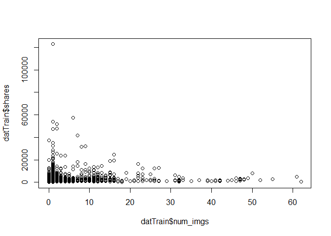
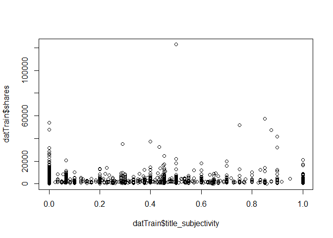
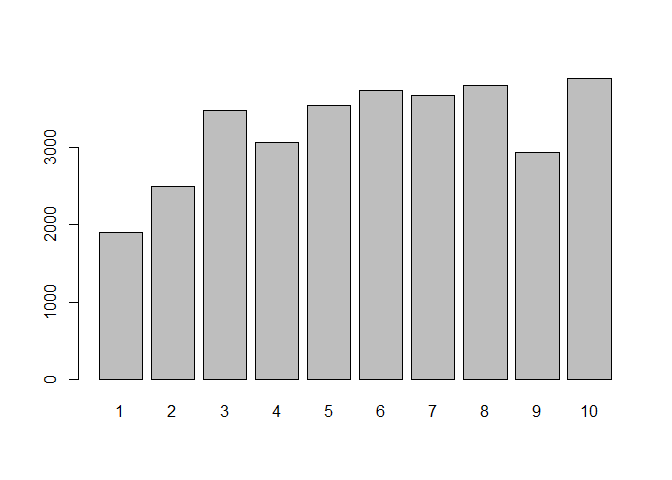
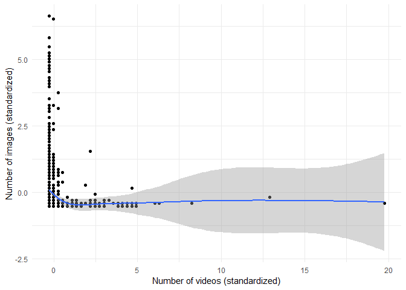
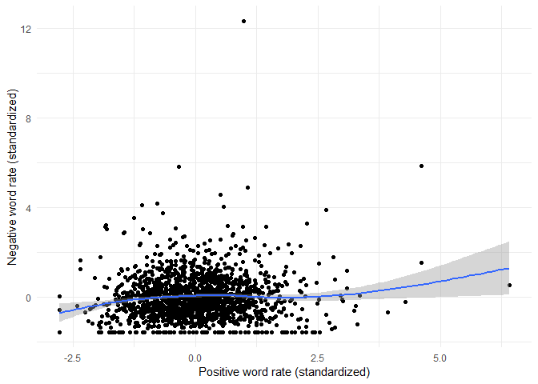
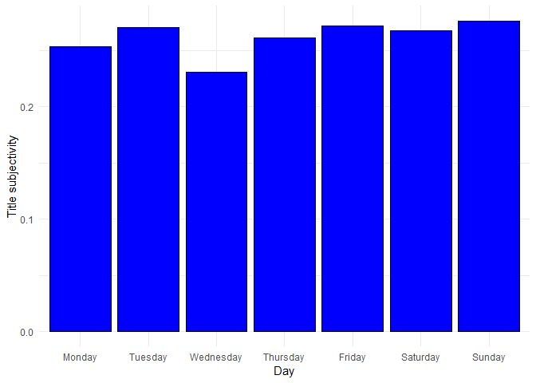
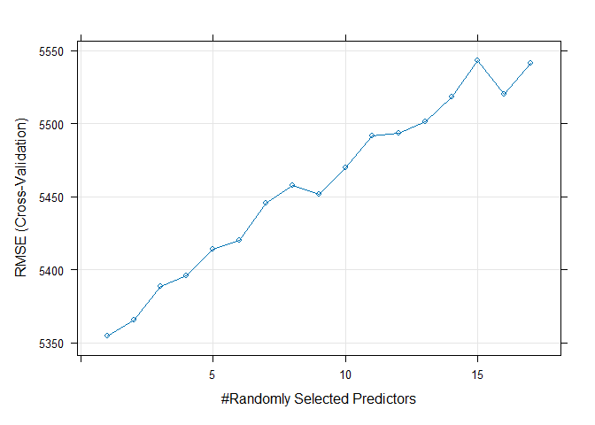
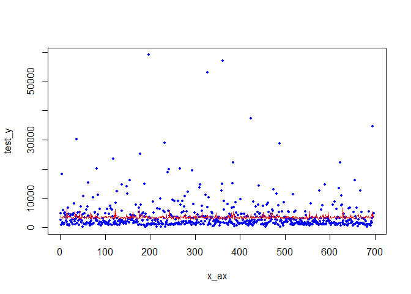
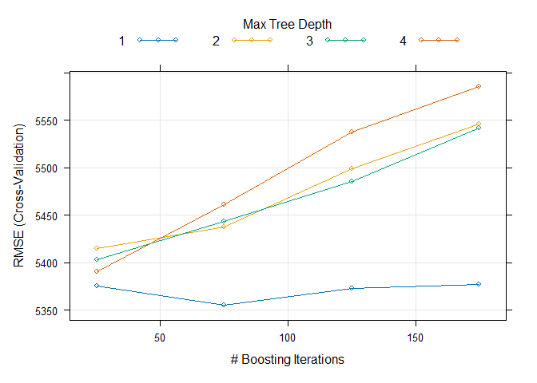
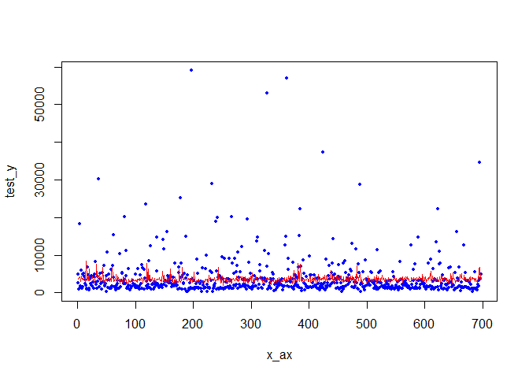

Project 2
================
Grace Holliday and Damon D’Ambrosio
2023-07-03

# Data Channel: **data_channel_is_socmed**

# Introduction

The goal/purpose of this project is to explore the factors influencing
the amount of shares (popularity) of articles published by Mashable in a
period of two years.

The data includes 39,644 observations of 61 total variables. For our
exploration, we will use variables num_imgs, num_videos, num_keywords,
weekday_is variables (including is_weekend), global_subjectivity (Text
subjectivity),global_sentiment_polarity (Text sentiment polarity),
global_rate_positive_words (Rate of positive words in the content),
global_rate_negative_words (Rate of negative words in the content),
title_subjectivity, and title_polarity, to explore the target variable
(shares).

The methods we will use to model the response include:  
- Linear Regression  
- Random Forest  
- Boosted Tree

# Data

``` r
dat <- read_csv("OnlineNewsPopularity.csv")
```

    ## Rows: 39644 Columns: 61
    ## ── Column specification ───────────────────────────────────────────────────────────────────────
    ## Delimiter: ","
    ## chr  (1): url
    ## dbl (60): timedelta, n_tokens_title, n_tokens_content, n_unique_tokens, n_non_stop_words, n...
    ## 
    ## ℹ Use `spec()` to retrieve the full column specification for this data.
    ## ℹ Specify the column types or set `show_col_types = FALSE` to quiet this message.

``` r
# Subset data to variables we want
dat <- dat[,-c(1:9,12,20:31,39:44, 49:55,58,59)]

# Subsetting to correct channel(s)
col <- params[[1]][1]
if(col=="data_channel_is_lifestyle")
{
  dattype <- subset(dat,data_channel_is_lifestyle==1)
} else if(col=="data_channel_is_entertainment")
{
  dattype <- subset(dat,data_channel_is_entertainment==1)
} else if(col=="data_channel_is_bus")
{
  dattype <- subset(dat,data_channel_is_bus==1)
} else if(col=="data_channel_is_socmed")
{
  dattype <- subset(dat,data_channel_is_socmed==1)
} else if(col=="data_channel_is_tech")
{
  dattype <- subset(dat,data_channel_is_tech==1)
} else if(col=="data_channel_is_world")
{
  dattype <- subset(dat,data_channel_is_world==1)
}

# Removing data channel columns
dattype <- dattype[,-c(4:9)]
```

# Summarizations

First, we will produce basic summary statistics and plots about the
training data. To do this, we first need to divide the data into a
training and test set.

``` r
# First, establishing every categorical variable as a character
# so can change the factor
dattype$weekday_is_monday <- as.character(dattype$weekday_is_monday)
dattype$weekday_is_tuesday <- as.character(dattype$weekday_is_tuesday)
dattype$weekday_is_wednesday <- as.character(dattype$weekday_is_wednesday)
dattype$weekday_is_thursday <- as.character(dattype$weekday_is_thursday)
dattype$weekday_is_friday <- as.character(dattype$weekday_is_friday)
dattype$weekday_is_saturday <- as.character(dattype$weekday_is_saturday)
dattype$weekday_is_sunday <- as.character(dattype$weekday_is_sunday)

# Creating single variable for day 1 = Monday 2 = Tuesday 3 = Wednesday
# 4 = Thursday 5 = Friday 6 = Saturday 7 = Sunday 0 if no day, also
# making these a factor and not 0 and 1 for ensemble models

for(i in 1:nrow(dattype))
{
  if(dattype[i,4]==1)
  {
    dattype[i,19] <- 'Monday'
    dattype[i,4] <- 'Y'
    dattype[i,5] <- 'N'
    dattype[i,6] <- 'N'
    dattype[i,7] <- 'N'
    dattype[i,8] <- 'N'
    dattype[i,9] <- 'N' 
    dattype[i,10] <- 'N'
  }
  else if (dattype[i,5]==1)
  {
    dattype[i,19] <- 'Tuesday'
    dattype[i,4] <- 'N'
    dattype[i,5] <- 'Y'
    dattype[i,6] <- 'N'
    dattype[i,7] <- 'N'
    dattype[i,8] <- 'N'
    dattype[i,9] <- 'N' 
    dattype[i,10] <- 'N'
  }
  else if (dattype[i,6]==1)
  {
    dattype[i,19] <- 'Wednesday'
    dattype[i,6] <- 'Y'
    dattype[i,4] <- 'N'
    dattype[i,5] <- 'N'
    dattype[i,7] <- 'N'
    dattype[i,8] <- 'N'
    dattype[i,9] <- 'N' 
    dattype[i,10] <- 'N'
  }
  else if (dattype[i,7]==1)
  {
    dattype[i,19] <- 'Thursday'
    dattype[i,6] <- 'N'
    dattype[i,4] <- 'N'
    dattype[i,5] <- 'N'
    dattype[i,7] <- 'Y'
    dattype[i,8] <- 'N'
    dattype[i,9] <- 'N' 
    dattype[i,10] <- 'N'
    }
  else if (dattype[i,8]==1)
  {
    dattype[i,19] <- 'Friday'
    dattype[i,6] <- 'N'
    dattype[i,4] <- 'N'
    dattype[i,5] <- 'N'
    dattype[i,7] <- 'N'
    dattype[i,8] <- 'Y'
    dattype[i,9] <- 'N' 
    dattype[i,10] <- 'N'
  }
  else if (dattype[i,9]==1)
  {
    dattype[i,19] <- 'Saturday'
    dattype[i,6] <- 'N'
    dattype[i,4] <- 'N'
    dattype[i,5] <- 'N'
    dattype[i,7] <- 'N'
    dattype[i,8] <- 'N'
    dattype[i,9] <- 'Y' 
    dattype[i,10] <- 'N'
  }
  else if (dattype[i,10]==1)
  {
    dattype[i,19] <- 'Sunday'
    dattype[i,6] <- 'N'
    dattype[i,4] <- 'N'
    dattype[i,5] <- 'N'
    dattype[i,7] <- 'N'
    dattype[i,8] <- 'N'
    dattype[i,9] <- 'N' 
    dattype[i,10] <- 'Y'
  }
  else
  {
    dattype[i,19] <- 'NA'
  }
}

colnames(dattype)[19] <- 'day'

# and back to a factor
dattype$weekday_is_monday <- as.factor(dattype$weekday_is_monday)
dattype$weekday_is_tuesday <- as.factor(dattype$weekday_is_tuesday)
dattype$weekday_is_wednesday <- as.factor(dattype$weekday_is_wednesday)
dattype$weekday_is_thursday <- as.factor(dattype$weekday_is_thursday)
dattype$weekday_is_friday <- as.factor(dattype$weekday_is_friday)
dattype$weekday_is_saturday <- as.factor(dattype$weekday_is_saturday)
dattype$weekday_is_sunday <- as.factor(dattype$weekday_is_sunday)
dattype$day <- as.factor(dattype$day)

# Setting order of new factor levels
dattype$day <- factor(dattype$day, levels =c('Monday', 'Tuesday', 'Wednesday',
                                  'Thursday', 'Friday', 'Saturday', 'Sunday'))

# First setting seed for reproducibility.
set.seed(1234)

# Divide data into training and test set.
train <- sample(1:nrow(dattype), size = nrow(dattype)*.70)
test <- setdiff(1:nrow(dattype), train)

# training and testing subsets
datTrain <- dattype[train, ]
datTest <- dattype[test, ]
```

## Summary Statistics

Now, we will conduct exploratory data analysis through creation of basic
summary statistics and graphs exploring variables of interest to our
response (shares) before we select variables for potential models.

### Mean Shares by Day

``` r
datTrain %>%
  group_by(day) %>%
  summarise_at(vars(shares), list(name = mean))
```

    ## # A tibble: 7 × 2
    ##   day        name
    ##   <fct>     <dbl>
    ## 1 Monday    4066.
    ## 2 Tuesday   3548.
    ## 3 Wednesday 3406.
    ## 4 Thursday  2978.
    ## 5 Friday    3528.
    ## 6 Saturday  3500.
    ## 7 Sunday    4343.

This summary reveals the average number of shares by day of the week
(Days 1-7, Mon-Sun). The highest average represents the day with the
most shares. A day of 0 means no day was specified.

### Total Multimedia (Images and Videos) by Day

``` r
datTrain %>% group_by(day) %>%
  mutate(total.media = num_imgs + num_videos) %>%
    group_by(day) %>%
      summarize(average = mean(total.media), median = median(total.media), 
                min = min(total.media), max = max(total.media),
                sd =   sd(total.media))
```

    ## # A tibble: 7 × 6
    ##   day       average median   min   max    sd
    ##   <fct>       <dbl>  <dbl> <dbl> <dbl> <dbl>
    ## 1 Monday       5.07      2     0    74  7.79
    ## 2 Tuesday      6.15      2     0    62 11.1 
    ## 3 Wednesday    4.52      1     0    51  7.16
    ## 4 Thursday     6.55      2     0    52  9.54
    ## 5 Friday       4.88      2     0    50  7.56
    ## 6 Saturday     6.89      2     0    55 10.2 
    ## 7 Sunday       5.97      2     0    62  8.78

This summary provides the mean, median, minimum, maximum, and standard
deviation of the total multimedia objects (images + videos) appearing in
articles by day. Potential trends in this summary (e.g., if articles
published on certain day have more multimedia objects), may indicate
some type of collinearity between “day” and the “num_imgs” or
“num_videos” variables.

## Graphs

### Number of Images vs Shares

We can inspect the trend of shares as a function of the number of
images. If the points show an upward trend, then articles with more
images tend to be shared more often. If the points show a downward
trend, then articles with less images tend to be shared more often.

``` r
plot(datTrain$shares~datTrain$num_imgs)
```

<!-- -->

### Title Subjectivity vs Shares

We can inspect the trend of shares as a function of title subjectivity.
If the points show an upward trend, then articles with higher title
subjectivity tend to be shared more often. If the points show a downward
trend, then articles with lower title subjectivity tend to be shared
more often.

``` r
plot(datTrain$shares~datTrain$title_subjectivity)
```

<!-- -->

### Average Number of Keywords vs Shares

We can inspect the trend of shares as a function of number of keywords.
If the bars show an upward trend, then articles with more keywords tend
to be shared more often. If the bars show a downward trend, then
articles with less keywords tend to be shared more often.

``` r
datTrain$num_keywords <- as.factor(datTrain$num_keywords)
means <- datTrain %>%
  group_by(num_keywords) %>%
  summarise_at(vars(shares), list(name = mean))
barplot(height=means$name, names=means$num_keywords)
```

<!-- -->

``` r
# back to numeric for later models
datTrain$num_keywords <- as.numeric(datTrain$num_keywords)
```

### Images vs Videos

We can inspect possible relationships between the number of images and
videos in an article. If some type of relationship is evident (e.g.,
articles with more images tend to have more videos), it may suggest some
collinearity between these two variables.

``` r
g <- ggplot(datTrain, aes(x = scale(num_videos), y = scale(num_imgs)))

g + geom_point() + 
    xlab("Number of videos (standardized)") + 
    ylab("Number of images (standardized)") + 
    geom_smooth() + 
    theme_minimal()
```

<!-- -->

### Positive vs negative word rates

We can inspect the relationship between positive and negative word rates
in articles. If some type of relationship is evident (e.g., articles
with higher positive word rates tend to have lower negative word rates),
it may suggest some collinearity between these two variables.

``` r
g <- ggplot(datTrain, aes(x = scale(global_rate_positive_words), y = scale(global_rate_negative_words)))

g + geom_point() + 
    xlab("Positive word rate (standardized)") + 
    ylab("Negative word rate (standardized)") + 
    geom_smooth() + 
    theme_minimal()
```

<!-- -->

### Title subjectivity by day of week

We can inspect the relationship between title subjectivity and the day
of the week to see if certain days tend to have more/less subjective
article titles.

``` r
g <- ggplot(datTrain, aes(x = day, y = title_subjectivity))

g + geom_bar(stat = "summary", fun = "mean", color = "black", fill = "blue") + 
    xlab("Day") + ylab("Title subjectivity") +
    theme_minimal()
```

<!-- -->

# Modeling

Linear regression is an analysis method wherein the values of a variable
(i.e., response variable) is predicted based upon the value of one more
more other variables (i.e., predictor variables). There is an underlying
assumption that there is a linear relationship between the response
variable and any given predictor. The slope of this line is determined
mathematically by minimizing the sum of the squared residuals.

## Linear Models

This first model will explore the impact of images as combined with
number of key words, title subjectivity, sentiment polarity, and
positive word rate.

``` r
#Train model
mod2 <- train(shares ~ num_imgs+num_keywords+title_subjectivity+
                global_subjectivity+global_sentiment_polarity +
                global_rate_positive_words,
              data = datTrain,
              method = "lm",
              preProcess = c("center", "scale"), 
              trControl = trainControl(method = "cv", number = 5))

summary(mod2)
```

    ## 
    ## Call:
    ## lm(formula = .outcome ~ ., data = dat)
    ## 
    ## Residuals:
    ##    Min     1Q Median     3Q    Max 
    ##  -4100  -2097  -1345    175 118762 
    ## 
    ## Coefficients:
    ##                            Estimate Std. Error t value Pr(>|t|)    
    ## (Intercept)                 3525.17     136.92  25.746   <2e-16 ***
    ## num_imgs                    -205.54     139.23  -1.476   0.1401    
    ## num_keywords                 243.70     138.06   1.765   0.0777 .  
    ## title_subjectivity           311.12     140.19   2.219   0.0266 *  
    ## global_subjectivity           11.88     148.86   0.080   0.9364    
    ## global_sentiment_polarity   -268.74     160.94  -1.670   0.0952 .  
    ## global_rate_positive_words    16.85     157.69   0.107   0.9149    
    ## ---
    ## Signif. codes:  0 '***' 0.001 '**' 0.01 '*' 0.05 '.' 0.1 ' ' 1
    ## 
    ## Residual standard error: 5521 on 1619 degrees of freedom
    ## Multiple R-squared:  0.007298,   Adjusted R-squared:  0.003619 
    ## F-statistic: 1.984 on 6 and 1619 DF,  p-value: 0.06484

``` r
#Run on test data
mod2.predict <- predict(mod2, newdata = datTest)

#Obtain RMSE from test set, which will be used in automated comparison
mod2.compare <- postResample(mod2.predict, obs = datTest$shares)
```

The second model explores the impact of videos instead of images.
Keywords are retained as a variable. Instead of exploring subjectivity
and postive word rates, this model explores the “negative” (i.e., global
rate of negative words and maximum polarity of negative words). It also
includes an interaction between the number of videos and number of
keywords.

``` r
#Train model
mod3 <- train(shares ~ num_videos + num_keywords + num_videos:num_keywords + global_rate_negative_words + max_negative_polarity,
              data = datTrain,
              method = "lm",
              preProcess = c("center", "scale"), 
              trControl = trainControl(method = "cv", number = 5))

#Run on test data
mod3.predict <- predict(mod3, newdata = datTest)

#Obtain RMSE from test set, which will be used in automated comparison
mod3.compare <- postResample(mod3.predict, obs = datTest$shares)
```

## Ensemble Models

To streamline model fitting, we will first remove the previously created
“day” variable.

``` r
# this is regression, not classification
#removing previously created day variable for boosted tree model
datTrain <- datTrain[,-19]
datTest <- datTest[,-19]
```

Now to fit the ensemble models.

### Random Forest Model

Random forests are similar to bagging in the sense that multiple trees
(i.e., a “forest”) are created from bootstrap samples of data, with the
outcome of these trees averaged to form a conclusion. Unlike bagging,
not all possible predictors are used in each tree when using a random
forest- only a random subset is used for each tree. This in turn makes
the trees less correlated with one another, which allows for a greater
reduction in variation once the outcomes of all trees are averaged.

Below is a random forest model to predict shares:

``` r
#Create model
random.forest.fit <- train(shares ~ ., data = datTrain,
                           method = "rf",
                           preProcess = c("center", "scale"),
                           trControl = trainControl(method = "cv", number = 5),
                           tuneGrid = data.frame(mtry = 1:17))

# plot fit
plot(random.forest.fit)
```

<!-- -->

``` r
random.forest.fit$finalModel
```

    ## 
    ## Call:
    ##  randomForest(x = x, y = y, mtry = param$mtry) 
    ##                Type of random forest: regression
    ##                      Number of trees: 500
    ## No. of variables tried at each split: 1
    ## 
    ##           Mean of squared residuals: 30416201
    ##                     % Var explained: 0.52

``` r
# test fit
test_x = datTest[, -18] 
test_y = datTest[, 18] 
pred_y = predict(random.forest.fit, test_x)
x_ax = 1:length(pred_y)
x_ax <- as.numeric(x_ax)
test_y <- test_y$shares 
test_y <- as.integer(test_y)
pred_y <- as.integer(pred_y)
plot(x_ax, test_y, col="blue", pch=20, cex=.9)
lines(x_ax, pred_y, col="red", pch=20, cex=.9)
```

<!-- -->

``` r
#Run on test data
random.forest.predict <- predict(random.forest.fit, newdata = datTest)

#Obtain RMSE from test set, which will be used in automated comparison
random.forest.compare <- postResample(random.forest.predict, 
                                      obs = datTest$shares)
```

Here, the red lines are the predicted values for each observation. If
the red lines are close to following the blue dots (which are
representative of the actual value for each observation), then the model
is closely predicting.

### Boosted Tree Model

Boosting is a general approach that can be applied to trees and allows
for the slow training of trees. The trees are grown sequentially with
each subsequent tree being grown on a modified version of the original
data. The predictions are then updated as the trees are grown, and new
trees are grown by considering the errors in the trees previously
created. Lambda represents a shrinkage parameter than slows the fitting
process.

Below is a boosted tree model to predict shares.

``` r
boostFit <- train(shares~., data=datTrain, method="gbm",
                      preProcess=c("center","scale"),
                      trControl=trainControl(method='cv',number=5),
                      tuneGrid = expand.grid(n.trees=seq(25,200,50),
                                             interaction.depth=seq(1,4,1),
                                             shrinkage=0.1,
                                             n.minobsinnode=10))
```

    ## Iter   TrainDeviance   ValidDeviance   StepSize   Improve
    ##      1 33757273.3683             nan     0.1000 46557.1446
    ##      2 33707470.6704             nan     0.1000 31468.8551
    ##      3 33616027.2043             nan     0.1000 34569.1112
    ##      4 33613177.7173             nan     0.1000 -43450.4851
    ##      5 33555896.1509             nan     0.1000 -2801.2407
    ##      6 33534048.3999             nan     0.1000  290.1600
    ##      7 33512414.4994             nan     0.1000 -21640.1677
    ##      8 33483360.9792             nan     0.1000 7753.8648
    ##      9 33408981.9391             nan     0.1000  -52.4523
    ##     10 33381596.2145             nan     0.1000 6171.6516
    ##     20 33066170.4495             nan     0.1000 -3749.2246
    ##     40 32628255.8712             nan     0.1000 12255.3637
    ##     60 32233815.7534             nan     0.1000 -34074.0700
    ##     80 31911735.0860             nan     0.1000 -41415.1572
    ##    100 31790937.8943             nan     0.1000 -38547.2150
    ##    120 31570858.1838             nan     0.1000 -38067.9185
    ##    140 31380048.9613             nan     0.1000 -55803.8883
    ##    160 31193560.2372             nan     0.1000 -44573.0944
    ##    175 31028384.4559             nan     0.1000 -50451.8232
    ## 
    ## Iter   TrainDeviance   ValidDeviance   StepSize   Improve
    ##      1 33745328.0797             nan     0.1000 -25206.8003
    ##      2 33663007.4351             nan     0.1000 48117.5823
    ##      3 33499917.7839             nan     0.1000 142227.3569
    ##      4 33410715.8169             nan     0.1000 -31478.1763
    ##      5 33234812.7497             nan     0.1000 81823.4679
    ##      6 33027815.0380             nan     0.1000 -30516.8379
    ##      7 32827591.0528             nan     0.1000 -50196.1520
    ##      8 32705788.2114             nan     0.1000 5550.6285
    ##      9 32344311.8061             nan     0.1000 -67222.0881
    ##     10 32205542.2929             nan     0.1000 55693.6282
    ##     20 31381754.4360             nan     0.1000 -60805.9371
    ##     40 30285081.9735             nan     0.1000 -20132.9992
    ##     60 29129597.7458             nan     0.1000 37238.3265
    ##     80 27975771.7491             nan     0.1000 -73802.6669
    ##    100 26960577.9139             nan     0.1000 -73447.3472
    ##    120 25837998.6765             nan     0.1000 -39435.4640
    ##    140 25265302.8583             nan     0.1000 -158593.7189
    ##    160 24671984.3711             nan     0.1000 -41720.8144
    ##    175 24298383.2728             nan     0.1000 -102776.4662
    ## 
    ## Iter   TrainDeviance   ValidDeviance   StepSize   Improve
    ##      1 33592724.9825             nan     0.1000 -52897.7003
    ##      2 33421705.4753             nan     0.1000 -15380.2187
    ##      3 33329900.6805             nan     0.1000 34592.0493
    ##      4 32816597.3523             nan     0.1000 212489.8230
    ##      5 32645724.0777             nan     0.1000 85961.8284
    ##      6 32419964.1594             nan     0.1000 -62467.3434
    ##      7 32030772.1886             nan     0.1000 -76787.3177
    ##      8 31942660.5215             nan     0.1000 -43249.0325
    ##      9 31800050.1418             nan     0.1000 62005.6403
    ##     10 31679467.6838             nan     0.1000 62022.7949
    ##     20 30434844.6323             nan     0.1000 -47321.1595
    ##     40 27028640.1196             nan     0.1000 -41599.9176
    ##     60 25298599.6338             nan     0.1000 -126800.2931
    ##     80 23697495.5934             nan     0.1000 -141862.9822
    ##    100 22076160.7647             nan     0.1000 -81323.8789
    ##    120 21102771.1275             nan     0.1000 -19695.0537
    ##    140 20120084.9926             nan     0.1000 -165263.4566
    ##    160 19270978.5676             nan     0.1000 -44243.6704
    ##    175 18834691.6780             nan     0.1000 -54240.2917
    ## 
    ## Iter   TrainDeviance   ValidDeviance   StepSize   Improve
    ##      1 32909239.3448             nan     0.1000 383482.3980
    ##      2 32510266.4845             nan     0.1000 -50306.3220
    ##      3 32095978.4569             nan     0.1000 -182389.5317
    ##      4 31531603.3189             nan     0.1000 117473.7747
    ##      5 31168475.3885             nan     0.1000 80575.5643
    ##      6 31028246.1881             nan     0.1000 -74209.8534
    ##      7 30824261.3155             nan     0.1000 -14716.6498
    ##      8 30380500.7845             nan     0.1000 219770.6685
    ##      9 30238963.0406             nan     0.1000 -68272.7718
    ##     10 29796017.4249             nan     0.1000 64842.3990
    ##     20 27907124.5214             nan     0.1000 8351.5495
    ##     40 24406337.7541             nan     0.1000 -204620.8453
    ##     60 22380207.9081             nan     0.1000 -14667.5050
    ##     80 20902678.6228             nan     0.1000 -28304.8048
    ##    100 19543694.3628             nan     0.1000 -53680.3011
    ##    120 18469324.6360             nan     0.1000 -41675.1332
    ##    140 17341626.9432             nan     0.1000 -49118.5317
    ##    160 16356070.1038             nan     0.1000 -86454.3854
    ##    175 15843041.0606             nan     0.1000 -122540.5986
    ## 
    ## Iter   TrainDeviance   ValidDeviance   StepSize   Improve
    ##      1 23852180.0367             nan     0.1000 -10506.6268
    ##      2 23812343.5463             nan     0.1000 26381.6999
    ##      3 23687950.0131             nan     0.1000 39681.8805
    ##      4 23616695.5435             nan     0.1000 29654.5956
    ##      5 23538585.1037             nan     0.1000 -58341.1398
    ##      6 23482082.2960             nan     0.1000 24075.9429
    ##      7 23438202.1608             nan     0.1000 2109.1099
    ##      8 23425354.7159             nan     0.1000 -38514.0032
    ##      9 23383861.3916             nan     0.1000 -31397.5727
    ##     10 23350648.6083             nan     0.1000 23287.6186
    ##     20 23112940.7553             nan     0.1000 -803.1695
    ##     40 22817444.0057             nan     0.1000 -32770.4193
    ##     60 22481595.1917             nan     0.1000 20496.9454
    ##     80 22158712.0406             nan     0.1000 -27028.0156
    ##    100 22020960.4598             nan     0.1000 -2268.1828
    ##    120 21774047.9772             nan     0.1000 12119.7637
    ##    140 21575058.7362             nan     0.1000 25547.7432
    ##    160 21420741.1398             nan     0.1000 -1772.8734
    ##    175 21330849.4135             nan     0.1000 -75500.6374
    ## 
    ## Iter   TrainDeviance   ValidDeviance   StepSize   Improve
    ##      1 23747681.6963             nan     0.1000 48466.9013
    ##      2 23631367.6191             nan     0.1000 -69773.3979
    ##      3 23437670.7696             nan     0.1000 101222.8064
    ##      4 23203759.5684             nan     0.1000 20897.8249
    ##      5 23083852.1206             nan     0.1000 -55938.6992
    ##      6 22922526.9256             nan     0.1000 12543.0181
    ##      7 22880849.6466             nan     0.1000 -147156.7367
    ##      8 22830076.1124             nan     0.1000 -4890.9836
    ##      9 22647090.0227             nan     0.1000 -42974.1176
    ##     10 22582687.4884             nan     0.1000 -48364.1267
    ##     20 21883893.8182             nan     0.1000 -20588.3433
    ##     40 20786926.7267             nan     0.1000 17421.6345
    ##     60 19865452.0904             nan     0.1000 -40703.8976
    ##     80 19266089.8021             nan     0.1000 -76667.0609
    ##    100 18754307.4404             nan     0.1000 -38809.9808
    ##    120 18383186.1869             nan     0.1000 -10536.6367
    ##    140 18091374.8744             nan     0.1000 -30861.0161
    ##    160 17573966.8050             nan     0.1000 -31021.9014
    ##    175 17283064.4745             nan     0.1000 -35633.9279
    ## 
    ## Iter   TrainDeviance   ValidDeviance   StepSize   Improve
    ##      1 23612225.5513             nan     0.1000 -1689.0200
    ##      2 23354430.1051             nan     0.1000 163316.2608
    ##      3 23148856.6119             nan     0.1000 100495.3636
    ##      4 23041372.4209             nan     0.1000 -66906.2798
    ##      5 22966245.5079             nan     0.1000 -80858.0459
    ##      6 22759007.9653             nan     0.1000 72466.8779
    ##      7 22675290.6285             nan     0.1000 -28810.8602
    ##      8 22604330.4483             nan     0.1000 -53748.5744
    ##      9 22503231.0302             nan     0.1000 -64093.0106
    ##     10 22288711.8679             nan     0.1000 -66336.1508
    ##     20 21236609.6907             nan     0.1000 -48468.3294
    ##     40 19854102.6743             nan     0.1000 -52148.3136
    ##     60 18895908.3905             nan     0.1000 -2815.4449
    ##     80 18119118.7173             nan     0.1000 -59430.2214
    ##    100 17250569.7062             nan     0.1000 -87496.4315
    ##    120 16549923.3597             nan     0.1000 -35420.8636
    ##    140 15980189.3928             nan     0.1000 -5702.4547
    ##    160 15481198.1127             nan     0.1000 -32390.2717
    ##    175 14847086.0113             nan     0.1000 -38919.3681
    ## 
    ## Iter   TrainDeviance   ValidDeviance   StepSize   Improve
    ##      1 23438054.8910             nan     0.1000 -3425.2545
    ##      2 23188707.5452             nan     0.1000 -6335.1923
    ##      3 22977889.2425             nan     0.1000 -20684.0390
    ##      4 22826010.3444             nan     0.1000 -91042.9925
    ##      5 22689105.8819             nan     0.1000 2731.0896
    ##      6 22364924.1298             nan     0.1000 82678.4702
    ##      7 21946469.2993             nan     0.1000 -69020.1515
    ##      8 21876128.9909             nan     0.1000 -140632.6347
    ##      9 21603440.3111             nan     0.1000 22999.8636
    ##     10 21313829.8518             nan     0.1000 5333.2565
    ##     20 19997564.8385             nan     0.1000 26184.2600
    ##     40 18364311.4075             nan     0.1000 -116297.4699
    ##     60 16999732.6464             nan     0.1000 -50790.9011
    ##     80 16015481.2060             nan     0.1000 -34176.0804
    ##    100 15008018.0670             nan     0.1000 -57887.9101
    ##    120 14194943.1459             nan     0.1000 -18982.3509
    ##    140 13415290.7024             nan     0.1000 -105702.9767
    ##    160 12747680.7627             nan     0.1000 -12134.3329
    ##    175 12350223.1558             nan     0.1000 -28780.9574
    ## 
    ## Iter   TrainDeviance   ValidDeviance   StepSize   Improve
    ##      1 28870454.7035             nan     0.1000 17263.4288
    ##      2 28844208.6182             nan     0.1000 -25763.4524
    ##      3 28827596.6686             nan     0.1000 -8142.0716
    ##      4 28786922.0445             nan     0.1000 8447.0068
    ##      5 28767829.1909             nan     0.1000 -587.5541
    ##      6 28747020.5946             nan     0.1000 12876.5053
    ##      7 28733499.8591             nan     0.1000 -20752.3733
    ##      8 28699131.6597             nan     0.1000 -44530.2633
    ##      9 28662248.3897             nan     0.1000 -11583.8603
    ##     10 28637435.1082             nan     0.1000 -44369.2675
    ##     20 28452809.5179             nan     0.1000  260.9529
    ##     40 28203742.9461             nan     0.1000 -32243.7785
    ##     60 27902402.9733             nan     0.1000  736.6965
    ##     80 27656535.6054             nan     0.1000 -40745.4813
    ##    100 27394749.0412             nan     0.1000 -30798.0540
    ##    120 27246412.1813             nan     0.1000 -73175.1419
    ##    140 27010568.3591             nan     0.1000 -14956.3399
    ##    160 26853978.8415             nan     0.1000 -24453.4408
    ##    175 26715573.8484             nan     0.1000 -31434.3391
    ## 
    ## Iter   TrainDeviance   ValidDeviance   StepSize   Improve
    ##      1 28843865.2476             nan     0.1000 -30852.7315
    ##      2 28757345.1315             nan     0.1000 -3498.7827
    ##      3 28725904.7756             nan     0.1000 -43777.2689
    ##      4 28640470.4077             nan     0.1000 12280.9604
    ##      5 28534492.2478             nan     0.1000 -72141.5602
    ##      6 28502006.0860             nan     0.1000 -9420.6402
    ##      7 28456678.8589             nan     0.1000 -26248.2262
    ##      8 28357131.4858             nan     0.1000 -68988.2443
    ##      9 28286642.4309             nan     0.1000 15695.0975
    ##     10 28202475.9023             nan     0.1000 -50514.5437
    ##     20 27716172.1111             nan     0.1000 -41737.1225
    ##     40 26920401.1293             nan     0.1000 11231.8162
    ##     60 26212862.6086             nan     0.1000 -25064.6261
    ##     80 25491397.2565             nan     0.1000 -53995.0539
    ##    100 24826231.4086             nan     0.1000 -47173.5421
    ##    120 24207896.3371             nan     0.1000 -81571.7491
    ##    140 23644399.5877             nan     0.1000 -28104.8706
    ##    160 23143054.2719             nan     0.1000 -18062.2635
    ##    175 22795552.7246             nan     0.1000 -22896.8419
    ## 
    ## Iter   TrainDeviance   ValidDeviance   StepSize   Improve
    ##      1 28725341.7949             nan     0.1000 -30089.6784
    ##      2 28462081.8430             nan     0.1000 -1840.9800
    ##      3 28115204.2211             nan     0.1000 22607.3445
    ##      4 27965219.7812             nan     0.1000 -115765.0305
    ##      5 27718921.8182             nan     0.1000 -48598.7144
    ##      6 27654896.3117             nan     0.1000 -4789.3137
    ##      7 27550794.2327             nan     0.1000 25696.4796
    ##      8 27439080.1554             nan     0.1000 -10935.6070
    ##      9 27204130.7944             nan     0.1000 -113758.4897
    ##     10 27119822.2909             nan     0.1000 -68158.1198
    ##     20 26327666.0336             nan     0.1000 -31725.6826
    ##     40 24944791.1919             nan     0.1000 67623.0850
    ##     60 23322421.5839             nan     0.1000 -83473.9064
    ##     80 22327367.1868             nan     0.1000 -34355.0688
    ##    100 21720592.4766             nan     0.1000 -132756.6793
    ##    120 20698169.4481             nan     0.1000 -27568.3006
    ##    140 20074332.8284             nan     0.1000 -12121.2166
    ##    160 19330903.1483             nan     0.1000 -49196.1223
    ##    175 18896394.2006             nan     0.1000 -43951.8277
    ## 
    ## Iter   TrainDeviance   ValidDeviance   StepSize   Improve
    ##      1 28846323.7165             nan     0.1000 -25204.1813
    ##      2 28597570.5529             nan     0.1000 122320.1335
    ##      3 28523040.1236             nan     0.1000 -26090.6129
    ##      4 27931843.0345             nan     0.1000 332195.6097
    ##      5 27789591.1783             nan     0.1000 -68909.0265
    ##      6 27670402.5498             nan     0.1000 -15952.1641
    ##      7 27563343.1061             nan     0.1000 29722.5593
    ##      8 27469681.8913             nan     0.1000 25158.7043
    ##      9 27150600.6655             nan     0.1000 -86309.0702
    ##     10 26917017.7712             nan     0.1000 -41597.2092
    ##     20 25596263.5586             nan     0.1000 -36607.7382
    ##     40 22454201.1771             nan     0.1000 -110068.7989
    ##     60 20968619.3255             nan     0.1000 -24087.9254
    ##     80 19447895.8056             nan     0.1000 -123558.4388
    ##    100 18160221.8016             nan     0.1000 -90612.6659
    ##    120 17072843.7198             nan     0.1000 -135539.8292
    ##    140 16183907.9881             nan     0.1000 -91056.9537
    ##    160 15369617.3847             nan     0.1000 -121781.5619
    ##    175 14681472.0072             nan     0.1000 -2696.9068
    ## 
    ## Iter   TrainDeviance   ValidDeviance   StepSize   Improve
    ##      1 33661657.8865             nan     0.1000 -17886.2765
    ##      2 33575552.6219             nan     0.1000 47459.5879
    ##      3 33471845.8331             nan     0.1000 -70141.1507
    ##      4 33401901.5670             nan     0.1000 -1711.9369
    ##      5 33336210.7362             nan     0.1000 -61110.9823
    ##      6 33293204.6269             nan     0.1000 11844.8005
    ##      7 33266576.1439             nan     0.1000 -9504.3870
    ##      8 33261953.3306             nan     0.1000 -58579.9605
    ##      9 33219846.9100             nan     0.1000 -98249.6587
    ##     10 33169796.2375             nan     0.1000 16790.9022
    ##     20 32917043.7748             nan     0.1000 -5533.0089
    ##     40 32385690.2792             nan     0.1000 -57214.6237
    ##     60 31963250.2662             nan     0.1000 -67419.6469
    ##     80 31647159.3834             nan     0.1000 -47525.6390
    ##    100 31388513.5086             nan     0.1000 -67490.4978
    ##    120 31117979.1886             nan     0.1000 19145.3627
    ##    140 30959520.9343             nan     0.1000 12198.6717
    ##    160 30756423.9342             nan     0.1000 -58394.8912
    ##    175 30626519.0421             nan     0.1000 -45302.6902
    ## 
    ## Iter   TrainDeviance   ValidDeviance   StepSize   Improve
    ##      1 33460301.2084             nan     0.1000 45675.8063
    ##      2 33281552.8797             nan     0.1000 -7460.6798
    ##      3 33141826.3849             nan     0.1000 42384.7645
    ##      4 32987903.5726             nan     0.1000 4169.6814
    ##      5 32943553.5799             nan     0.1000 -82068.8010
    ##      6 32850845.0633             nan     0.1000 36694.1395
    ##      7 32694894.6573             nan     0.1000 -74709.6011
    ##      8 32510516.5955             nan     0.1000 -95196.3731
    ##      9 32475164.9668             nan     0.1000 -37476.2920
    ##     10 32402073.0152             nan     0.1000 49394.9352
    ##     20 31793726.0813             nan     0.1000 -59198.5364
    ##     40 30547648.1104             nan     0.1000 -49069.6568
    ##     60 29383485.3384             nan     0.1000 -82518.9503
    ##     80 28492863.1981             nan     0.1000 -73596.0040
    ##    100 27558193.3187             nan     0.1000 -71519.9043
    ##    120 26333642.4458             nan     0.1000 -67948.6197
    ##    140 25706125.6480             nan     0.1000 -171241.9424
    ##    160 25112752.0850             nan     0.1000 -38463.1416
    ##    175 24575805.7458             nan     0.1000 -40595.6093
    ## 
    ## Iter   TrainDeviance   ValidDeviance   StepSize   Improve
    ##      1 33719625.3047             nan     0.1000 -71275.8996
    ##      2 33559924.2090             nan     0.1000 78042.5530
    ##      3 33263514.3217             nan     0.1000 185540.6149
    ##      4 32992430.2975             nan     0.1000 140143.9853
    ##      5 32699463.2801             nan     0.1000 -184312.8933
    ##      6 32630645.1172             nan     0.1000 -18043.6616
    ##      7 32559887.8361             nan     0.1000 -33943.9722
    ##      8 32308349.4067             nan     0.1000 154425.2301
    ##      9 32046192.3206             nan     0.1000 -129361.6840
    ##     10 31892484.2085             nan     0.1000 -145594.1508
    ##     20 30236479.7690             nan     0.1000 -41917.8759
    ##     40 27639613.4922             nan     0.1000 -78603.0874
    ##     60 26334350.1646             nan     0.1000 -65973.4972
    ##     80 24840921.5989             nan     0.1000 -203704.8560
    ##    100 23772410.6500             nan     0.1000 -79809.4923
    ##    120 22806198.1618             nan     0.1000 -88821.7651
    ##    140 21969008.1060             nan     0.1000 -43109.5520
    ##    160 21082895.4369             nan     0.1000 -53167.2972
    ##    175 20210980.9728             nan     0.1000 -11253.3763
    ## 
    ## Iter   TrainDeviance   ValidDeviance   StepSize   Improve
    ##      1 33679279.8596             nan     0.1000 -12816.9950
    ##      2 33329885.4433             nan     0.1000 224676.6561
    ##      3 33210873.7818             nan     0.1000 13092.2139
    ##      4 32981926.5438             nan     0.1000 52482.2407
    ##      5 32046111.1630             nan     0.1000 -85409.9968
    ##      6 31818195.2619             nan     0.1000 -163827.1583
    ##      7 31383866.4367             nan     0.1000 -73224.8528
    ##      8 31305661.6434             nan     0.1000 9852.4380
    ##      9 31095852.9784             nan     0.1000 -52365.8823
    ##     10 30785407.3518             nan     0.1000 -185682.7165
    ##     20 29078869.0419             nan     0.1000 -59065.7552
    ##     40 26037132.9635             nan     0.1000 -25920.8220
    ##     60 23822582.8407             nan     0.1000 -18850.6659
    ##     80 22168220.2780             nan     0.1000 -67211.3831
    ##    100 20307303.1795             nan     0.1000 -140151.5079
    ##    120 19134942.1946             nan     0.1000 -138194.1362
    ##    140 18175177.8211             nan     0.1000 -57813.4235
    ##    160 17406676.8978             nan     0.1000 -35460.5311
    ##    175 16644500.5071             nan     0.1000 -148836.4093
    ## 
    ## Iter   TrainDeviance   ValidDeviance   StepSize   Improve
    ##      1 32397743.4764             nan     0.1000 24417.7742
    ##      2 32350458.5185             nan     0.1000 30486.8583
    ##      3 32299001.4981             nan     0.1000 28357.6527
    ##      4 32238613.9672             nan     0.1000 -46221.8763
    ##      5 32189735.3330             nan     0.1000 -23175.3475
    ##      6 32141933.8937             nan     0.1000 18577.3642
    ##      7 32102500.1417             nan     0.1000 -49712.7123
    ##      8 32085004.6865             nan     0.1000 -18537.2943
    ##      9 32060280.5119             nan     0.1000 -4054.0311
    ##     10 32027938.2241             nan     0.1000 -8769.3949
    ##     20 31731329.6468             nan     0.1000 6522.4914
    ##     40 31314857.0834             nan     0.1000 -33508.8717
    ##     60 30929539.0164             nan     0.1000 -670.0487
    ##     80 30651999.2147             nan     0.1000 -2308.7092
    ##    100 30389087.1652             nan     0.1000 13807.6846
    ##    120 30236281.4160             nan     0.1000 -41423.9569
    ##    140 30035896.2663             nan     0.1000 -167.6203
    ##    160 29888605.8048             nan     0.1000 -49589.7352
    ##    175 29768172.1776             nan     0.1000 -41990.8616
    ## 
    ## Iter   TrainDeviance   ValidDeviance   StepSize   Improve
    ##      1 32368931.3163             nan     0.1000 24192.5927
    ##      2 31953279.7521             nan     0.1000 -73408.6066
    ##      3 31778656.1295             nan     0.1000 67739.0042
    ##      4 31509054.2148             nan     0.1000 -180002.2675
    ##      5 31408137.9149             nan     0.1000 -10343.3828
    ##      6 31248470.5561             nan     0.1000 -18433.6925
    ##      7 31149226.4643             nan     0.1000 -35569.8100
    ##      8 31057449.5680             nan     0.1000 47147.1474
    ##      9 30968236.6082             nan     0.1000 -25399.2827
    ##     10 30776993.8428             nan     0.1000 -101714.0763
    ##     20 29770618.8538             nan     0.1000 -30202.0815
    ##     40 28378639.7819             nan     0.1000 9457.3000
    ##     60 27135043.5201             nan     0.1000 -61131.9394
    ##     80 26396093.4744             nan     0.1000 -62806.5001
    ##    100 25633308.6226             nan     0.1000 13458.0761
    ##    120 25145173.7068             nan     0.1000 -37215.0902
    ##    140 24297188.7128             nan     0.1000 -48672.2559
    ##    160 23843155.6950             nan     0.1000 -35390.3766
    ##    175 23469557.6270             nan     0.1000 -2268.3303
    ## 
    ## Iter   TrainDeviance   ValidDeviance   StepSize   Improve
    ##      1 32266374.1335             nan     0.1000 -89983.3254
    ##      2 32025783.4481             nan     0.1000 -26827.3035
    ##      3 31879858.8049             nan     0.1000 5805.6414
    ##      4 31713613.1620             nan     0.1000 3171.8540
    ##      5 31529359.3930             nan     0.1000 25810.2509
    ##      6 31248898.6745             nan     0.1000 107019.8863
    ##      7 31120085.2768             nan     0.1000 37796.1682
    ##      8 30943615.9548             nan     0.1000 6340.6217
    ##      9 30870301.4439             nan     0.1000 -71116.9744
    ##     10 30771394.5484             nan     0.1000 -54407.5922
    ##     20 28803361.0035             nan     0.1000 -123704.9267
    ##     40 26529778.7943             nan     0.1000 -69777.6825
    ##     60 24691708.7195             nan     0.1000 -74974.2303
    ##     80 23201784.6632             nan     0.1000 -76657.9443
    ##    100 22049053.3167             nan     0.1000 -103675.6771
    ##    120 20687065.0431             nan     0.1000 -54316.4738
    ##    140 19615369.7375             nan     0.1000 -69735.3531
    ##    160 18718604.0463             nan     0.1000 -28537.7922
    ##    175 18090196.9134             nan     0.1000 -85964.9893
    ## 
    ## Iter   TrainDeviance   ValidDeviance   StepSize   Improve
    ##      1 32122868.2604             nan     0.1000 33998.6260
    ##      2 31962947.4035             nan     0.1000 -65415.3419
    ##      3 31720651.0962             nan     0.1000 -3351.2629
    ##      4 31160421.5508             nan     0.1000 -31351.7232
    ##      5 30867439.2857             nan     0.1000 144444.1787
    ##      6 30734053.5805             nan     0.1000 -67425.3016
    ##      7 30252191.9192             nan     0.1000 -47052.2161
    ##      8 30084360.7793             nan     0.1000 -24867.4248
    ##      9 29846065.7017             nan     0.1000 -140862.7392
    ##     10 29740844.7106             nan     0.1000 -35219.9070
    ##     20 27497259.0207             nan     0.1000 -76101.0616
    ##     40 25096334.2657             nan     0.1000 -166129.2885
    ##     60 22321415.6580             nan     0.1000 -89453.9139
    ##     80 20986123.9657             nan     0.1000 -105699.0785
    ##    100 19513377.1061             nan     0.1000 -47988.1158
    ##    120 18218140.4881             nan     0.1000 -74651.8875
    ##    140 17218861.5885             nan     0.1000 -45553.7352
    ##    160 16563882.8553             nan     0.1000 -40195.7670
    ##    175 15973096.8123             nan     0.1000 -73983.6075
    ## 
    ## Iter   TrainDeviance   ValidDeviance   StepSize   Improve
    ##      1 30512415.7932             nan     0.1000 37705.2542
    ##      2 30462633.6142             nan     0.1000 44977.9019
    ##      3 30443718.1986             nan     0.1000 -23616.0822
    ##      4 30358745.6349             nan     0.1000 -42148.0981
    ##      5 30334552.3778             nan     0.1000 -4592.4811
    ##      6 30313100.6525             nan     0.1000 -17983.2644
    ##      7 30289637.3777             nan     0.1000 -41567.6361
    ##      8 30230730.2731             nan     0.1000 -18051.7860
    ##      9 30188969.5696             nan     0.1000 12050.5145
    ##     10 30158792.7259             nan     0.1000 -1951.9688
    ##     20 29928754.3296             nan     0.1000 -14557.3216
    ##     40 29544274.2126             nan     0.1000 -45675.2611
    ##     60 29226261.8899             nan     0.1000 -17659.2436
    ##     75 29015826.9725             nan     0.1000 -13623.7626

``` r
# plot fit
plot(boostFit)
```

<!-- -->

``` r
boostFit$finalModel
```

    ## A gradient boosted model with gaussian loss function.
    ## 75 iterations were performed.
    ## There were 17 predictors of which 12 had non-zero influence.

``` r
# test fit
test_x = datTest[, -18] 
test_y = datTest[, 18] 
pred_y = predict(boostFit, test_x)
x_ax = 1:length(pred_y)
x_ax <- as.numeric(x_ax)
test_y <- test_y$shares 
test_y <- as.integer(test_y)
pred_y <- as.integer(pred_y)
plot(x_ax, test_y, col="blue", pch=20, cex=.9)
lines(x_ax, pred_y, col="red", pch=20, cex=.9)
```

<!-- -->

``` r
#Run on test data
boostFit.predict <- predict(boostFit, newdata = datTest)

#Obtain RMSE from test set, which will be used in automated comparison
boostFit.compare <- postResample(boostFit.predict, obs = datTest$shares)
```

Here, the red lines are the predicted values for each observation. If
the red lines are close to following the blue dots (which are
representative of the actual value for each observation), then the model
is closely predicting.

## Comparison

Now, grab all the RMSEs obtained from fitting the 4 models on the test
set to determine the “winner.”

``` r
#Compile RMSEs from the 4 models
mod2.RMSE <- mod2.compare[1]
mod3.RMSE <- mod3.compare[1]
random.forest.RMSE <- random.forest.compare[1]
boostFit.RMSE <- boostFit.compare[1]

compare.all <- data.frame(
                    model = c("mod2", "mod3", "random.forest", "boostFit"),
                    RMSE = c(mod2.RMSE, mod3.RMSE, random.forest.RMSE, boostFit.RMSE)
)

winner <- compare.all %>% slice_min(order_by = RMSE)
```

The lowest RMSE obtained on the test set was **5472.075479**, which
belongs to the **boostFit** model. Therefore, **boostFit** is the
winner!

The final standings of all 4 models can be seen below:

``` r
compare.all %>% arrange(RMSE) %>% mutate(Final.Rank = rank(RMSE))
```

    ##           model     RMSE Final.Rank
    ## 1      boostFit 5472.075          1
    ## 2          mod2 5472.632          2
    ## 3 random.forest 5478.700          3
    ## 4          mod3 5538.324          4

Automation Below is the code (also found in the file
render_w_automation.R) that is used to automate production of the six
data channel html documents. This is run in the command line and
produces the six separate reports.

``` r
channels <- c("data_channel_is_lifestyle","data_channel_is_entertainment",
    "data_channel_is_bus",
    "data_channel_is_socmed",
    "data_channel_is_tech",
    "data_channel_is_world")

for(i in 1:6)
{rmarkdown::render("project2.rmd",
                  output_format="github_document",
                  params=list(datachannel=channels[i]),
                  output_file = channels[i])
}
```
