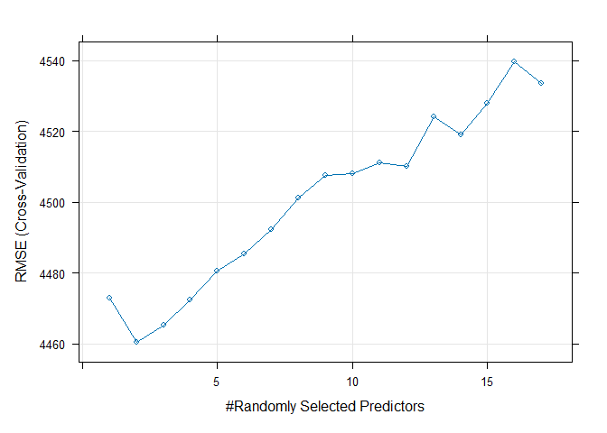

Project 2
================
Grace Holliday and Damon D’Ambrosio
2023-07-03

# Data Channel: **data_channel_is_tech**

# Introduction

The goal/purpose of this project is to explore the factors influencing
the amount of shares (popularity) of articles published by Mashable in a
period of two years.

The data includes 39,644 observations of 61 total variables. For our
exploration, we will use variables num_imgs, num_videos, num_keywords,
weekday_is variables (including is_weekend), global_subjectivity (Text
subjectivity),global_sentiment_polarity (Text sentiment polarity),
global_rate_positive_words (Rate of positive words in the content),
global_rate_negative_words (Rate of negative words in the content),
title_subjectivity, and title_polarity, to explore the target variable
(shares).

The methods we will use to model the response include:  
- Linear Regression  
- Random Forest  
- Boosted Tree

# Data

``` r
dat <- read_csv("OnlineNewsPopularity.csv")
```

    ## Rows: 39644 Columns: 61
    ## ── Column specification ───────────────────────────────────────────────────────────────────────
    ## Delimiter: ","
    ## chr  (1): url
    ## dbl (60): timedelta, n_tokens_title, n_tokens_content, n_unique_tokens, n_non_stop_words, n...
    ## 
    ## ℹ Use `spec()` to retrieve the full column specification for this data.
    ## ℹ Specify the column types or set `show_col_types = FALSE` to quiet this message.

``` r
# Subset data to variables we want
dat <- dat[,-c(1:9,12,20:31,39:44, 49:55,58,59)]

# Subsetting to correct channel(s)
col <- params[[1]][1]
if(col=="data_channel_is_lifestyle")
{
  dattype <- subset(dat,data_channel_is_lifestyle==1)
} else if(col=="data_channel_is_entertainment")
{
  dattype <- subset(dat,data_channel_is_entertainment==1)
} else if(col=="data_channel_is_bus")
{
  dattype <- subset(dat,data_channel_is_bus==1)
} else if(col=="data_channel_is_socmed")
{
  dattype <- subset(dat,data_channel_is_socmed==1)
} else if(col=="data_channel_is_tech")
{
  dattype <- subset(dat,data_channel_is_tech==1)
} else if(col=="data_channel_is_world")
{
  dattype <- subset(dat,data_channel_is_world==1)
}

# Removing data channel columns
dattype <- dattype[,-c(4:9)]
```

# Summarizations

First, we will produce basic summary statistics and plots about the
training data. To do this, we first need to divide the data into a
training and test set.

``` r
# First, establishing every categorical variable as a character
# so can change the factor
dattype$weekday_is_monday <- as.character(dattype$weekday_is_monday)
dattype$weekday_is_tuesday <- as.character(dattype$weekday_is_tuesday)
dattype$weekday_is_wednesday <- as.character(dattype$weekday_is_wednesday)
dattype$weekday_is_thursday <- as.character(dattype$weekday_is_thursday)
dattype$weekday_is_friday <- as.character(dattype$weekday_is_friday)
dattype$weekday_is_saturday <- as.character(dattype$weekday_is_saturday)
dattype$weekday_is_sunday <- as.character(dattype$weekday_is_sunday)

# Creating single variable for day 1 = Monday 2 = Tuesday 3 = Wednesday
# 4 = Thursday 5 = Friday 6 = Saturday 7 = Sunday 0 if no day, also
# making these a factor and not 0 and 1 for ensemble models

for(i in 1:nrow(dattype))
{
  if(dattype[i,4]==1)
  {
    dattype[i,19] <- 'Monday'
    dattype[i,4] <- 'Y'
    dattype[i,5] <- 'N'
    dattype[i,6] <- 'N'
    dattype[i,7] <- 'N'
    dattype[i,8] <- 'N'
    dattype[i,9] <- 'N' 
    dattype[i,10] <- 'N'
  }
  else if (dattype[i,5]==1)
  {
    dattype[i,19] <- 'Tuesday'
    dattype[i,4] <- 'N'
    dattype[i,5] <- 'Y'
    dattype[i,6] <- 'N'
    dattype[i,7] <- 'N'
    dattype[i,8] <- 'N'
    dattype[i,9] <- 'N' 
    dattype[i,10] <- 'N'
  }
  else if (dattype[i,6]==1)
  {
    dattype[i,19] <- 'Wednesday'
    dattype[i,6] <- 'Y'
    dattype[i,4] <- 'N'
    dattype[i,5] <- 'N'
    dattype[i,7] <- 'N'
    dattype[i,8] <- 'N'
    dattype[i,9] <- 'N' 
    dattype[i,10] <- 'N'
  }
  else if (dattype[i,7]==1)
  {
    dattype[i,19] <- 'Thursday'
    dattype[i,6] <- 'N'
    dattype[i,4] <- 'N'
    dattype[i,5] <- 'N'
    dattype[i,7] <- 'Y'
    dattype[i,8] <- 'N'
    dattype[i,9] <- 'N' 
    dattype[i,10] <- 'N'
    }
  else if (dattype[i,8]==1)
  {
    dattype[i,19] <- 'Friday'
    dattype[i,6] <- 'N'
    dattype[i,4] <- 'N'
    dattype[i,5] <- 'N'
    dattype[i,7] <- 'N'
    dattype[i,8] <- 'Y'
    dattype[i,9] <- 'N' 
    dattype[i,10] <- 'N'
  }
  else if (dattype[i,9]==1)
  {
    dattype[i,19] <- 'Saturday'
    dattype[i,6] <- 'N'
    dattype[i,4] <- 'N'
    dattype[i,5] <- 'N'
    dattype[i,7] <- 'N'
    dattype[i,8] <- 'N'
    dattype[i,9] <- 'Y' 
    dattype[i,10] <- 'N'
  }
  else if (dattype[i,10]==1)
  {
    dattype[i,19] <- 'Sunday'
    dattype[i,6] <- 'N'
    dattype[i,4] <- 'N'
    dattype[i,5] <- 'N'
    dattype[i,7] <- 'N'
    dattype[i,8] <- 'N'
    dattype[i,9] <- 'N' 
    dattype[i,10] <- 'Y'
  }
  else
  {
    dattype[i,19] <- 'NA'
  }
}

colnames(dattype)[19] <- 'day'

# and back to a factor
dattype$weekday_is_monday <- as.factor(dattype$weekday_is_monday)
dattype$weekday_is_tuesday <- as.factor(dattype$weekday_is_tuesday)
dattype$weekday_is_wednesday <- as.factor(dattype$weekday_is_wednesday)
dattype$weekday_is_thursday <- as.factor(dattype$weekday_is_thursday)
dattype$weekday_is_friday <- as.factor(dattype$weekday_is_friday)
dattype$weekday_is_saturday <- as.factor(dattype$weekday_is_saturday)
dattype$weekday_is_sunday <- as.factor(dattype$weekday_is_sunday)
dattype$day <- as.factor(dattype$day)

# Setting order of new factor levels
dattype$day <- factor(dattype$day, levels =c('Monday', 'Tuesday', 'Wednesday',
                                  'Thursday', 'Friday', 'Saturday', 'Sunday'))

# First setting seed for reproducibility.
set.seed(1234)

# Divide data into training and test set.
train <- sample(1:nrow(dattype), size = nrow(dattype)*.70)
test <- setdiff(1:nrow(dattype), train)

# training and testing subsets
datTrain <- dattype[train, ]
datTest <- dattype[test, ]
```

## Summary Statistics

Now, we will conduct exploratory data analysis through creation of basic
summary statistics and graphs exploring variables of interest to our
response (shares) before we select variables for potential models.

### Mean Shares by Day

``` r
datTrain %>%
  group_by(day) %>%
  summarise_at(vars(shares), list(name = mean))
```

    ## # A tibble: 7 × 2
    ##   day        name
    ##   <fct>     <dbl>
    ## 1 Monday    2794.
    ## 2 Tuesday   2908.
    ## 3 Wednesday 2977.
    ## 4 Thursday  2793.
    ## 5 Friday    2980.
    ## 6 Saturday  3587.
    ## 7 Sunday    3625.

This summary reveals the average number of shares by day of the week
(Days 1-7, Mon-Sun). The highest average represents the day with the
most shares. A day of 0 means no day was specified.

### Total Multimedia (Images and Videos) by Day

``` r
datTrain %>% group_by(day) %>%
  mutate(total.media = num_imgs + num_videos) %>%
    group_by(day) %>%
      summarize(average = mean(total.media), median = median(total.media), 
                min = min(total.media), max = max(total.media),
                sd =   sd(total.media))
```

    ## # A tibble: 7 × 6
    ##   day       average median   min   max    sd
    ##   <fct>       <dbl>  <dbl> <dbl> <dbl> <dbl>
    ## 1 Monday       5.83      2     0    65  8.77
    ## 2 Tuesday      4.63      2     0    60  6.85
    ## 3 Wednesday    4.79      2     0    74  6.87
    ## 4 Thursday     4.65      2     0    43  6.83
    ## 5 Friday       4.15      2     0    36  5.94
    ## 6 Saturday     5.39      2     0    64  6.58
    ## 7 Sunday       4.69      1     0    41  6.67

This summary provides the mean, median, minimum, maximum, and standard
deviation of the total multimedia objects (images + videos) appearing in
articles by day. Potential trends in this summary (e.g., if articles
published on certain day have more multimedia objects), may indicate
some type of collinearity between “day” and the “num_imgs” or
“num_videos” variables.

## Graphs

### Number of Images vs Shares

We can inspect the trend of shares as a function of the number of
images. If the points show an upward trend, then articles with more
images tend to be shared more often. If the points show a downward
trend, then articles with less images tend to be shared more often.

``` r
plot(datTrain$shares~datTrain$num_imgs)
```

<!-- -->

### Title Subjectivity vs Shares

We can inspect the trend of shares as a function of title subjectivity.
If the points show an upward trend, then articles with higher title
subjectivity tend to be shared more often. If the points show a downward
trend, then articles with lower title subjectivity tend to be shared
more often.

``` r
plot(datTrain$shares~datTrain$title_subjectivity)
```

<!-- -->

### Average Number of Keywords vs Shares

We can inspect the trend of shares as a function of number of keywords.
If the bars show an upward trend, then articles with more keywords tend
to be shared more often. If the bars show a downward trend, then
articles with less keywords tend to be shared more often.

``` r
datTrain$num_keywords <- as.factor(datTrain$num_keywords)
means <- datTrain %>%
  group_by(num_keywords) %>%
  summarise_at(vars(shares), list(name = mean))
barplot(height=means$name, names=means$num_keywords)
```

<!-- -->

``` r
# back to numeric for later models
datTrain$num_keywords <- as.numeric(datTrain$num_keywords)
```

### Images vs Videos

We can inspect possible relationships between the number of images and
videos in an article. If some type of relationship is evident (e.g.,
articles with more images tend to have more videos), it may suggest some
collinearity between these two variables.

``` r
g <- ggplot(datTrain, aes(x = scale(num_videos), y = scale(num_imgs)))

g + geom_point() + 
    xlab("Number of videos (standardized)") + 
    ylab("Number of images (standardized)") + 
    geom_smooth() + 
    theme_minimal()
```

<!-- -->

### Positive vs negative word rates

We can inspect the relationship between positive and negative word rates
in articles. If some type of relationship is evident (e.g., articles
with higher positive word rates tend to have lower negative word rates),
it may suggest some collinearity between these two variables.

``` r
g <- ggplot(datTrain, aes(x = scale(global_rate_positive_words), y = scale(global_rate_negative_words)))

g + geom_point() + 
    xlab("Positive word rate (standardized)") + 
    ylab("Negative word rate (standardized)") + 
    geom_smooth() + 
    theme_minimal()
```

<!-- -->

### Title subjectivity by day of week

We can inspect the relationship between title subjectivity and the day
of the week to see if certain days tend to have more/less subjective
article titles.

``` r
g <- ggplot(datTrain, aes(x = day, y = title_subjectivity))

g + geom_bar(stat = "summary", fun = "mean", color = "black", fill = "blue") + 
    xlab("Day") + ylab("Title subjectivity") +
    theme_minimal()
```

<!-- -->

# Modeling

Linear regression is an analysis method wherein the values of a variable
(i.e., response variable) is predicted based upon the value of one more
more other variables (i.e., predictor variables). There is an underlying
assumption that there is a linear relationship between the response
variable and any given predictor. The slope of this line is determined
mathematically by minimizing the sum of the squared residuals.

## Linear Models

This first model will explore the impact of images as combined with
number of key words, title subjectivity, sentiment polarity, and
positive word rate.

``` r
#Train model
mod2 <- train(shares ~ num_imgs+num_keywords+title_subjectivity+
                global_subjectivity+global_sentiment_polarity +
                global_rate_positive_words,
              data = datTrain,
              method = "lm",
              preProcess = c("center", "scale"), 
              trControl = trainControl(method = "cv", number = 5))

summary(mod2)
```

    ## 
    ## Call:
    ## lm(formula = .outcome ~ ., data = dat)
    ## 
    ## Residuals:
    ##    Min     1Q Median     3Q    Max 
    ##  -3860  -1823  -1204    157  92416 
    ## 
    ## Coefficients:
    ##                            Estimate Std. Error t value Pr(>|t|)    
    ## (Intercept)                2975.709     63.067  47.183  < 2e-16 ***
    ## num_imgs                    136.935     63.588   2.153 0.031327 *  
    ## num_keywords                  3.209     63.660   0.050 0.959802    
    ## title_subjectivity           83.972     63.866   1.315 0.188630    
    ## global_subjectivity         245.009     67.775   3.615 0.000303 ***
    ## global_sentiment_polarity  -261.133     77.047  -3.389 0.000706 ***
    ## global_rate_positive_words  -27.745     76.945  -0.361 0.718424    
    ## ---
    ## Signif. codes:  0 '***' 0.001 '**' 0.01 '*' 0.05 '.' 0.1 ' ' 1
    ## 
    ## Residual standard error: 4522 on 5135 degrees of freedom
    ## Multiple R-squared:  0.005553,   Adjusted R-squared:  0.004391 
    ## F-statistic: 4.779 on 6 and 5135 DF,  p-value: 7.229e-05

``` r
#Run on test data
mod2.predict <- predict(mod2, newdata = datTest)

#Obtain RMSE from test set, which will be used in automated comparison
mod2.compare <- postResample(mod2.predict, obs = datTest$shares)
```

The second model explores the impact of videos instead of images.
Keywords are retained as a variable. Instead of exploring subjectivity
and postive word rates, this model explores the “negative” (i.e., global
rate of negative words and maximum polarity of negative words). It also
includes an interaction between the number of videos and number of
keywords.

``` r
#Train model
mod3 <- train(shares ~ num_videos + num_keywords + num_videos:num_keywords + global_rate_negative_words + max_negative_polarity,
              data = datTrain,
              method = "lm",
              preProcess = c("center", "scale"), 
              trControl = trainControl(method = "cv", number = 5))

#Run on test data
mod3.predict <- predict(mod3, newdata = datTest)

#Obtain RMSE from test set, which will be used in automated comparison
mod3.compare <- postResample(mod3.predict, obs = datTest$shares)
```

## Ensemble Models

To streamline model fitting, we will first remove the previously created
“day” variable.

``` r
# this is regression, not classification
#removing previously created day variable for boosted tree model
datTrain <- datTrain[,-19]
datTest <- datTest[,-19]
```

Now to fit the ensemble models.

### Random Forest Model

Random forests are similar to bagging in the sense that multiple trees
(i.e., a “forest”) are created from bootstrap samples of data, with the
outcome of these trees averaged to form a conclusion. Unlike bagging,
not all possible predictors are used in each tree when using a random
forest- only a random subset is used for each tree. This in turn makes
the trees less correlated with one another, which allows for a greater
reduction in variation once the outcomes of all trees are averaged.

Below is a random forest model to predict shares:

``` r
#Create model
random.forest.fit <- train(shares ~ ., data = datTrain,
                           method = "rf",
                           preProcess = c("center", "scale"),
                           trControl = trainControl(method = "cv", number = 5),
                           tuneGrid = data.frame(mtry = 1:17))

# plot fit
plot(random.forest.fit)
```

<!-- -->

``` r
random.forest.fit$finalModel
```

    ## 
    ## Call:
    ##  randomForest(x = x, y = y, mtry = param$mtry) 
    ##                Type of random forest: regression
    ##                      Number of trees: 500
    ## No. of variables tried at each split: 2
    ## 
    ##           Mean of squared residuals: 20258311
    ##                     % Var explained: 1.36

``` r
# test fit
test_x = datTest[, -18] 
test_y = datTest[, 18] 
pred_y = predict(random.forest.fit, test_x)
x_ax = 1:length(pred_y)
x_ax <- as.numeric(x_ax)
test_y <- test_y$shares 
test_y <- as.integer(test_y)
pred_y <- as.integer(pred_y)
plot(x_ax, test_y, col="blue", pch=20, cex=.9)
lines(x_ax, pred_y, col="red", pch=20, cex=.9)
```

<!-- -->

``` r
#Run on test data
random.forest.predict <- predict(random.forest.fit, newdata = datTest)

#Obtain RMSE from test set, which will be used in automated comparison
random.forest.compare <- postResample(random.forest.predict, 
                                      obs = datTest$shares)
```

Here, the red lines are the predicted values for each observation. If
the red lines are close to following the blue dots (which are
representative of the actual value for each observation), then the model
is closely predicting.

### Boosted Tree Model

Boosting is a general approach that can be applied to trees and allows
for the slow training of trees. The trees are grown sequentially with
each subsequent tree being grown on a modified version of the original
data. The predictions are then updated as the trees are grown, and new
trees are grown by considering the errors in the trees previously
created. Lambda represents a shrinkage parameter than slows the fitting
process.

Below is a boosted tree model to predict shares.

``` r
boostFit <- train(shares~., data=datTrain, method="gbm",
                      preProcess=c("center","scale"),
                      trControl=trainControl(method='cv',number=5),
                      tuneGrid = expand.grid(n.trees=seq(25,200,50),
                                             interaction.depth=seq(1,4,1),
                                             shrinkage=0.1,
                                             n.minobsinnode=10))
```

    ## Iter   TrainDeviance   ValidDeviance   StepSize   Improve
    ##      1 15294122.5447             nan     0.1000 -403.3215
    ##      2 15281389.5307             nan     0.1000 -4621.3659
    ##      3 15264328.5911             nan     0.1000 10774.0728
    ##      4 15257977.0745             nan     0.1000 -2543.1320
    ##      5 15237972.2816             nan     0.1000 16481.2081
    ##      6 15235023.2331             nan     0.1000 -8941.4442
    ##      7 15218120.2604             nan     0.1000 4003.8198
    ##      8 15206515.7169             nan     0.1000 -415.5398
    ##      9 15198726.3564             nan     0.1000 2771.2964
    ##     10 15185112.2597             nan     0.1000 12679.5977
    ##     20 15093303.9814             nan     0.1000  525.3794
    ##     40 14968144.1335             nan     0.1000 -1701.2675
    ##     60 14888089.1976             nan     0.1000 -736.6922
    ##     80 14827507.0595             nan     0.1000 -1936.4905
    ##    100 14773979.8618             nan     0.1000 -1175.1065
    ##    120 14727773.8061             nan     0.1000 -7905.1186
    ##    140 14697803.9333             nan     0.1000 -2289.5646
    ##    160 14676976.5853             nan     0.1000 -8662.5162
    ##    175 14655604.2418             nan     0.1000 -7280.5965
    ## 
    ## Iter   TrainDeviance   ValidDeviance   StepSize   Improve
    ##      1 15285898.7172             nan     0.1000 -12653.4603
    ##      2 15266882.1533             nan     0.1000 -2059.3783
    ##      3 15225340.7222             nan     0.1000 25989.9733
    ##      4 15196266.3505             nan     0.1000 24595.8333
    ##      5 15146524.0575             nan     0.1000 -8222.9945
    ##      6 15124018.7547             nan     0.1000 5994.7566
    ##      7 15110168.6652             nan     0.1000 3500.7694
    ##      8 15097662.2913             nan     0.1000 -6467.3693
    ##      9 15078999.9027             nan     0.1000 4778.1815
    ##     10 15059698.5367             nan     0.1000  816.5489
    ##     20 14848896.3708             nan     0.1000 2787.0383
    ##     40 14587920.4235             nan     0.1000 -9370.6962
    ##     60 14372013.4186             nan     0.1000 -14242.1427
    ##     80 14206462.6361             nan     0.1000 -8932.1501
    ##    100 14047209.8149             nan     0.1000 -1452.5705
    ##    120 13929943.0510             nan     0.1000 -12225.3630
    ##    140 13837844.3146             nan     0.1000 -13012.5144
    ##    160 13730750.0457             nan     0.1000  528.3900
    ##    175 13613536.6592             nan     0.1000 -5355.0849
    ## 
    ## Iter   TrainDeviance   ValidDeviance   StepSize   Improve
    ##      1 15272079.8378             nan     0.1000 12414.3431
    ##      2 15241773.6079             nan     0.1000 25280.9714
    ##      3 15195704.6662             nan     0.1000 17396.3056
    ##      4 15129048.6227             nan     0.1000 -1546.9854
    ##      5 15092441.0807             nan     0.1000 19497.1810
    ##      6 15067369.1961             nan     0.1000 -5072.5041
    ##      7 15049855.7339             nan     0.1000 -5813.2547
    ##      8 15009147.0484             nan     0.1000 13951.7866
    ##      9 14985954.6867             nan     0.1000 -7599.8332
    ##     10 14958440.9346             nan     0.1000 4827.5756
    ##     20 14699748.3058             nan     0.1000 3014.6691
    ##     40 14333185.0152             nan     0.1000 -384.3707
    ##     60 14022235.1351             nan     0.1000 -15702.9260
    ##     80 13701077.1975             nan     0.1000 -8820.5640
    ##    100 13464827.4324             nan     0.1000 -11778.2550
    ##    120 13222314.6276             nan     0.1000 -10933.6974
    ##    140 12988814.6896             nan     0.1000 -20984.9694
    ##    160 12829799.1275             nan     0.1000 -10869.1558
    ##    175 12670106.5440             nan     0.1000 -15754.9558
    ## 
    ## Iter   TrainDeviance   ValidDeviance   StepSize   Improve
    ##      1 15251706.6328             nan     0.1000 20992.4272
    ##      2 15159706.1862             nan     0.1000 6435.7675
    ##      3 15111529.1610             nan     0.1000 29202.5275
    ##      4 15064905.8450             nan     0.1000 -5736.5549
    ##      5 15026724.9459             nan     0.1000 -9047.8426
    ##      6 14967679.6462             nan     0.1000 -8502.7479
    ##      7 14874311.6733             nan     0.1000 -3825.2654
    ##      8 14832669.5230             nan     0.1000 -5219.7312
    ##      9 14779969.9664             nan     0.1000  650.9571
    ##     10 14744869.4492             nan     0.1000 -8579.2732
    ##     20 14426530.7340             nan     0.1000 3593.3836
    ##     40 13817175.0809             nan     0.1000 -3098.5653
    ##     60 13304579.9080             nan     0.1000 -4893.3510
    ##     80 12976364.5135             nan     0.1000 -3355.3836
    ##    100 12574547.8596             nan     0.1000 -8225.0731
    ##    120 12257494.6659             nan     0.1000 -13452.2181
    ##    140 11951617.9199             nan     0.1000 -15664.7095
    ##    160 11664038.8093             nan     0.1000 -19612.2656
    ##    175 11498480.6768             nan     0.1000 -19081.7132
    ## 
    ## Iter   TrainDeviance   ValidDeviance   StepSize   Improve
    ##      1 22807955.1027             nan     0.1000 6080.3749
    ##      2 22787077.9734             nan     0.1000 -2490.7415
    ##      3 22763242.7267             nan     0.1000  913.0623
    ##      4 22742976.4584             nan     0.1000 13000.2032
    ##      5 22723214.1060             nan     0.1000 -8495.3728
    ##      6 22710644.4737             nan     0.1000 -860.2787
    ##      7 22691405.5869             nan     0.1000 10467.6729
    ##      8 22672941.6777             nan     0.1000 -8409.7310
    ##      9 22658694.2949             nan     0.1000 3277.4749
    ##     10 22645875.1981             nan     0.1000 -6917.0593
    ##     20 22492513.4861             nan     0.1000 1025.4640
    ##     40 22324125.6097             nan     0.1000 -2109.8375
    ##     60 22216096.2492             nan     0.1000 -9192.7789
    ##     80 22134267.4226             nan     0.1000 -2184.5362
    ##    100 22056021.1934             nan     0.1000 -11710.3171
    ##    120 21995583.3016             nan     0.1000 -8975.4134
    ##    140 21926987.9075             nan     0.1000 -17146.5298
    ##    160 21880886.5566             nan     0.1000 -8641.9264
    ##    175 21852803.8415             nan     0.1000 -6252.3944
    ## 
    ## Iter   TrainDeviance   ValidDeviance   StepSize   Improve
    ##      1 22785601.8096             nan     0.1000 20022.1519
    ##      2 22744464.2488             nan     0.1000 19241.9031
    ##      3 22607098.6859             nan     0.1000 3363.1665
    ##      4 22548343.9219             nan     0.1000 18328.5919
    ##      5 22489450.6949             nan     0.1000 35265.6188
    ##      6 22450957.6978             nan     0.1000 16987.3361
    ##      7 22426251.8623             nan     0.1000 -11872.1322
    ##      8 22266841.7180             nan     0.1000 -6335.5462
    ##      9 22245945.1419             nan     0.1000 2268.5182
    ##     10 22214395.0011             nan     0.1000 13583.6489
    ##     20 21765146.1462             nan     0.1000 -4485.5530
    ##     40 21245232.4732             nan     0.1000 -20906.0672
    ##     60 20912533.8726             nan     0.1000 -18159.3968
    ##     80 20546130.3140             nan     0.1000 -6495.2679
    ##    100 20260258.1584             nan     0.1000 -12897.5832
    ##    120 20005263.5980             nan     0.1000 -13235.4050
    ##    140 19799251.6456             nan     0.1000 -27607.2711
    ##    160 19564369.4580             nan     0.1000 -13033.3832
    ##    175 19435204.1810             nan     0.1000 -48406.3358
    ## 
    ## Iter   TrainDeviance   ValidDeviance   StepSize   Improve
    ##      1 22726568.0939             nan     0.1000 45845.5837
    ##      2 22519511.0065             nan     0.1000 13829.8433
    ##      3 22461964.8433             nan     0.1000 21410.8185
    ##      4 22373974.5851             nan     0.1000 -14377.1494
    ##      5 22300764.6292             nan     0.1000 11184.9089
    ##      6 22189311.6606             nan     0.1000 40039.1317
    ##      7 22142817.5216             nan     0.1000 12149.7411
    ##      8 22012179.2019             nan     0.1000 1938.7921
    ##      9 21933284.7628             nan     0.1000 30406.4573
    ##     10 21828057.7988             nan     0.1000 40198.0685
    ##     20 21313246.9163             nan     0.1000 -12109.9559
    ##     40 20543728.7202             nan     0.1000 -35201.1594
    ##     60 19942868.7594             nan     0.1000 -21580.2004
    ##     80 19432497.0815             nan     0.1000 -28082.5510
    ##    100 18902938.8777             nan     0.1000 -3620.5251
    ##    120 18471557.8071             nan     0.1000 -26181.0105
    ##    140 18094367.1212             nan     0.1000 -25260.8302
    ##    160 17816104.1083             nan     0.1000 -26238.0419
    ##    175 17592472.0910             nan     0.1000 -20648.1742
    ## 
    ## Iter   TrainDeviance   ValidDeviance   StepSize   Improve
    ##      1 22718531.6682             nan     0.1000 14928.0555
    ##      2 22596127.8528             nan     0.1000 57735.2183
    ##      3 22512730.9727             nan     0.1000 12827.9461
    ##      4 22359145.9494             nan     0.1000 13431.5664
    ##      5 22195503.3284             nan     0.1000 -16318.4379
    ##      6 22102209.4071             nan     0.1000 -17756.6370
    ##      7 22025806.9488             nan     0.1000  528.2233
    ##      8 21860789.0842             nan     0.1000 4119.9624
    ##      9 21789924.4522             nan     0.1000 15639.8134
    ##     10 21684706.5630             nan     0.1000 22057.5819
    ##     20 20880384.3089             nan     0.1000 -7596.5344
    ##     40 19729921.2443             nan     0.1000 -4120.4094
    ##     60 18926132.7600             nan     0.1000 -19818.7081
    ##     80 18303355.2743             nan     0.1000 -38548.7357
    ##    100 17611959.2252             nan     0.1000 -20201.7018
    ##    120 17169938.6898             nan     0.1000 -41441.8366
    ##    140 16683120.2612             nan     0.1000 -8985.5624
    ##    160 16243233.7220             nan     0.1000 -26127.4765
    ##    175 15948807.4481             nan     0.1000 -19172.7870
    ## 
    ## Iter   TrainDeviance   ValidDeviance   StepSize   Improve
    ##      1 23029189.6339             nan     0.1000 7837.5082
    ##      2 23017653.2560             nan     0.1000 -875.1458
    ##      3 22989311.2621             nan     0.1000 21908.4322
    ##      4 22975252.7086             nan     0.1000 7170.6602
    ##      5 22956914.8754             nan     0.1000 17166.8726
    ##      6 22937908.9770             nan     0.1000 10826.9219
    ##      7 22921507.8990             nan     0.1000 7091.3058
    ##      8 22904779.0234             nan     0.1000 -2644.6957
    ##      9 22894482.1707             nan     0.1000 1999.2058
    ##     10 22882973.7834             nan     0.1000 -9330.2152
    ##     20 22760397.6446             nan     0.1000 7664.0569
    ##     40 22633643.6051             nan     0.1000 -2339.4711
    ##     60 22539610.2218             nan     0.1000 -9803.0252
    ##     80 22461768.9844             nan     0.1000 -5982.2133
    ##    100 22394575.8250             nan     0.1000 -23946.9305
    ##    120 22327197.1449             nan     0.1000 -5247.2787
    ##    140 22260254.4765             nan     0.1000 -10257.3064
    ##    160 22220592.4978             nan     0.1000 -7389.0834
    ##    175 22192437.2480             nan     0.1000 -10150.1893
    ## 
    ## Iter   TrainDeviance   ValidDeviance   StepSize   Improve
    ##      1 23002620.9829             nan     0.1000 14684.7156
    ##      2 22973821.5660             nan     0.1000 -5436.2522
    ##      3 22927638.1000             nan     0.1000 29827.6740
    ##      4 22897024.0016             nan     0.1000 8400.0645
    ##      5 22853675.4894             nan     0.1000 18319.0679
    ##      6 22809360.7799             nan     0.1000 37339.8119
    ##      7 22769701.8464             nan     0.1000 21099.4474
    ##      8 22744553.1472             nan     0.1000 9480.0131
    ##      9 22621858.3384             nan     0.1000 23166.3135
    ##     10 22558193.6614             nan     0.1000 33754.3663
    ##     20 22192019.0244             nan     0.1000 -8100.4351
    ##     40 21628872.7905             nan     0.1000 -13132.7782
    ##     60 21382597.8738             nan     0.1000 -3835.3832
    ##     80 21123036.8010             nan     0.1000 -3100.1863
    ##    100 20929021.5286             nan     0.1000 -5759.4196
    ##    120 20727797.6050             nan     0.1000 -7446.8505
    ##    140 20515888.7238             nan     0.1000 -3902.6563
    ##    160 20302475.7725             nan     0.1000 -19195.1919
    ##    175 20141640.9158             nan     0.1000 -9892.1231
    ## 
    ## Iter   TrainDeviance   ValidDeviance   StepSize   Improve
    ##      1 22952845.9373             nan     0.1000 63803.8495
    ##      2 22815140.3105             nan     0.1000 32840.3430
    ##      3 22685643.5402             nan     0.1000 51734.0193
    ##      4 22596293.3726             nan     0.1000 1336.5737
    ##      5 22532761.7602             nan     0.1000 16500.7172
    ##      6 22464066.3804             nan     0.1000 -13567.7431
    ##      7 22428280.1607             nan     0.1000 -2902.5350
    ##      8 22382439.3192             nan     0.1000 13954.6113
    ##      9 22308945.9451             nan     0.1000 4684.4403
    ##     10 22264134.7827             nan     0.1000 15057.2496
    ##     20 21801256.3401             nan     0.1000 1737.6400
    ##     40 21230441.4666             nan     0.1000 -6883.8119
    ##     60 20696142.2180             nan     0.1000 -10976.8930
    ##     80 20246391.6626             nan     0.1000 -29779.8571
    ##    100 19765701.1221             nan     0.1000 -19977.3242
    ##    120 19310056.7844             nan     0.1000 -18331.7954
    ##    140 18841432.6338             nan     0.1000 -20015.3822
    ##    160 18537454.6589             nan     0.1000 2026.5633
    ##    175 18271139.5557             nan     0.1000 -27223.1665
    ## 
    ## Iter   TrainDeviance   ValidDeviance   StepSize   Improve
    ##      1 22982721.6408             nan     0.1000 2875.7827
    ##      2 22868064.5663             nan     0.1000 4967.5144
    ##      3 22769925.6289             nan     0.1000 22437.3112
    ##      4 22665633.5267             nan     0.1000 -9257.9580
    ##      5 22612236.4172             nan     0.1000 27019.5547
    ##      6 22572345.2254             nan     0.1000 17380.5387
    ##      7 22527726.5697             nan     0.1000 14987.5299
    ##      8 22407836.7309             nan     0.1000 12055.8102
    ##      9 22259468.5489             nan     0.1000 -5673.6690
    ##     10 22190760.1331             nan     0.1000 12071.2407
    ##     20 21321625.6620             nan     0.1000 -3910.5322
    ##     40 20209437.8404             nan     0.1000 -14213.0510
    ##     60 19594829.5118             nan     0.1000 -17238.6793
    ##     80 18987556.2411             nan     0.1000 -14011.6071
    ##    100 18495101.7293             nan     0.1000 -59726.3561
    ##    120 17981313.6941             nan     0.1000 -8920.4721
    ##    140 17506685.7339             nan     0.1000 -25151.1335
    ##    160 17067400.4887             nan     0.1000 -20273.2013
    ##    175 16747944.1006             nan     0.1000 -43634.1611
    ## 
    ## Iter   TrainDeviance   ValidDeviance   StepSize   Improve
    ##      1 21671084.4883             nan     0.1000 -8502.1333
    ##      2 21653924.2784             nan     0.1000 3665.5723
    ##      3 21635801.9935             nan     0.1000  551.6727
    ##      4 21616067.6290             nan     0.1000 1185.0022
    ##      5 21597637.5865             nan     0.1000 -5929.4032
    ##      6 21577909.6026             nan     0.1000 20659.8032
    ##      7 21562175.9632             nan     0.1000 -2317.3231
    ##      8 21549188.5342             nan     0.1000 -5941.1491
    ##      9 21533960.8911             nan     0.1000 8128.2733
    ##     10 21516902.8624             nan     0.1000 5951.0504
    ##     20 21406025.2268             nan     0.1000 7461.9383
    ##     40 21250423.4181             nan     0.1000 -4299.7716
    ##     60 21160196.5085             nan     0.1000  199.8633
    ##     80 21095944.1673             nan     0.1000 -6776.6974
    ##    100 21029826.7411             nan     0.1000 -5738.5701
    ##    120 20968144.9143             nan     0.1000 -4107.6215
    ##    140 20927855.0841             nan     0.1000 -12504.2099
    ##    160 20878904.5658             nan     0.1000 2658.9619
    ##    175 20845668.7366             nan     0.1000 -3702.1929
    ## 
    ## Iter   TrainDeviance   ValidDeviance   StepSize   Improve
    ##      1 21634704.5491             nan     0.1000 36060.1017
    ##      2 21603989.4526             nan     0.1000 9220.8829
    ##      3 21377699.5820             nan     0.1000 31628.3626
    ##      4 21348149.8448             nan     0.1000 -6533.8054
    ##      5 21323639.0611             nan     0.1000 6811.8477
    ##      6 21299956.1923             nan     0.1000 12544.4981
    ##      7 21258677.8771             nan     0.1000 10915.9159
    ##      8 21227266.8678             nan     0.1000 13261.2474
    ##      9 21123403.1674             nan     0.1000 6079.2077
    ##     10 21098701.5754             nan     0.1000 11280.1183
    ##     20 20731227.2324             nan     0.1000 -12917.2807
    ##     40 20294639.2150             nan     0.1000 -15539.3509
    ##     60 19874116.8325             nan     0.1000 -15307.1484
    ##     80 19635280.8698             nan     0.1000 -8779.1718
    ##    100 19400686.4866             nan     0.1000 -21040.8449
    ##    120 19152925.7169             nan     0.1000 -8813.2339
    ##    140 19039968.7550             nan     0.1000 -12058.3444
    ##    160 18825077.6110             nan     0.1000 5478.6400
    ##    175 18668259.8909             nan     0.1000 -2673.8368
    ## 
    ## Iter   TrainDeviance   ValidDeviance   StepSize   Improve
    ##      1 21622702.5077             nan     0.1000 5021.4571
    ##      2 21399307.6620             nan     0.1000 -14731.4500
    ##      3 21358495.7619             nan     0.1000 28153.5513
    ##      4 21297320.8550             nan     0.1000 23136.0828
    ##      5 21222748.7723             nan     0.1000 10590.6091
    ##      6 21186699.8573             nan     0.1000 10456.4600
    ##      7 21113464.2156             nan     0.1000 -9025.7002
    ##      8 21061368.6791             nan     0.1000 -16041.1886
    ##      9 20954761.5850             nan     0.1000 9653.0045
    ##     10 20889276.5119             nan     0.1000 13208.3941
    ##     20 20437071.2038             nan     0.1000 3767.2823
    ##     40 19624731.2364             nan     0.1000 -18473.8379
    ##     60 19036180.3236             nan     0.1000 -64428.3453
    ##     80 18388793.9881             nan     0.1000 -46595.6972
    ##    100 17908717.4389             nan     0.1000 -7809.8728
    ##    120 17555784.1538             nan     0.1000 -6423.6325
    ##    140 17246455.0854             nan     0.1000 -3040.5677
    ##    160 16966751.6173             nan     0.1000 -6507.7438
    ##    175 16829041.0775             nan     0.1000 -60634.0992
    ## 
    ## Iter   TrainDeviance   ValidDeviance   StepSize   Improve
    ##      1 21528999.6774             nan     0.1000 21999.6633
    ##      2 21383461.9441             nan     0.1000 51630.9980
    ##      3 21294110.5328             nan     0.1000 -26493.2048
    ##      4 21234454.0513             nan     0.1000 -6975.8276
    ##      5 21157332.7682             nan     0.1000 10264.1234
    ##      6 21075568.3450             nan     0.1000 -30683.0565
    ##      7 21009951.5147             nan     0.1000 2296.0303
    ##      8 20933874.6271             nan     0.1000 1735.3600
    ##      9 20879801.4333             nan     0.1000 -9107.1168
    ##     10 20730520.7672             nan     0.1000 -1974.1663
    ##     20 20011938.6340             nan     0.1000 -11776.2220
    ##     40 19103313.4474             nan     0.1000 -8773.0930
    ##     60 18217500.6358             nan     0.1000 -43201.6220
    ##     80 17661465.1699             nan     0.1000 -17667.3562
    ##    100 17064733.9370             nan     0.1000 -20544.9754
    ##    120 16653528.2041             nan     0.1000 -6966.2550
    ##    140 16343165.4221             nan     0.1000 -55046.4555
    ##    160 15922596.7277             nan     0.1000 -63284.0326
    ##    175 15637700.9870             nan     0.1000 -34075.2142
    ## 
    ## Iter   TrainDeviance   ValidDeviance   StepSize   Improve
    ##      1 19791074.0092             nan     0.1000 8943.6182
    ##      2 19770315.1010             nan     0.1000 12314.3813
    ##      3 19757911.4717             nan     0.1000 8161.9912
    ##      4 19727476.3829             nan     0.1000 24761.7498
    ##      5 19708818.7129             nan     0.1000 -4192.2041
    ##      6 19698876.4805             nan     0.1000 2369.7346
    ##      7 19686497.8944             nan     0.1000 8105.0080
    ##      8 19673623.2743             nan     0.1000 2308.3573
    ##      9 19649399.2921             nan     0.1000 15320.6164
    ##     10 19630672.3606             nan     0.1000 14419.5521
    ##     20 19493015.1470             nan     0.1000 -6277.3607
    ##     40 19354224.4855             nan     0.1000 3345.1470
    ##     60 19268609.1747             nan     0.1000 -3175.1704
    ##     80 19200596.4327             nan     0.1000 -3949.0883
    ##    100 19149310.2006             nan     0.1000 -8122.6817
    ##    120 19095147.2839             nan     0.1000 -3189.9819
    ##    140 19048794.3965             nan     0.1000 -2907.3743
    ##    160 19011395.3258             nan     0.1000 -7617.5833
    ##    175 18988815.8074             nan     0.1000 1629.7046
    ## 
    ## Iter   TrainDeviance   ValidDeviance   StepSize   Improve
    ##      1 19769201.0147             nan     0.1000 24878.2024
    ##      2 19738329.7283             nan     0.1000 -8618.9380
    ##      3 19682463.0623             nan     0.1000 21350.2098
    ##      4 19633551.4626             nan     0.1000 1377.2418
    ##      5 19578879.2625             nan     0.1000 -4865.6037
    ##      6 19546635.2334             nan     0.1000 3842.3821
    ##      7 19502982.1182             nan     0.1000 -1619.2528
    ##      8 19464446.6777             nan     0.1000 6422.0707
    ##      9 19358652.1857             nan     0.1000 -29735.4527
    ##     10 19333331.1870             nan     0.1000 -6737.2927
    ##     20 18952353.6857             nan     0.1000 -7252.8817
    ##     40 18560412.2899             nan     0.1000 -29909.9402
    ##     60 18217780.8843             nan     0.1000  806.8302
    ##     80 18032376.3334             nan     0.1000 -5366.1462
    ##    100 17792322.0061             nan     0.1000 -1573.4907
    ##    120 17567989.0834             nan     0.1000 -414.8131
    ##    140 17353949.6452             nan     0.1000 -21718.1541
    ##    160 17118797.6818             nan     0.1000 -21752.8604
    ##    175 16998983.5266             nan     0.1000 -8214.6812
    ## 
    ## Iter   TrainDeviance   ValidDeviance   StepSize   Improve
    ##      1 19763394.9026             nan     0.1000 10725.9394
    ##      2 19695137.2375             nan     0.1000  313.2484
    ##      3 19585202.8683             nan     0.1000 -3066.2395
    ##      4 19536558.6555             nan     0.1000 23837.8588
    ##      5 19499917.9926             nan     0.1000 -2258.4508
    ##      6 19428222.7798             nan     0.1000 2261.7597
    ##      7 19340635.5112             nan     0.1000 -7275.9374
    ##      8 19264883.7093             nan     0.1000 -349.8514
    ##      9 19200206.5283             nan     0.1000 6419.0842
    ##     10 19094104.8650             nan     0.1000 24052.2831
    ##     20 18645939.6562             nan     0.1000 -7867.6851
    ##     40 18098376.2812             nan     0.1000 -13888.4320
    ##     60 17461634.4325             nan     0.1000 -19799.5547
    ##     80 16972279.8980             nan     0.1000 -32639.3440
    ##    100 16569238.5277             nan     0.1000 -25203.6939
    ##    120 16215619.3941             nan     0.1000 -10279.8976
    ##    140 15952834.7611             nan     0.1000 -6208.4876
    ##    160 15658442.8703             nan     0.1000 -16230.5247
    ##    175 15455507.7898             nan     0.1000 -31378.3663
    ## 
    ## Iter   TrainDeviance   ValidDeviance   StepSize   Improve
    ##      1 19695782.9146             nan     0.1000 -3200.8385
    ##      2 19623430.9083             nan     0.1000 -9009.6257
    ##      3 19504865.0314             nan     0.1000 -25833.7716
    ##      4 19296395.2180             nan     0.1000 16596.9548
    ##      5 19262605.6178             nan     0.1000 -19013.4952
    ##      6 19157493.1005             nan     0.1000 18959.0795
    ##      7 19100328.5738             nan     0.1000 -6067.3534
    ##      8 19021633.4202             nan     0.1000 -15785.4807
    ##      9 18979206.7641             nan     0.1000 13308.7179
    ##     10 18869734.8765             nan     0.1000 3571.5407
    ##     20 18217040.3583             nan     0.1000 14102.4888
    ##     40 17426893.8711             nan     0.1000 -59674.8821
    ##     60 16779315.1738             nan     0.1000 -6768.0563
    ##     80 16195436.4721             nan     0.1000 -31379.6827
    ##    100 15759676.3351             nan     0.1000 -5592.6212
    ##    120 15357426.8647             nan     0.1000 -30087.4474
    ##    140 15031846.6593             nan     0.1000 -14369.4306
    ##    160 14651612.2500             nan     0.1000 -16792.7588
    ##    175 14379335.1321             nan     0.1000 -8965.1403
    ## 
    ## Iter   TrainDeviance   ValidDeviance   StepSize   Improve
    ##      1 20509452.7709             nan     0.1000 12495.8195
    ##      2 20496060.1084             nan     0.1000 3571.1804
    ##      3 20480867.9282             nan     0.1000 4342.2426
    ##      4 20464239.4268             nan     0.1000 -2071.1545
    ##      5 20453710.6817             nan     0.1000 -6016.2735
    ##      6 20438813.4765             nan     0.1000 5604.5344
    ##      7 20423045.3331             nan     0.1000 3440.0338
    ##      8 20404006.6988             nan     0.1000 12344.4395
    ##      9 20393921.3847             nan     0.1000 -2271.7949
    ##     10 20384903.7451             nan     0.1000 -4971.8870
    ##     20 20286198.5127             nan     0.1000 -6841.2294
    ##     40 20159677.7402             nan     0.1000 -12062.8671
    ##     60 20080518.8586             nan     0.1000 -12662.5784
    ##     75 20030210.4694             nan     0.1000   36.5523

``` r
# plot fit
plot(boostFit)
```

<!-- -->

``` r
boostFit$finalModel
```

    ## A gradient boosted model with gaussian loss function.
    ## 75 iterations were performed.
    ## There were 17 predictors of which 13 had non-zero influence.

``` r
# test fit
test_x = datTest[, -18] 
test_y = datTest[, 18] 
pred_y = predict(boostFit, test_x)
x_ax = 1:length(pred_y)
x_ax <- as.numeric(x_ax)
test_y <- test_y$shares 
test_y <- as.integer(test_y)
pred_y <- as.integer(pred_y)
plot(x_ax, test_y, col="blue", pch=20, cex=.9)
lines(x_ax, pred_y, col="red", pch=20, cex=.9)
```

<!-- -->

``` r
#Run on test data
boostFit.predict <- predict(boostFit, newdata = datTest)

#Obtain RMSE from test set, which will be used in automated comparison
boostFit.compare <- postResample(boostFit.predict, obs = datTest$shares)
```

Here, the red lines are the predicted values for each observation. If
the red lines are close to following the blue dots (which are
representative of the actual value for each observation), then the model
is closely predicting.

## Comparison

Now, grab all the RMSEs obtained from fitting the 4 models on the test
set to determine the “winner.”

``` r
#Compile RMSEs from the 4 models
mod2.RMSE <- mod2.compare[1]
mod3.RMSE <- mod3.compare[1]
random.forest.RMSE <- random.forest.compare[1]
boostFit.RMSE <- boostFit.compare[1]

compare.all <- data.frame(
                    model = c("mod2", "mod3", "random.forest", "boostFit"),
                    RMSE = c(mod2.RMSE, mod3.RMSE, random.forest.RMSE, boostFit.RMSE)
)

winner <- compare.all %>% slice_min(order_by = RMSE)
```

The lowest RMSE obtained on the test set was **1.487782^{4}**, which
belongs to the **random.forest** model. Therefore, **random.forest** is
the winner!

The final standings of all 4 models can be seen below:

``` r
compare.all %>% arrange(RMSE) %>% mutate(Final.Rank = rank(RMSE))
```

    ##           model     RMSE Final.Rank
    ## 1 random.forest 14877.82          1
    ## 2      boostFit 14919.49          2
    ## 3          mod3 14944.91          3
    ## 4          mod2 14948.52          4

Automation Below is the code (also found in the file
render_w_automation.R) that is used to automate production of the six
data channel html documents. This is run in the command line and
produces the six separate reports.

``` r
channels <- c("data_channel_is_lifestyle","data_channel_is_entertainment",
    "data_channel_is_bus",
    "data_channel_is_socmed",
    "data_channel_is_tech",
    "data_channel_is_world")

for(i in 1:6)
{rmarkdown::render("project2.rmd",
                  output_format="github_document",
                  params=list(datachannel=channels[i]),
                  output_file = channels[i])
}
```
