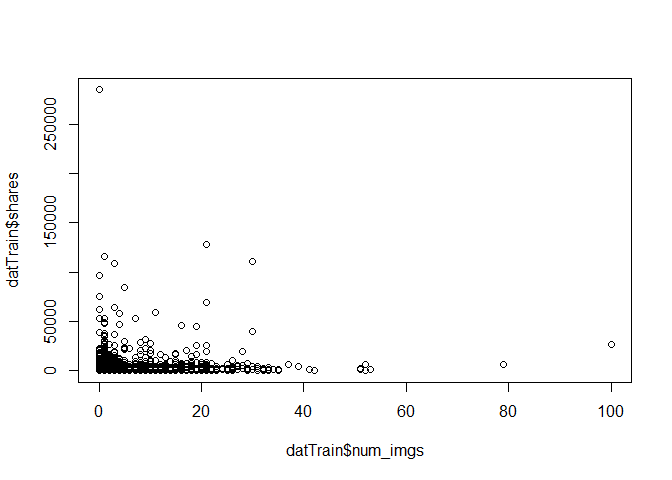
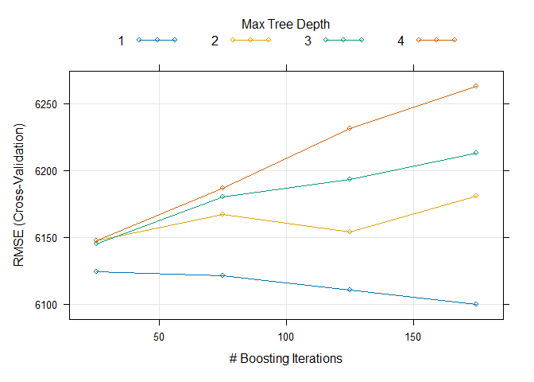

Project 2
================
Grace Holliday and Damon D’Ambrosio
2023-07-03

# Data Channel: **data_channel_is_world**

# Introduction

The goal/purpose of this project is to explore the factors influencing
the amount of shares (popularity) of articles published by Mashable in a
period of two years.

The data includes 39,644 observations of 61 total variables. For our
exploration, we will use variables num_imgs, num_videos, num_keywords,
weekday_is variables (including is_weekend), global_subjectivity (Text
subjectivity),global_sentiment_polarity (Text sentiment polarity),
global_rate_positive_words (Rate of positive words in the content),
global_rate_negative_words (Rate of negative words in the content),
title_subjectivity, and title_polarity, to explore the target variable
(shares).

The methods we will use to model the response include:  
- Linear Regression  
- Random Forest  
- Boosted Tree

# Data

``` r
dat <- read_csv("OnlineNewsPopularity.csv")
```

    ## Rows: 39644 Columns: 61
    ## ── Column specification ───────────────────────────────────────────────────────────────────────
    ## Delimiter: ","
    ## chr  (1): url
    ## dbl (60): timedelta, n_tokens_title, n_tokens_content, n_unique_tokens, n_non_stop_words, n...
    ## 
    ## ℹ Use `spec()` to retrieve the full column specification for this data.
    ## ℹ Specify the column types or set `show_col_types = FALSE` to quiet this message.

``` r
# Subset data to variables we want
dat <- dat[,-c(1:9,12,20:31,39:44, 49:55,58,59)]

# Subsetting to correct channel(s)
col <- params[[1]][1]
if(col=="data_channel_is_lifestyle")
{
  dattype <- subset(dat,data_channel_is_lifestyle==1)
} else if(col=="data_channel_is_entertainment")
{
  dattype <- subset(dat,data_channel_is_entertainment==1)
} else if(col=="data_channel_is_bus")
{
  dattype <- subset(dat,data_channel_is_bus==1)
} else if(col=="data_channel_is_socmed")
{
  dattype <- subset(dat,data_channel_is_socmed==1)
} else if(col=="data_channel_is_tech")
{
  dattype <- subset(dat,data_channel_is_tech==1)
} else if(col=="data_channel_is_world")
{
  dattype <- subset(dat,data_channel_is_world==1)
}

# Removing data channel columns
dattype <- dattype[,-c(4:9)]
```

# Summarizations

First, we will produce basic summary statistics and plots about the
training data. To do this, we first need to divide the data into a
training and test set.

``` r
# First, establishing every categorical variable as a character
# so can change the factor
dattype$weekday_is_monday <- as.character(dattype$weekday_is_monday)
dattype$weekday_is_tuesday <- as.character(dattype$weekday_is_tuesday)
dattype$weekday_is_wednesday <- as.character(dattype$weekday_is_wednesday)
dattype$weekday_is_thursday <- as.character(dattype$weekday_is_thursday)
dattype$weekday_is_friday <- as.character(dattype$weekday_is_friday)
dattype$weekday_is_saturday <- as.character(dattype$weekday_is_saturday)
dattype$weekday_is_sunday <- as.character(dattype$weekday_is_sunday)

# Creating single variable for day 1 = Monday 2 = Tuesday 3 = Wednesday
# 4 = Thursday 5 = Friday 6 = Saturday 7 = Sunday 0 if no day, also
# making these a factor and not 0 and 1 for ensemble models

for(i in 1:nrow(dattype))
{
  if(dattype[i,4]==1)
  {
    dattype[i,19] <- 'Monday'
    dattype[i,4] <- 'Y'
    dattype[i,5] <- 'N'
    dattype[i,6] <- 'N'
    dattype[i,7] <- 'N'
    dattype[i,8] <- 'N'
    dattype[i,9] <- 'N' 
    dattype[i,10] <- 'N'
  }
  else if (dattype[i,5]==1)
  {
    dattype[i,19] <- 'Tuesday'
    dattype[i,4] <- 'N'
    dattype[i,5] <- 'Y'
    dattype[i,6] <- 'N'
    dattype[i,7] <- 'N'
    dattype[i,8] <- 'N'
    dattype[i,9] <- 'N' 
    dattype[i,10] <- 'N'
  }
  else if (dattype[i,6]==1)
  {
    dattype[i,19] <- 'Wednesday'
    dattype[i,6] <- 'Y'
    dattype[i,4] <- 'N'
    dattype[i,5] <- 'N'
    dattype[i,7] <- 'N'
    dattype[i,8] <- 'N'
    dattype[i,9] <- 'N' 
    dattype[i,10] <- 'N'
  }
  else if (dattype[i,7]==1)
  {
    dattype[i,19] <- 'Thursday'
    dattype[i,6] <- 'N'
    dattype[i,4] <- 'N'
    dattype[i,5] <- 'N'
    dattype[i,7] <- 'Y'
    dattype[i,8] <- 'N'
    dattype[i,9] <- 'N' 
    dattype[i,10] <- 'N'
    }
  else if (dattype[i,8]==1)
  {
    dattype[i,19] <- 'Friday'
    dattype[i,6] <- 'N'
    dattype[i,4] <- 'N'
    dattype[i,5] <- 'N'
    dattype[i,7] <- 'N'
    dattype[i,8] <- 'Y'
    dattype[i,9] <- 'N' 
    dattype[i,10] <- 'N'
  }
  else if (dattype[i,9]==1)
  {
    dattype[i,19] <- 'Saturday'
    dattype[i,6] <- 'N'
    dattype[i,4] <- 'N'
    dattype[i,5] <- 'N'
    dattype[i,7] <- 'N'
    dattype[i,8] <- 'N'
    dattype[i,9] <- 'Y' 
    dattype[i,10] <- 'N'
  }
  else if (dattype[i,10]==1)
  {
    dattype[i,19] <- 'Sunday'
    dattype[i,6] <- 'N'
    dattype[i,4] <- 'N'
    dattype[i,5] <- 'N'
    dattype[i,7] <- 'N'
    dattype[i,8] <- 'N'
    dattype[i,9] <- 'N' 
    dattype[i,10] <- 'Y'
  }
  else
  {
    dattype[i,19] <- 'NA'
  }
}

colnames(dattype)[19] <- 'day'

# and back to a factor
dattype$weekday_is_monday <- as.factor(dattype$weekday_is_monday)
dattype$weekday_is_tuesday <- as.factor(dattype$weekday_is_tuesday)
dattype$weekday_is_wednesday <- as.factor(dattype$weekday_is_wednesday)
dattype$weekday_is_thursday <- as.factor(dattype$weekday_is_thursday)
dattype$weekday_is_friday <- as.factor(dattype$weekday_is_friday)
dattype$weekday_is_saturday <- as.factor(dattype$weekday_is_saturday)
dattype$weekday_is_sunday <- as.factor(dattype$weekday_is_sunday)
dattype$day <- as.factor(dattype$day)

# Setting order of new factor levels
dattype$day <- factor(dattype$day, levels =c('Monday', 'Tuesday', 'Wednesday',
                                  'Thursday', 'Friday', 'Saturday', 'Sunday'))

# First setting seed for reproducibility.
set.seed(1234)

# Divide data into training and test set.
train <- sample(1:nrow(dattype), size = nrow(dattype)*.70)
test <- setdiff(1:nrow(dattype), train)

# training and testing subsets
datTrain <- dattype[train, ]
datTest <- dattype[test, ]
```

## Summary Statistics

Now, we will conduct exploratory data analysis through creation of basic
summary statistics and graphs exploring variables of interest to our
response (shares) before we select variables for potential models.

### Mean Shares by Day

``` r
datTrain %>%
  group_by(day) %>%
  summarise_at(vars(shares), list(name = mean))
```

    ## # A tibble: 7 × 2
    ##   day        name
    ##   <fct>     <dbl>
    ## 1 Monday    2400.
    ## 2 Tuesday   2244.
    ## 3 Wednesday 1854.
    ## 4 Thursday  2423.
    ## 5 Friday    2294.
    ## 6 Saturday  2820.
    ## 7 Sunday    2554.

This summary reveals the average number of shares by day of the week
(Days 1-7, Mon-Sun). The highest average represents the day with the
most shares. A day of 0 means no day was specified.

### Total Multimedia (Images and Videos) by Day

``` r
datTrain %>% group_by(day) %>%
  mutate(total.media = num_imgs + num_videos) %>%
    group_by(day) %>%
      summarize(average = mean(total.media), median = median(total.media), 
                min = min(total.media), max = max(total.media),
                sd =   sd(total.media))
```

    ## # A tibble: 7 × 6
    ##   day       average median   min   max    sd
    ##   <fct>       <dbl>  <dbl> <dbl> <dbl> <dbl>
    ## 1 Monday       3.12      1     0    52  4.58
    ## 2 Tuesday      3.25      1     0    79  5.11
    ## 3 Wednesday    3.38      1     0    53  5.42
    ## 4 Thursday     3.18      1     0   100  5.43
    ## 5 Friday       3.99      2     0    52  6.59
    ## 6 Saturday     3.16      1     0    32  4.56
    ## 7 Sunday       3.66      2     0    35  5.10

This summary provides the mean, median, minimum, maximum, and standard
deviation of the total multimedia objects (images + videos) appearing in
articles by day. Potential trends in this summary (e.g., if articles
published on certain day have more multimedia objects), may indicate
some type of collinearity between “day” and the “num_imgs” or
“num_videos” variables.

## Graphs

### Number of Images vs Shares

We can inspect the trend of shares as a function of the number of
images. If the points show an upward trend, then articles with more
images tend to be shared more often. If the points show a downward
trend, then articles with less images tend to be shared more often.

``` r
plot(datTrain$shares~datTrain$num_imgs)
```

<!-- -->

### Title Subjectivity vs Shares

We can inspect the trend of shares as a function of title subjectivity.
If the points show an upward trend, then articles with higher title
subjectivity tend to be shared more often. If the points show a downward
trend, then articles with lower title subjectivity tend to be shared
more often.

``` r
plot(datTrain$shares~datTrain$title_subjectivity)
```

<!-- -->

### Average Number of Keywords vs Shares

We can inspect the trend of shares as a function of number of keywords.
If the bars show an upward trend, then articles with more keywords tend
to be shared more often. If the bars show a downward trend, then
articles with less keywords tend to be shared more often.

``` r
datTrain$num_keywords <- as.factor(datTrain$num_keywords)
means <- datTrain %>%
  group_by(num_keywords) %>%
  summarise_at(vars(shares), list(name = mean))
barplot(height=means$name, names=means$num_keywords)
```

<!-- -->

``` r
# back to numeric for later models
datTrain$num_keywords <- as.numeric(datTrain$num_keywords)
```

### Images vs Videos

We can inspect possible relationships between the number of images and
videos in an article. If some type of relationship is evident (e.g.,
articles with more images tend to have more videos), it may suggest some
collinearity between these two variables.

``` r
g <- ggplot(datTrain, aes(x = scale(num_videos), y = scale(num_imgs)))

g + geom_point() + 
    xlab("Number of videos (standardized)") + 
    ylab("Number of images (standardized)") + 
    geom_smooth() + 
    theme_minimal()
```

<!-- -->

### Positive vs negative word rates

We can inspect the relationship between positive and negative word rates
in articles. If some type of relationship is evident (e.g., articles
with higher positive word rates tend to have lower negative word rates),
it may suggest some collinearity between these two variables.

``` r
g <- ggplot(datTrain, aes(x = scale(global_rate_positive_words), y = scale(global_rate_negative_words)))

g + geom_point() + 
    xlab("Positive word rate (standardized)") + 
    ylab("Negative word rate (standardized)") + 
    geom_smooth() + 
    theme_minimal()
```

<!-- -->

### Title subjectivity by day of week

We can inspect the relationship between title subjectivity and the day
of the week to see if certain days tend to have more/less subjective
article titles.

``` r
g <- ggplot(datTrain, aes(x = day, y = title_subjectivity))

g + geom_bar(stat = "summary", fun = "mean", color = "black", fill = "blue") + 
    xlab("Day") + ylab("Title subjectivity") +
    theme_minimal()
```

<!-- -->

# Modeling

Linear regression is an analysis method wherein the values of a variable
(i.e., response variable) is predicted based upon the value of one more
more other variables (i.e., predictor variables). There is an underlying
assumption that there is a linear relationship between the response
variable and any given predictor. The slope of this line is determined
mathematically by minimizing the sum of the squared residuals.

## Linear Models

This first model will explore the impact of images as combined with
number of key words, title subjectivity, sentiment polarity, and
positive word rate.

``` r
#Train model
mod2 <- train(shares ~ num_imgs+num_keywords+title_subjectivity+
                global_subjectivity+global_sentiment_polarity +
                global_rate_positive_words,
              data = datTrain,
              method = "lm",
              preProcess = c("center", "scale"), 
              trControl = trainControl(method = "cv", number = 5))

summary(mod2)
```

    ## 
    ## Call:
    ## lm(formula = .outcome ~ ., data = dat)
    ## 
    ## Residuals:
    ##    Min     1Q Median     3Q    Max 
    ##  -6266  -1423  -1002   -347 282468 
    ## 
    ## Coefficients:
    ##                            Estimate Std. Error t value Pr(>|t|)    
    ## (Intercept)                 2292.08      83.82  27.345  < 2e-16 ***
    ## num_imgs                     530.83      85.97   6.175 7.07e-10 ***
    ## num_keywords                 167.11      84.92   1.968   0.0491 *  
    ## title_subjectivity           190.73      84.91   2.246   0.0247 *  
    ## global_subjectivity          130.43     101.12   1.290   0.1971    
    ## global_sentiment_polarity     51.97     107.73   0.482   0.6295    
    ## global_rate_positive_words    42.27     121.26   0.349   0.7274    
    ## ---
    ## Signif. codes:  0 '***' 0.001 '**' 0.01 '*' 0.05 '.' 0.1 ' ' 1
    ## 
    ## Residual standard error: 6437 on 5891 degrees of freedom
    ## Multiple R-squared:  0.009153,   Adjusted R-squared:  0.008144 
    ## F-statistic:  9.07 on 6 and 5891 DF,  p-value: 6.763e-10

``` r
#Run on test data
mod2.predict <- predict(mod2, newdata = datTest)

#Obtain RMSE from test set, which will be used in automated comparison
mod2.compare <- postResample(mod2.predict, obs = datTest$shares)
```

The second model explores the impact of videos instead of images.
Keywords are retained as a variable. Instead of exploring subjectivity
and postive word rates, this model explores the “negative” (i.e., global
rate of negative words and maximum polarity of negative words). It also
includes an interaction between the number of videos and number of
keywords.

``` r
#Train model
mod3 <- train(shares ~ num_videos + num_keywords + num_videos:num_keywords + global_rate_negative_words + max_negative_polarity,
              data = datTrain,
              method = "lm",
              preProcess = c("center", "scale"), 
              trControl = trainControl(method = "cv", number = 5))

#Run on test data
mod3.predict <- predict(mod3, newdata = datTest)

#Obtain RMSE from test set, which will be used in automated comparison
mod3.compare <- postResample(mod3.predict, obs = datTest$shares)
```

## Ensemble Models

To streamline model fitting, we will first remove the previously created
“day” variable.

``` r
# this is regression, not classification
#removing previously created day variable for boosted tree model
datTrain <- datTrain[,-19]
datTest <- datTest[,-19]
```

Now to fit the ensemble models.

### Random Forest Model

Random forests are similar to bagging in the sense that multiple trees
(i.e., a “forest”) are created from bootstrap samples of data, with the
outcome of these trees averaged to form a conclusion. Unlike bagging,
not all possible predictors are used in each tree when using a random
forest- only a random subset is used for each tree. This in turn makes
the trees less correlated with one another, which allows for a greater
reduction in variation once the outcomes of all trees are averaged.

Below is a random forest model to predict shares:

``` r
#Create model
random.forest.fit <- train(shares ~ ., data = datTrain,
                           method = "rf",
                           preProcess = c("center", "scale"),
                           trControl = trainControl(method = "cv", number = 5),
                           tuneGrid = data.frame(mtry = 1:17))

# plot fit
plot(random.forest.fit)
```

<!-- -->

``` r
random.forest.fit$finalModel
```

    ## 
    ## Call:
    ##  randomForest(x = x, y = y, mtry = param$mtry) 
    ##                Type of random forest: regression
    ##                      Number of trees: 500
    ## No. of variables tried at each split: 1
    ## 
    ##           Mean of squared residuals: 41508168
    ##                     % Var explained: 0.63

``` r
# test fit
test_x = datTest[, -18] 
test_y = datTest[, 18] 
pred_y = predict(random.forest.fit, test_x)
x_ax = 1:length(pred_y)
x_ax <- as.numeric(x_ax)
test_y <- test_y$shares 
test_y <- as.integer(test_y)
pred_y <- as.integer(pred_y)
plot(x_ax, test_y, col="blue", pch=20, cex=.9)
lines(x_ax, pred_y, col="red", pch=20, cex=.9)
```

<!-- -->

``` r
#Run on test data
random.forest.predict <- predict(random.forest.fit, newdata = datTest)

#Obtain RMSE from test set, which will be used in automated comparison
random.forest.compare <- postResample(random.forest.predict, 
                                      obs = datTest$shares)
```

Here, the red lines are the predicted values for each observation. If
the red lines are close to following the blue dots (which are
representative of the actual value for each observation), then the model
is closely predicting.

### Boosted Tree Model

Boosting is a general approach that can be applied to trees and allows
for the slow training of trees. The trees are grown sequentially with
each subsequent tree being grown on a modified version of the original
data. The predictions are then updated as the trees are grown, and new
trees are grown by considering the errors in the trees previously
created. Lambda represents a shrinkage parameter than slows the fitting
process.

Below is a boosted tree model to predict shares.

``` r
boostFit <- train(shares~., data=datTrain, method="gbm",
                      preProcess=c("center","scale"),
                      trControl=trainControl(method='cv',number=5),
                      tuneGrid = expand.grid(n.trees=seq(25,200,50),
                                             interaction.depth=seq(1,4,1),
                                             shrinkage=0.1,
                                             n.minobsinnode=10))
```

    ## Iter   TrainDeviance   ValidDeviance   StepSize   Improve
    ##      1 39643894.9061             nan     0.1000 -17295.8867
    ##      2 39520316.0502             nan     0.1000 -32808.3644
    ##      3 39471529.6472             nan     0.1000 -16824.7503
    ##      4 39447123.8806             nan     0.1000 17432.7053
    ##      5 39402517.8299             nan     0.1000 25105.2784
    ##      6 39289909.0821             nan     0.1000 -75217.3577
    ##      7 39221044.3684             nan     0.1000 -122076.1361
    ##      8 39187659.0454             nan     0.1000 11018.5145
    ##      9 39161100.2566             nan     0.1000 -71576.0174
    ##     10 39143730.4698             nan     0.1000 -156404.6351
    ##     20 38765509.7486             nan     0.1000 -62230.9444
    ##     40 37973408.9441             nan     0.1000 70436.8160
    ##     60 37275166.4401             nan     0.1000 -42934.4292
    ##     80 36690889.0569             nan     0.1000 -47134.9063
    ##    100 36166980.1319             nan     0.1000 -75477.5188
    ##    120 35603262.4396             nan     0.1000 28180.8523
    ##    140 34999772.5650             nan     0.1000 -103998.2817
    ##    160 34394809.6354             nan     0.1000 23196.3523
    ##    175 33973040.2781             nan     0.1000 49760.1436
    ## 
    ## Iter   TrainDeviance   ValidDeviance   StepSize   Improve
    ##      1 39414626.0482             nan     0.1000 -43454.7510
    ##      2 39127694.9620             nan     0.1000 -41186.6041
    ##      3 38897870.1411             nan     0.1000 -109329.7844
    ##      4 38768732.7815             nan     0.1000 33991.0976
    ##      5 38677503.5649             nan     0.1000 25679.8753
    ##      6 38613195.8038             nan     0.1000 21740.5766
    ##      7 38560193.3496             nan     0.1000 -11292.0212
    ##      8 38346566.2766             nan     0.1000 -53161.0679
    ##      9 38099935.7572             nan     0.1000 -30807.9283
    ##     10 37929512.6990             nan     0.1000 -84809.7777
    ##     20 36936767.6960             nan     0.1000 -190046.3569
    ##     40 35183523.5782             nan     0.1000 -162031.0434
    ##     60 33514462.4523             nan     0.1000 -49042.1029
    ##     80 32445089.0367             nan     0.1000 -91448.0004
    ##    100 31421156.8668             nan     0.1000 -111758.3780
    ##    120 30380081.4550             nan     0.1000 -66346.4675
    ##    140 29428983.6303             nan     0.1000 -65571.9845
    ##    160 28753394.4224             nan     0.1000 -87489.0894
    ##    175 28330555.2996             nan     0.1000 -85403.6048
    ## 
    ## Iter   TrainDeviance   ValidDeviance   StepSize   Improve
    ##      1 39588932.1832             nan     0.1000 20987.1441
    ##      2 39429463.2754             nan     0.1000 72092.3912
    ##      3 39325812.7622             nan     0.1000 1567.7787
    ##      4 39259921.3976             nan     0.1000 36683.8131
    ##      5 38916354.0499             nan     0.1000 -27553.6158
    ##      6 38730008.0480             nan     0.1000 2926.0810
    ##      7 38677508.9814             nan     0.1000 6088.1079
    ##      8 38376379.7098             nan     0.1000 3823.5532
    ##      9 38337978.2135             nan     0.1000 -29767.4862
    ##     10 38173445.6676             nan     0.1000 -88148.1435
    ##     20 36707719.6475             nan     0.1000 -42464.1320
    ##     40 34560509.8213             nan     0.1000 -69292.2727
    ##     60 32511732.3711             nan     0.1000 -72223.9107
    ##     80 31172898.3267             nan     0.1000 -71959.2557
    ##    100 30117726.0645             nan     0.1000 -37523.6798
    ##    120 29327651.8544             nan     0.1000 -22841.4177
    ##    140 28286639.7494             nan     0.1000 -18031.8482
    ##    160 27616742.3645             nan     0.1000 2448.7615
    ##    175 26905427.7852             nan     0.1000 -61630.8839
    ## 
    ## Iter   TrainDeviance   ValidDeviance   StepSize   Improve
    ##      1 39628089.7511             nan     0.1000 60404.7627
    ##      2 39251258.5092             nan     0.1000 -48468.3817
    ##      3 39111609.4000             nan     0.1000 48973.3213
    ##      4 38806844.4695             nan     0.1000 -139744.6017
    ##      5 38649513.1525             nan     0.1000 -107799.5033
    ##      6 38380660.5042             nan     0.1000 -79308.9643
    ##      7 38157340.2013             nan     0.1000 -7349.7264
    ##      8 37805601.6605             nan     0.1000 -51949.1154
    ##      9 37668440.0888             nan     0.1000 -191064.7276
    ##     10 37355243.4292             nan     0.1000 34117.2100
    ##     20 36049779.3952             nan     0.1000 -64289.0908
    ##     40 34296008.4176             nan     0.1000 -60364.4682
    ##     60 32237120.3635             nan     0.1000 -103382.8759
    ##     80 30646915.3845             nan     0.1000 -118769.2301
    ##    100 29408063.1788             nan     0.1000 -132003.5593
    ##    120 28526996.3536             nan     0.1000 7958.0895
    ##    140 27482247.6447             nan     0.1000 -84578.4990
    ##    160 26617060.8369             nan     0.1000 -96351.6413
    ##    175 26035535.9177             nan     0.1000 -60681.6345
    ## 
    ## Iter   TrainDeviance   ValidDeviance   StepSize   Improve
    ##      1 28754299.4513             nan     0.1000 11887.1731
    ##      2 28699398.7431             nan     0.1000 -14595.4258
    ##      3 28656279.4830             nan     0.1000 16084.2580
    ##      4 28613166.8202             nan     0.1000 39370.4979
    ##      5 28546763.8923             nan     0.1000 17890.9931
    ##      6 28509065.4995             nan     0.1000 -9033.3908
    ##      7 28486565.9498             nan     0.1000 -3993.7625
    ##      8 28459445.6753             nan     0.1000 27790.4850
    ##      9 28424230.2169             nan     0.1000 18513.8216
    ##     10 28400463.3460             nan     0.1000 -6125.7485
    ##     20 28143276.5886             nan     0.1000 -34054.7729
    ##     40 27922342.7511             nan     0.1000 -36027.5125
    ##     60 27724077.1702             nan     0.1000 -9383.2066
    ##     80 27583257.2871             nan     0.1000 -45344.7372
    ##    100 27478026.4676             nan     0.1000 -17379.5635
    ##    120 27394551.3478             nan     0.1000 -11740.8466
    ##    140 27331729.3827             nan     0.1000 -26231.2000
    ##    160 27218657.1960             nan     0.1000 -9227.9701
    ##    175 27186433.5781             nan     0.1000 -25252.4154
    ## 
    ## Iter   TrainDeviance   ValidDeviance   StepSize   Improve
    ##      1 28728951.5493             nan     0.1000 50884.6567
    ##      2 28621406.5284             nan     0.1000 -10133.9734
    ##      3 28547685.1965             nan     0.1000 28560.0364
    ##      4 28460291.9477             nan     0.1000 11775.2346
    ##      5 28360488.7796             nan     0.1000 11115.3824
    ##      6 28246363.6847             nan     0.1000 -26137.5946
    ##      7 28187849.2213             nan     0.1000 19613.1137
    ##      8 28140444.9937             nan     0.1000 21836.5157
    ##      9 28051272.3746             nan     0.1000 38499.8104
    ##     10 27911745.7523             nan     0.1000 -9507.3683
    ##     20 27196699.6520             nan     0.1000 -35371.6720
    ##     40 26465068.1988             nan     0.1000 -32916.7953
    ##     60 26082097.6978             nan     0.1000 -59575.9155
    ##     80 25603969.6023             nan     0.1000 -20596.9005
    ##    100 25352661.0041             nan     0.1000 -55662.5385
    ##    120 25195015.3368             nan     0.1000 -24558.4954
    ##    140 24955267.9691             nan     0.1000 -41440.6779
    ##    160 24677597.7271             nan     0.1000 -56685.9408
    ##    175 24478383.6207             nan     0.1000 -17964.8759
    ## 
    ## Iter   TrainDeviance   ValidDeviance   StepSize   Improve
    ##      1 28663083.4593             nan     0.1000 93308.6460
    ##      2 28477756.3683             nan     0.1000 -16258.2580
    ##      3 28348801.5361             nan     0.1000 11080.1653
    ##      4 28248591.4629             nan     0.1000 33089.8738
    ##      5 28112888.8471             nan     0.1000 22260.2890
    ##      6 27885333.8956             nan     0.1000 12667.7564
    ##      7 27783489.4247             nan     0.1000 -43915.6400
    ##      8 27626743.4709             nan     0.1000 -4636.7384
    ##      9 27543460.4219             nan     0.1000 -28108.1075
    ##     10 27321052.8251             nan     0.1000 -33558.8903
    ##     20 26395505.2039             nan     0.1000 3296.6807
    ##     40 25355009.4469             nan     0.1000 -2578.4862
    ##     60 24758050.9839             nan     0.1000 -65936.0007
    ##     80 24280970.5426             nan     0.1000 -76911.7448
    ##    100 23710886.6855             nan     0.1000 -56192.6902
    ##    120 23258404.8645             nan     0.1000 -23231.1125
    ##    140 22814163.1819             nan     0.1000 -95832.5174
    ##    160 22412764.8949             nan     0.1000 -35181.5928
    ##    175 22039714.7424             nan     0.1000 -70296.9932
    ## 
    ## Iter   TrainDeviance   ValidDeviance   StepSize   Improve
    ##      1 28594020.3970             nan     0.1000 -4846.7971
    ##      2 28170113.2905             nan     0.1000 21066.9400
    ##      3 27924703.3264             nan     0.1000 -11547.9975
    ##      4 27725766.8655             nan     0.1000 -36258.6742
    ##      5 27651836.3479             nan     0.1000 9847.5911
    ##      6 27396295.7257             nan     0.1000 14471.0621
    ##      7 27284028.6969             nan     0.1000 32609.6102
    ##      8 27088092.9120             nan     0.1000 -35745.9161
    ##      9 27004612.4634             nan     0.1000 -54221.7953
    ##     10 26858643.1948             nan     0.1000 -51372.2004
    ##     20 25885041.1464             nan     0.1000 -34099.1499
    ##     40 24416798.6731             nan     0.1000 -64979.7865
    ##     60 23575371.2134             nan     0.1000 -50456.6629
    ##     80 22838198.0122             nan     0.1000 -48069.4503
    ##    100 22138703.9115             nan     0.1000 -55751.0506
    ##    120 21362741.0959             nan     0.1000 -31094.0589
    ##    140 20802140.8200             nan     0.1000 -91072.5665
    ##    160 20369011.1316             nan     0.1000 -17045.9861
    ##    175 20126820.3973             nan     0.1000 -50975.4678
    ## 
    ## Iter   TrainDeviance   ValidDeviance   StepSize   Improve
    ##      1 44274551.1053             nan     0.1000 -48697.9449
    ##      2 44212715.9349             nan     0.1000 27879.6149
    ##      3 44172126.7337             nan     0.1000 34858.9062
    ##      4 44132226.7204             nan     0.1000 -965.2978
    ##      5 44105268.0000             nan     0.1000 21345.2673
    ##      6 44057353.8315             nan     0.1000 21027.5818
    ##      7 44023845.8012             nan     0.1000 16068.8494
    ##      8 43939431.7710             nan     0.1000 -28321.4669
    ##      9 43911632.1750             nan     0.1000 8260.7622
    ##     10 43891703.7009             nan     0.1000 -2356.8045
    ##     20 43392559.7109             nan     0.1000 148951.8072
    ##     40 42334287.3380             nan     0.1000 -86837.8227
    ##     60 41439777.8414             nan     0.1000 -78665.0927
    ##     80 40557531.5150             nan     0.1000 87831.8225
    ##    100 39695062.6613             nan     0.1000 35981.4492
    ##    120 38947420.4112             nan     0.1000 92559.3579
    ##    140 38283256.3549             nan     0.1000 -67754.9483
    ##    160 37562820.8704             nan     0.1000 33835.4644
    ##    175 37140992.1133             nan     0.1000 -107125.8237
    ## 
    ## Iter   TrainDeviance   ValidDeviance   StepSize   Improve
    ##      1 44400764.5521             nan     0.1000 29426.6185
    ##      2 44084205.5615             nan     0.1000 -12790.2546
    ##      3 44003383.5631             nan     0.1000 -17945.5059
    ##      4 43922660.6398             nan     0.1000 17692.9310
    ##      5 43758736.5015             nan     0.1000 -31580.3328
    ##      6 43658888.8252             nan     0.1000 4983.4715
    ##      7 43565004.4122             nan     0.1000 -10422.8441
    ##      8 43436900.0543             nan     0.1000 -12875.0955
    ##      9 43345878.0387             nan     0.1000 -38173.4547
    ##     10 43245596.3902             nan     0.1000 -74156.2525
    ##     20 42650000.7182             nan     0.1000 -73342.4200
    ##     40 40675787.4532             nan     0.1000 -290887.7113
    ##     60 39646458.0805             nan     0.1000 -12240.9097
    ##     80 38907384.8985             nan     0.1000 -43945.8490
    ##    100 37824270.0793             nan     0.1000 -32113.5451
    ##    120 36821676.5312             nan     0.1000 27062.9192
    ##    140 36355226.5734             nan     0.1000 30549.9843
    ##    160 35602851.6453             nan     0.1000 -72487.0050
    ##    175 35102429.8246             nan     0.1000 -55868.6664
    ## 
    ## Iter   TrainDeviance   ValidDeviance   StepSize   Improve
    ##      1 44291715.3734             nan     0.1000 77926.0834
    ##      2 44012547.2873             nan     0.1000 -52981.4239
    ##      3 43830147.7022             nan     0.1000 37788.8887
    ##      4 43669596.0626             nan     0.1000 -62873.4308
    ##      5 43497499.8650             nan     0.1000 -136124.0593
    ##      6 43339457.1516             nan     0.1000 -91037.1307
    ##      7 43228400.2897             nan     0.1000 115138.3712
    ##      8 43128467.4038             nan     0.1000 21393.2843
    ##      9 43064312.1851             nan     0.1000 46818.9668
    ##     10 42988980.7870             nan     0.1000 26165.0536
    ##     20 41823511.5625             nan     0.1000 -154467.3295
    ##     40 39849072.8492             nan     0.1000 -16150.2464
    ##     60 38810240.6407             nan     0.1000 101219.0393
    ##     80 37355221.2904             nan     0.1000 -124635.1780
    ##    100 36238853.1719             nan     0.1000 61068.9027
    ##    120 34926893.9808             nan     0.1000 -138871.0987
    ##    140 33950984.3911             nan     0.1000 -83147.2424
    ##    160 33270455.4329             nan     0.1000 -67132.3669
    ##    175 32564705.9676             nan     0.1000 -90056.5496
    ## 
    ## Iter   TrainDeviance   ValidDeviance   StepSize   Improve
    ##      1 44260315.2729             nan     0.1000 45534.7822
    ##      2 43782054.1659             nan     0.1000 -70491.3478
    ##      3 43563161.1599             nan     0.1000 -18235.4209
    ##      4 43353039.8939             nan     0.1000 -49222.0795
    ##      5 43182429.4696             nan     0.1000 -93760.1888
    ##      6 43065720.8294             nan     0.1000 -149607.0034
    ##      7 42894086.2705             nan     0.1000 34402.4540
    ##      8 42694033.4777             nan     0.1000 48488.9610
    ##      9 42292628.3398             nan     0.1000 9567.1301
    ##     10 42179155.0236             nan     0.1000 -91967.2438
    ##     20 40643115.5058             nan     0.1000 -84786.1839
    ##     40 38654842.0365             nan     0.1000 -105376.4449
    ##     60 37095558.9414             nan     0.1000 -122838.3483
    ##     80 35496982.2265             nan     0.1000 -219570.9429
    ##    100 33704118.0354             nan     0.1000 -75187.0957
    ##    120 32630937.2075             nan     0.1000 -102154.6955
    ##    140 31394473.0483             nan     0.1000 -30241.9359
    ##    160 30291358.3974             nan     0.1000 -131105.2576
    ##    175 29394109.5748             nan     0.1000 -34571.9336
    ## 
    ## Iter   TrainDeviance   ValidDeviance   StepSize   Improve
    ##      1 48258389.2721             nan     0.1000 34513.9257
    ##      2 48211613.5649             nan     0.1000 41586.4621
    ##      3 48153875.1702             nan     0.1000 49530.8477
    ##      4 48035481.7592             nan     0.1000 -20718.1085
    ##      5 47990779.5128             nan     0.1000 21239.7049
    ##      6 47883873.5666             nan     0.1000 -51719.6162
    ##      7 47811992.7287             nan     0.1000 -86967.8364
    ##      8 47767247.4307             nan     0.1000 -117224.4635
    ##      9 47739074.8620             nan     0.1000 -6092.0230
    ##     10 47693505.5821             nan     0.1000 15906.6724
    ##     20 47229732.9398             nan     0.1000 52138.6297
    ##     40 46479096.3313             nan     0.1000 31688.7773
    ##     60 45806292.4620             nan     0.1000 32764.2942
    ##     80 45206121.7724             nan     0.1000 23108.2769
    ##    100 44684374.3633             nan     0.1000 -60301.5785
    ##    120 44062578.1347             nan     0.1000 -71429.6426
    ##    140 43481841.3296             nan     0.1000 -50988.4648
    ##    160 42804299.6233             nan     0.1000 -24024.8055
    ##    175 42415602.6541             nan     0.1000 43717.6185
    ## 
    ## Iter   TrainDeviance   ValidDeviance   StepSize   Improve
    ##      1 48070761.6264             nan     0.1000 -35410.9984
    ##      2 47805489.8667             nan     0.1000 -89011.8105
    ##      3 47610596.2554             nan     0.1000 -53836.6640
    ##      4 47510931.0280             nan     0.1000 -56515.7379
    ##      5 47230202.9381             nan     0.1000 -16988.3037
    ##      6 47134985.3612             nan     0.1000 25116.0681
    ##      7 47047466.3221             nan     0.1000 -1258.7209
    ##      8 46845190.9876             nan     0.1000 -51964.2882
    ##      9 46691162.8004             nan     0.1000 -165577.6730
    ##     10 46583827.6807             nan     0.1000 84936.3572
    ##     20 45224654.6694             nan     0.1000 41365.1590
    ##     40 43749589.1033             nan     0.1000 -66564.5224
    ##     60 41983296.6216             nan     0.1000 -9698.1712
    ##     80 40312903.0284             nan     0.1000 7891.0456
    ##    100 39353394.4007             nan     0.1000 -84296.1907
    ##    120 38575899.2128             nan     0.1000 -52819.6664
    ##    140 37722669.1021             nan     0.1000 -27519.5854
    ##    160 36754374.7716             nan     0.1000 -92991.0686
    ##    175 36197326.2843             nan     0.1000 -6435.4394
    ## 
    ## Iter   TrainDeviance   ValidDeviance   StepSize   Improve
    ##      1 48153554.3015             nan     0.1000 -18539.9137
    ##      2 48043819.3068             nan     0.1000 31184.5776
    ##      3 47882487.0001             nan     0.1000 54035.4767
    ##      4 47681033.4862             nan     0.1000 -8939.6664
    ##      5 47464610.7007             nan     0.1000 -40804.7437
    ##      6 47178212.2294             nan     0.1000 -99845.8482
    ##      7 47089814.5676             nan     0.1000 -14785.9519
    ##      8 46817105.8992             nan     0.1000 -26669.7580
    ##      9 46548245.9932             nan     0.1000 9783.9797
    ##     10 46451736.0548             nan     0.1000 -34491.1377
    ##     20 44683212.4220             nan     0.1000 4708.1681
    ##     40 42013683.7613             nan     0.1000 -69410.7583
    ##     60 40404742.9443             nan     0.1000 -67436.3619
    ##     80 39306902.1628             nan     0.1000 -126678.8783
    ##    100 37513248.8874             nan     0.1000 -4552.9831
    ##    120 36109412.3752             nan     0.1000 -49823.5231
    ##    140 35002927.5866             nan     0.1000 -44656.5071
    ##    160 34202339.6256             nan     0.1000 -128466.7536
    ##    175 33461727.1165             nan     0.1000 -46195.9355
    ## 
    ## Iter   TrainDeviance   ValidDeviance   StepSize   Improve
    ##      1 47837502.3677             nan     0.1000 13505.9227
    ##      2 47463410.2871             nan     0.1000 -47617.4539
    ##      3 46999678.0315             nan     0.1000 -84597.9928
    ##      4 46616317.4042             nan     0.1000 -96290.1441
    ##      5 46389960.3985             nan     0.1000 -60294.2540
    ##      6 45972767.1848             nan     0.1000 -33104.4323
    ##      7 45631675.4374             nan     0.1000 61835.8874
    ##      8 45482695.1197             nan     0.1000 26637.6113
    ##      9 45302372.5509             nan     0.1000 45536.7728
    ##     10 45160015.2914             nan     0.1000 -45903.9460
    ##     20 43484404.6682             nan     0.1000 -43137.8214
    ##     40 41143277.6604             nan     0.1000 -176761.0206
    ##     60 38556704.1326             nan     0.1000 22023.2471
    ##     80 36796430.4766             nan     0.1000 -108844.7239
    ##    100 34981432.6132             nan     0.1000 -98631.8491
    ##    120 33589160.1954             nan     0.1000 -10404.3350
    ##    140 32579689.9155             nan     0.1000 -50551.3162
    ##    160 31691154.9317             nan     0.1000 -91589.8432
    ##    175 30917762.6750             nan     0.1000 -72639.0010
    ## 
    ## Iter   TrainDeviance   ValidDeviance   StepSize   Improve
    ##      1 47396225.0734             nan     0.1000 53708.3091
    ##      2 47365316.6027             nan     0.1000 -3354.7361
    ##      3 47217998.7800             nan     0.1000 -11291.3286
    ##      4 47120092.0235             nan     0.1000 -40987.6320
    ##      5 47044335.8813             nan     0.1000 8603.7516
    ##      6 46989066.7224             nan     0.1000 -36757.6756
    ##      7 46948459.9755             nan     0.1000 -13433.1386
    ##      8 46919584.0468             nan     0.1000 -43529.6414
    ##      9 46864581.4065             nan     0.1000 -90716.8410
    ##     10 46828289.1716             nan     0.1000 34654.4219
    ##     20 46436531.0530             nan     0.1000 9988.9194
    ##     40 45645765.4596             nan     0.1000 -58158.6031
    ##     60 44846412.7055             nan     0.1000 -13094.0688
    ##     80 44044912.7074             nan     0.1000 -56529.0616
    ##    100 43291456.7532             nan     0.1000 45772.3032
    ##    120 42660617.0257             nan     0.1000 39893.3320
    ##    140 42089240.4538             nan     0.1000 -79505.8739
    ##    160 41443113.9104             nan     0.1000 28259.3835
    ##    175 41079289.2479             nan     0.1000 19733.7609
    ## 
    ## Iter   TrainDeviance   ValidDeviance   StepSize   Improve
    ##      1 47387583.8672             nan     0.1000 32632.9825
    ##      2 47306148.5800             nan     0.1000 11218.4979
    ##      3 47259323.3318             nan     0.1000 -4505.7868
    ##      4 47174966.3644             nan     0.1000 -5745.6319
    ##      5 47093696.6100             nan     0.1000 19240.6497
    ##      6 46919179.9733             nan     0.1000 21529.2431
    ##      7 46704057.1114             nan     0.1000 -14402.4469
    ##      8 46671797.8866             nan     0.1000 -4378.2352
    ##      9 46539986.3652             nan     0.1000 -45653.1407
    ##     10 46446321.2382             nan     0.1000 -16800.9265
    ##     20 45361268.4529             nan     0.1000 -77431.4436
    ##     40 43482998.7708             nan     0.1000 36434.5127
    ##     60 42366863.6890             nan     0.1000 19274.1717
    ##     80 41161189.1218             nan     0.1000 -91951.5389
    ##    100 39946649.0125             nan     0.1000 7511.0596
    ##    120 39100965.7050             nan     0.1000 -69197.5926
    ##    140 38446194.6664             nan     0.1000 -106044.2789
    ##    160 37302137.9420             nan     0.1000 -91198.5185
    ##    175 36869794.4893             nan     0.1000 -22060.0067
    ## 
    ## Iter   TrainDeviance   ValidDeviance   StepSize   Improve
    ##      1 47277944.5430             nan     0.1000 -2893.9195
    ##      2 46905419.6474             nan     0.1000 -17445.6033
    ##      3 46783179.7478             nan     0.1000 -21147.2614
    ##      4 46471019.1231             nan     0.1000 -7685.5117
    ##      5 46374597.3935             nan     0.1000  145.9207
    ##      6 46267498.6311             nan     0.1000 37485.6935
    ##      7 46026561.9829             nan     0.1000 -23014.8771
    ##      8 45852112.5519             nan     0.1000   -8.9239
    ##      9 45690057.3655             nan     0.1000 -11059.9566
    ##     10 45542759.1369             nan     0.1000 20146.8049
    ##     20 44224292.0907             nan     0.1000 -47735.5477
    ##     40 42190056.5915             nan     0.1000 -25205.4688
    ##     60 40380076.5965             nan     0.1000 -72566.5690
    ##     80 38503764.1309             nan     0.1000 -24696.0371
    ##    100 37295620.2374             nan     0.1000 -123968.7033
    ##    120 36139949.9093             nan     0.1000 -102233.0292
    ##    140 35301108.8439             nan     0.1000 -77396.1569
    ##    160 34485027.7086             nan     0.1000 -173534.4119
    ##    175 33817602.0575             nan     0.1000 -93089.9714
    ## 
    ## Iter   TrainDeviance   ValidDeviance   StepSize   Improve
    ##      1 47237131.1768             nan     0.1000 10660.8188
    ##      2 46732960.1222             nan     0.1000 -39826.8497
    ##      3 46461292.3541             nan     0.1000 10007.0423
    ##      4 46081992.2226             nan     0.1000 -37417.8609
    ##      5 45884855.7510             nan     0.1000 -129145.1108
    ##      6 45720874.5319             nan     0.1000 -59163.8098
    ##      7 45583020.2413             nan     0.1000 -145958.5793
    ##      8 45357466.0358             nan     0.1000 84062.4380
    ##      9 45255296.7045             nan     0.1000 13117.1252
    ##     10 44991995.8116             nan     0.1000 -123954.3221
    ##     20 43070323.2573             nan     0.1000 -39603.8144
    ##     40 40630292.8860             nan     0.1000 -174053.8267
    ##     60 38996094.7808             nan     0.1000 -187376.9519
    ##     80 37510535.6961             nan     0.1000 -66796.6781
    ##    100 36111303.6101             nan     0.1000 -101736.2842
    ##    120 35084706.3788             nan     0.1000 -139169.0981
    ##    140 33901147.3818             nan     0.1000 -87038.7500
    ##    160 32960739.3346             nan     0.1000 -161410.9487
    ##    175 32150852.1584             nan     0.1000 -109666.4418
    ## 
    ## Iter   TrainDeviance   ValidDeviance   StepSize   Improve
    ##      1 41680762.8845             nan     0.1000 -20142.7634
    ##      2 41615773.2857             nan     0.1000 -36537.5432
    ##      3 41581072.5711             nan     0.1000 -29450.5982
    ##      4 41547925.7154             nan     0.1000 -74280.0368
    ##      5 41522095.2504             nan     0.1000 8305.8417
    ##      6 41509857.4023             nan     0.1000 -48851.3370
    ##      7 41504374.4844             nan     0.1000 -71457.3293
    ##      8 41461291.5529             nan     0.1000 2964.9385
    ##      9 41410933.4766             nan     0.1000 -9287.5994
    ##     10 41414113.7914             nan     0.1000 -71504.0087
    ##     20 40968119.9461             nan     0.1000 38578.0986
    ##     40 40420890.2037             nan     0.1000 -4477.0286
    ##     60 39934456.4044             nan     0.1000 -25055.3546
    ##     80 39435919.5901             nan     0.1000 59536.5858
    ##    100 38952869.4268             nan     0.1000 -67154.6693
    ##    120 38501984.8095             nan     0.1000 -11168.0168
    ##    140 38099598.0467             nan     0.1000 -21625.5893
    ##    160 37664709.4630             nan     0.1000 -39422.4202
    ##    175 37371396.9704             nan     0.1000 25689.8484

``` r
# plot fit
plot(boostFit)
```

<!-- -->

``` r
boostFit$finalModel
```

    ## A gradient boosted model with gaussian loss function.
    ## 175 iterations were performed.
    ## There were 17 predictors of which 8 had non-zero influence.

``` r
# test fit
test_x = datTest[, -18] 
test_y = datTest[, 18] 
pred_y = predict(boostFit, test_x)
x_ax = 1:length(pred_y)
x_ax <- as.numeric(x_ax)
test_y <- test_y$shares 
test_y <- as.integer(test_y)
pred_y <- as.integer(pred_y)
plot(x_ax, test_y, col="blue", pch=20, cex=.9)
lines(x_ax, pred_y, col="red", pch=20, cex=.9)
```

<!-- -->

``` r
#Run on test data
boostFit.predict <- predict(boostFit, newdata = datTest)

#Obtain RMSE from test set, which will be used in automated comparison
boostFit.compare <- postResample(boostFit.predict, obs = datTest$shares)
```

Here, the red lines are the predicted values for each observation. If
the red lines are close to following the blue dots (which are
representative of the actual value for each observation), then the model
is closely predicting.

## Comparison

Now, grab all the RMSEs obtained from fitting the 4 models on the test
set to determine the “winner.”

``` r
#Compile RMSEs from the 4 models
mod2.RMSE <- mod2.compare[1]
mod3.RMSE <- mod3.compare[1]
random.forest.RMSE <- random.forest.compare[1]
boostFit.RMSE <- boostFit.compare[1]

compare.all <- data.frame(
                    model = c("mod2", "mod3", "random.forest", "boostFit"),
                    RMSE = c(mod2.RMSE, mod3.RMSE, random.forest.RMSE, boostFit.RMSE)
)

winner <- compare.all %>% slice_min(order_by = RMSE)
```

The lowest RMSE obtained on the test set was **5062.541334**, which
belongs to the **boostFit** model. Therefore, **boostFit** is the
winner!

The final standings of all 4 models can be seen below:

``` r
compare.all %>% arrange(RMSE) %>% mutate(Final.Rank = rank(RMSE))
```

    ##           model     RMSE Final.Rank
    ## 1      boostFit 5062.541          1
    ## 2 random.forest 5080.343          2
    ## 3          mod2 5091.680          3
    ## 4          mod3 5113.281          4

Automation Below is the code (also found in the file
render_w_automation.R) that is used to automate production of the six
data channel html documents. This is run in the command line and
produces the six separate reports.

``` r
channels <- c("data_channel_is_lifestyle","data_channel_is_entertainment",
    "data_channel_is_bus",
    "data_channel_is_socmed",
    "data_channel_is_tech",
    "data_channel_is_world")

for(i in 1:6)
{rmarkdown::render("project2.rmd",
                  output_format="github_document",
                  params=list(datachannel=channels[i]),
                  output_file = channels[i])
}
```
